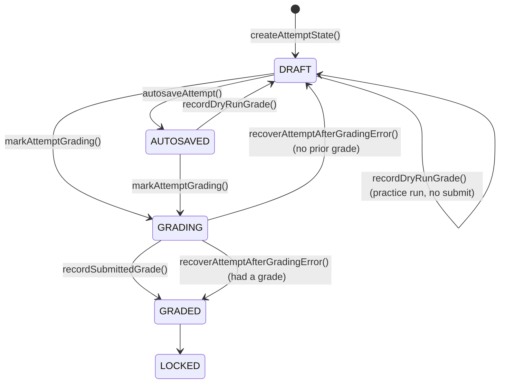
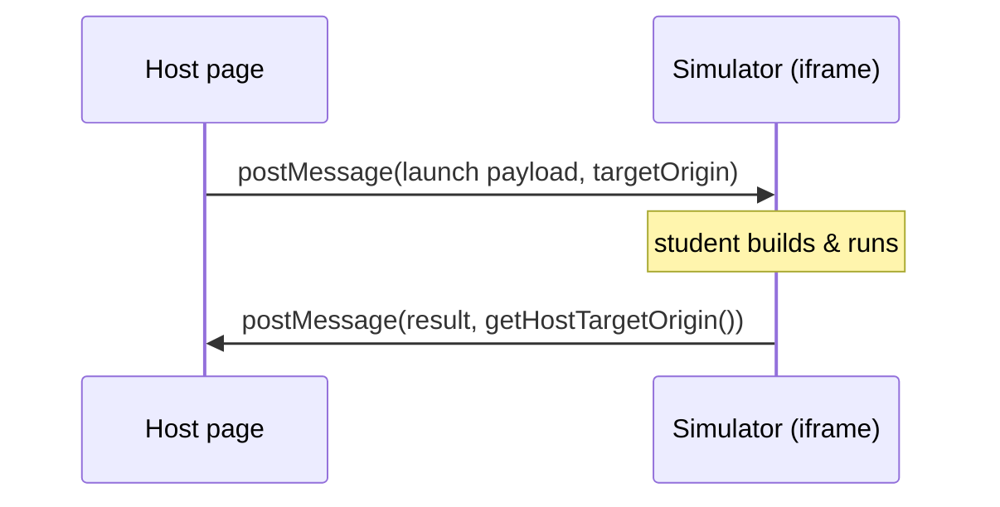

# PR #212 — Question Platform Foundation

> **Branch:** `feat/question-platform-hardening` · **Merge:** `ee57ecd`
> **Scale:** ~4,900 lines across 37 files
> **Theme:** Establish *what a question is*, *what a student's attempt is*, and
> the checks that grade a **diagram** rather than a **simulation**.

This is the base of the whole stack. Everything #213 and #214 do assumes the
types and lifecycle introduced here.

---

## 1. What this PR delivers

| Area | Files | Purpose |
|------|-------|---------|
| Content & attempt model | `src/engine/analysis/question.ts` (+919) | `QuestionPackage`, `AttemptState`, lifecycle transitions, host contract, test-ID helpers |
| Structural grading | `src/engine/analysis/structural.ts` (+397) | Grade the *shape* of a topology against authored rules |
| Invariant grading | `src/engine/analysis/invariants.ts` (+120) | Grade always-must-hold conditions |
| Contract seed | `src/engine/analysis/evaluationContract.ts` (+68) | The first, minimal contract surface (expanded later in #213) |
| Embed / host | `questionHostMessaging.ts`, `QuestionPanel.tsx`, `WorkspaceLayout.tsx`, `EmbeddedIframeQuestion.tsx` | Run a question inside a host page via an iframe and `postMessage` |
| Attempt persistence | `questionAttemptPersistence.ts` (+60) | Save/restore a student's in-progress attempt |

---

## 2. The content model — `QuestionPackage`

A `QuestionPackage` is the **immutable definition** of a question. It is authored
once and never mutated by grading. Its core fields:

```ts
interface QuestionPackage {
  version: '1.0'
  id: string
  title: string
  difficulty: 'intermediate' | ...
  type: 'open-build' | 'fix' | 'build-budget' | 'optimize'
      | 'scaling' | 'ha-chaos' | 'tradeoff'          // question taxonomy
  prompt: {
    text: string
    functionalRequirements: string[]
    nonFunctionalRequirements: NFRTarget[]            // measurable NFRs
    scale: { ... }
  }
  scaffold: { type: 'empty' } | { type: 'partial'; topology: TopologyJSON }
  constraints: { canModifyScaffold: boolean; canRemoveScaffoldNodes: boolean }
  structuralRules?: StructuralRule[]                   // diagram-shape checks
  suite: { name: string; visibleToStudent: boolean; cases: { id: string }[] }
  rubric: { checks: RubricCheck[] }                    // simulation-metric checks
}
```

*Reference: `src/engine/analysis/question.ts`.*

### Why it is shaped this way

- **Separation of "what" from "how much is shown."** The package never encodes
  presentation. Whether a student sees the suite (`visibleToStudent`) is content;
  whether they can *edit* the scaffold (`constraints`) is content; but *which
  environment* renders it (author/contest/learn) is deliberately **not** here —
  that belongs to a future `EnvironmentProfile`. This keeps one question reusable
  across environments.
- **Two independent grading axes.** `structuralRules` grade the *diagram*;
  `rubric.checks` grade the *simulation*. A question can use either or both. This
  split is what later lets #214 introduce **check kinds** cleanly (see doc 03).
- **A closed question taxonomy** (`type`) rather than free-form tags, so the
  platform can reason about grading characteristics per type.

### Concept — Zod as the schema authority

Every model is defined **twice**: once as a TypeScript `interface` (compile-time)
and once as a Zod schema (runtime). `parseQuestionPackage(input)` is the only
sanctioned way to turn untrusted JSON into a `QuestionPackage`. This matters
because questions and attempts arrive from **outside** the process — a file, a
host `postMessage`, `localStorage` — and cannot be trusted to match the type.
Runtime parsing is the boundary that makes the compile-time types *true*.

---

## 3. The attempt model — `AttemptState` and its lifecycle

Where `QuestionPackage` is fixed, `AttemptState` is the student's **mutable work**:

```ts
type AttemptStatus =
  | 'DRAFT' | 'AUTOSAVED' | 'SUBMITTED' | 'GRADING' | 'GRADED' | 'LOCKED'

interface AttemptState {
  questionId: string
  topology: TopologyJSON     // the student's current diagram
  status: AttemptStatus
  grade?: AttemptGrade       // last grade produced, if any
  // timestamps, attemptId, ...
}
```

*Reference: `src/engine/analysis/question.ts:156`.*

### The lifecycle as a state machine



The transition functions are explicit and total — each returns a **new**
`AttemptState` rather than mutating in place:

- `createAttemptState({ questionId, topology, now })` → `DRAFT`
- `autosaveAttempt(...)` → `AUTOSAVED` (periodic save while editing)
- `recordDryRunGrade(...)` → stays `DRAFT` (a *practice* grade doesn't submit)
- `markAttemptGrading(...)` → `GRADING` (submission in flight)
- `recordSubmittedGrade(...)` → `GRADED`
- `recoverAttemptAfterGradingError(...)` → back to `GRADED` if a prior grade
  exists, else `DRAFT`
- `resumePersistedAttempt(...)` → reload from storage, `GRADED` or `AUTOSAVED`

### Why a state machine (and why immutable transitions)

- **A dry-run must never look like a submission.** `recordDryRunGrade` keeping
  the status at `DRAFT` is the single most important distinction: students can
  practice-grade freely without consuming their submission. Encoding this as a
  status transition (not a boolean flag scattered across the UI) makes the rule
  impossible to get wrong downstream.
- **Grading is asynchronous and can fail.** `GRADING` is an explicit in-flight
  state, and `recoverAttemptAfterGradingError` defines what happens when the
  worker throws — you fall back to the *last good* grade, never a blank slate.
- **Immutable transitions** make the attempt trivially serializable and
  replayable, and they play well with the renderer's store model.

---

## 4. Structural checks — grading the diagram

Some things you want to require of a *design* have nothing to do with running a
simulation: "there must be a load balancer," "the graph must be connected,"
"no more than two databases." These are **structural rules**, evaluated against
the topology directly.

```ts
type StructuralRule =
  | { kind: 'requires_component';   componentType }   // must contain X
  | { kind: 'requires_category';    ... }
  | { kind: 'requires_edge';        ... }
  | { kind: 'max_component_count';  componentType; ... }
  | { kind: 'requires_redundancy';  componentType }   // ≥2 of X
  | { kind: 'forbids_component';    componentType }
  | { kind: 'requires_connected_graph' }
  | { kind: 'requires_single_source' }
  | { kind: 'min_node_count' } | { kind: 'max_node_count' }
  | { kind: 'requires_path';        ... }
```

*Reference: `src/engine/analysis/structural.ts:17`.*

### Why structural checks are a separate stage

- **They are a cheap, deterministic gate.** Checking "does this diagram contain a
  load balancer?" is graph inspection — no simulation, no randomness, instant.
  Running them *first* lets grading fail fast on a fundamentally wrong design
  before spending time on simulation.
- **They gate the expensive stage.** This "structural first, then simulate"
  ordering is what #214 later formalizes into **short-circuit skip semantics**:
  if the structural gate fails, the simulation checks are marked *skipped*
  rather than *failed* (doc 03). #212 sets up the ordering; #214 makes the
  reporting honest about it.

---

## 5. Invariant checks

Invariants express conditions that must *always* hold, authored as parseable
condition strings and compared with the same operator set the rubric uses
(`<`, `<=`, `>`, `>=`, `==`, `!=`).

```ts
evaluateInvariantViolations(...)   // returns the list of violated invariants
```

*Reference: `src/engine/analysis/invariants.ts:64`.* Unsupported or unparseable
conditions produce an explicit *violation* rather than silently passing — a
recurring theme in this codebase: **absence of a check is never treated as
success.**

---

## 6. The host contract

Grading produces a lot of detail. An embedding host (a UI, an LMS) usually wants
only a thin, boolean summary. That projection is the **host contract**:

```ts
interface HostContract {
  tests: { id; name; passed; detail? }[]
  totalTests: number
  passedTests: number
  allPassed: boolean
}
```

`toHostContract(structural, graded)` builds it, and — crucially — it builds
`tests` from the **same** flattening logic the full contract uses (this becomes
`flattenAttemptCheckRows` in #214). The result is that the host's thin view is
always a faithful projection of the full grade, never a hand-maintained parallel
list. See doc 02 for the *host-alignment invariant* that enforces this at parse
time, and doc 04 for the bug it caught.

### Test-ID helpers

Every test row gets a **stable, host-safe ID**:

```ts
structuralTestId('need-lb')        // "topology.structural.need-lb"
topologyRubricTestId('err')        // "topology.rubric.err"
caseRubricTestId('baseline', 'simulation', 'err')  // "case.baseline.simulation.err"
```

*Reference: `src/engine/analysis/question.ts:262`.* #212 introduces these as
readable IDs; #214 makes them **content-hashed** for collision-safety (doc 03).

---

## 7. Embedding — running a question inside a host iframe

A question can be embedded in a host page inside an `<iframe>`, communicating
over `window.postMessage`. #212 hardened this seam.



*Reference: `src/renderer/src/utils/questionHostMessaging.ts`,
`QuestionPanel.tsx`, `WorkspaceLayout.tsx`, `EmbeddedIframeQuestion.tsx`.*

### Concept — `postMessage` origin security

`postMessage` takes a **`targetOrigin`**: the browser only delivers the message
if the receiving frame's origin matches. Getting this wrong is a real security
issue — a `targetOrigin` of `'*'` broadcasts your payload to *any* page that
happens to be framing you.

The current outbound logic derives the target from the referrer:

```ts
// questionHostMessaging.ts:47
return document.referrer ? new URL(document.referrer).origin : '*'
```

This is the pragmatic default: use the real host origin when known, fall back to
`'*'` only when the referrer is unavailable. **That `'*'` fallback is a known
sharp edge** — doc 05 records it as an accepted, documented trade-off with a
follow-up to make origins explicitly configured. Flagging it honestly (rather
than pretending the seam is fully locked down) is itself a deliberate choice.

---

## 8. Attempt persistence

`questionAttemptPersistence.ts` provides best-effort save/restore of an attempt
(currently `localStorage`-backed), so a student who reloads mid-build doesn't
lose work. It is deliberately *best-effort*, not an immutable grading archive —
a boundary the team chose to keep #212 shippable, with the durable-replay archive
left as explicit future work.

---

## 9. What to take away

1. **Two immutable models, one shared pipeline.** `QuestionPackage` (what) and
   `AttemptState` (the student's work) never bleed into each other, and grading
   is a pure function of both.
2. **The attempt lifecycle is a real state machine** whose most important edge is
   "dry-run ≠ submission."
3. **Two grading axes** — structural (diagram) and rubric (simulation) — set up
   the check-kind model that #214 completes.
4. **Runtime parsing at every trust boundary** (files, `postMessage`, storage) is
   what makes the compile-time types trustworthy.
5. **Honest boundaries:** the `'*'` origin fallback and best-effort persistence
   are documented sharp edges, not hidden ones.

**Next:** [PR #213 — Evaluation Contract & CLI](02-pr213-evaluation-contract-and-cli.md),
which wraps this grading in a versioned, machine-readable contract and exposes it
to the outside world.
