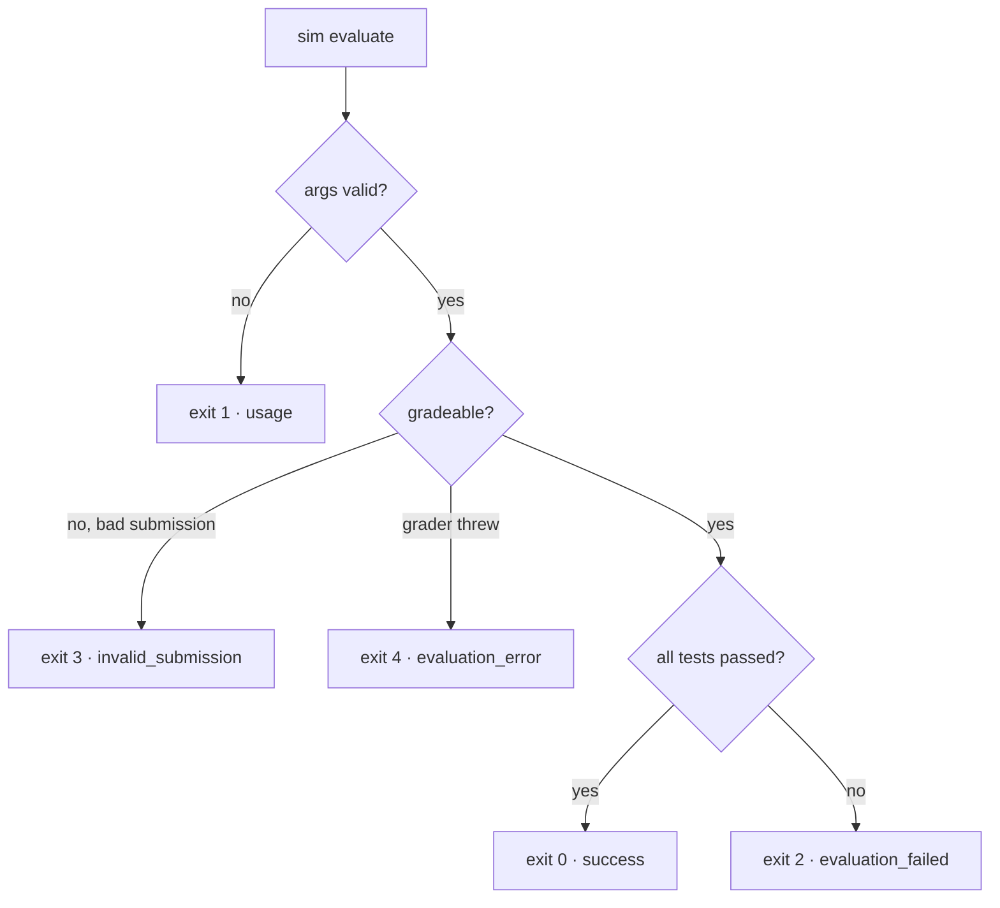

# PR #213 — Evaluation Contract & CLI

> **Branch:** `feat/sim-evaluate-contract` · **Merge:** `89fe96e`
> **Scale:** ~3,600 lines across 20 files
> **Theme:** Turn grading into a **versioned, machine-readable contract**, expose
> it through a scriptable **CLI**, and add an **adapter** so an external host can
> consume it without touching our internals.

If #212 answered "what is a question and how do we grade it?", #213 answers
"**how does the outside world consume a grade?**"

---

## 1. What this PR delivers

| Area | Files | Purpose |
|------|-------|---------|
| Evaluation contract | `src/engine/analysis/evaluationContract.ts` (+739) | Versioned result types, builders, and strict parsers |
| Frozen fixtures | `src/engine/analysis/fixtures/evaluation-contracts.json` (+636) | Golden snapshots the contract is tested against |
| Game Playground adapter | `src/engine/analysis/gamePlayground.ts` (+250) | Translate between our contract and the host's payloads |
| CLI | `src/cli/index.ts` (+565), `questionEvaluate.ts`, `questionBatch.ts`, `exitCodes.ts` | `sim evaluate` — grade single questions and batches from the shell |
| Renderer wiring | `questionHostMessaging.ts`, `QuestionPanel.tsx`, `EmbeddedIframeQuestion.tsx` | Send/receive the versioned payloads over the iframe seam |

---

## 2. The evaluation contract — grading's public API

The contract is the **stable, serializable shape** of a grading result. Three
top-level shapes exist:

```ts
QuestionEvaluationContract       // one question's result (success OR error)
QuestionEvaluationBatch          // many results + an aggregate summary
ScenarioEvaluationContract       // scenario-level (multi-verdict) result
```

A successful question contract looks like:

```ts
interface SuccessfulQuestionEvaluationContract {
  version: '1.0'
  mode: 'question'
  simulatorVersion?: string
  questionId: string
  questionVersion: string
  topologyId: string
  topologySchemaVersion: string
  attemptId?: string
  submissionId?: string
  evaluatedAt?: string          // optional on purpose — see "deterministic output"
  status: 'passed' | 'failed'
  score: { earned; possible; fraction }
  summary: QuestionEvaluationSummary
  tests: QuestionEvaluationTestResult[]
  host: HostContract            // the thin projection from #212
  structural: StructuralEvaluation
  graded: GradedEvaluationBatch
}
```

*Reference: `src/engine/analysis/evaluationContract.ts:96`.* Error outcomes use a
`FailedQuestionEvaluationContract` with a `status` like `invalid_submission` /
`evaluation_error` and an `error: { code, message }` instead of a score.

### Concept — why *versioned* contracts

Every contract carries a `version` **literal** (`QUESTION_EVALUATION_CONTRACT_VERSION`).
The parser asserts it with `z.literal(...)`. This is the seam that lets the
simulator and its consumers (the CLI, the Game Playground host, an LMS) **evolve
independently**: a consumer can check `version` and refuse or adapt, and we can
ship a `2.0` shape beside `1.0` without silently corrupting old readers. Version
literals are cheap insurance against the classic "we changed the JSON and three
downstreams broke silently" failure.

---

## 3. Builders and parsers — a one-way trust valve

The module exposes a **builder** and a **parser** for each shape:

```ts
buildQuestionEvaluationContract(question, topology, grade, options)  // internal → contract
parseQuestionEvaluationContract(raw): QuestionEvaluationContract     // untrusted → validated
```

Builders are used *inside* the simulator to produce output. Parsers are the
**only** sanctioned way to accept a contract from anywhere untrusted. This is the
same trust-boundary pattern as #212's `parseQuestionPackage`, applied to results.

### Concept — `superRefine` and cross-field invariants

A plain Zod schema validates *field shapes*. But a grading contract has
**cross-field invariants** — facts that must be true *between* fields:

- `summary.passedTests` must equal the number of `tests` whose status is passed.
- `summary.topologyFailures` must equal the number of failed `topology` tests.
- `host.tests` must line up with `tests` (next section).

These are enforced with Zod's `superRefine`, which runs custom logic over the
whole parsed object and can attach precise, path-addressed errors:

```ts
// evaluationContract.ts — validateQuestionSummary
if (summary.passedTests !== expected.passedTests) {
  ctx.addIssue({ path: ['summary', 'passedTests'],
    message: 'summary.passedTests must match passed tests.' })
}
```

Why bother? Because a contract with a `summary` that disagrees with its `tests`
is **worse than no contract** — a downstream would trust the wrong number. Making
the parser reject internally-inconsistent contracts means every consumer can
trust the summary without re-deriving it.

---

## 4. The host-alignment invariant

The single most important cross-field rule, and the one that later caught a real
bug (doc 04):

```ts
// evaluationContract.ts:568 — validateHostAlignment
if (host.tests.length !== tests.length) { /* reject */ }
for (each index) {
  if (host.tests[i].id     !== tests[i].id)                 /* reject */
  if (host.tests[i].name   !== tests[i].name)               /* reject */
  if (host.tests[i].passed !== (tests[i].status==='passed')) /* reject */
}
```

**In words:** the thin `host` contract must be an *exact projection* of the full
`tests` array — same length, same order, matching ids and names, and the boolean
`passed` must agree with the rich `status`.

### Why this invariant exists

The host contract and the full contract are two views of the same truth. Without
this rule they can drift — a host might show "3 tests, 2 passed" while the detail
says otherwise. Because `toHostContract` (from #212) builds the host view from
the *same* flattening logic, alignment holds by construction in production; the
invariant is the **tripwire** that fails loudly if any code path ever builds them
separately. (Exactly what happened during the #214 rebase — see doc 04.)

---

## 5. Deterministic output

Grading the same inputs must produce **byte-identical** output. This is a hard
requirement for a grading platform: golden fixtures, reproducible re-grades, and
diffable CI all depend on it.

Concretely:

- **Stable ordering** everywhere — tests, cases, and checks come out in a defined
  order, never hash-map iteration order.
- **No wall-clock in the payload by default.** `evaluatedAt` is **optional** and
  only included when the caller explicitly passes one:

  ```ts
  ...(options?.evaluatedAt ? { evaluatedAt: options.evaluatedAt } : {})
  ```

  This is why the tests can freeze fixtures at all — omit `evaluatedAt` and the
  output is a pure function of the inputs.
- **No incidental fields** — optional fields are omitted entirely rather than
  serialized as `undefined`/`null`, so two logically-equal contracts are also
  *textually* equal.

See doc 05 for why determinism was treated as a non-negotiable criterion.

---

## 6. The CLI — `sim evaluate`

`src/cli/index.ts` exposes grading to the shell for CI, authoring, and batch
regrades:

```bash
sim evaluate question <question.json> <topology.json> \
  --attempt-id a1 --submission-id s1 --evaluated-at 2026-08-01T00:00:00.000Z
sim evaluate batch <manifest.json>
```

The contract JSON goes to **stdout**; human-readable progress goes to **stderr**.
That split is deliberate: you can pipe `stdout` into `jq` or a file while still
seeing progress in your terminal.

### Concept — the exit-code taxonomy

The CLI maps *outcome category* → *process exit code*:

```ts
// src/cli/exitCodes.ts
CLI_EXIT_SUCCESS            = 0   // graded, all tests passed
CLI_EXIT_USAGE_ERROR       = 1   // bad arguments / usage
CLI_EXIT_EVALUATION_FAILED = 2   // graded fine, but the submission failed tests
CLI_EXIT_INVALID_SUBMISSION= 3   // the submission couldn't be graded (bad topology)
CLI_EXIT_EVALUATION_ERROR  = 4   // the grader itself errored
```

**Why five distinct codes instead of 0/1?** Because a CI pipeline or grading
service needs to distinguish *"the student failed"* (code 2 — expected, record
the grade) from *"we couldn't grade this"* (code 3/4 — infrastructure/authoring
problem, alert someone). Collapsing these into a single non-zero code would make
it impossible to tell a legitimately failing submission from a broken grader. The
taxonomy encodes an operational decision as a stable interface.



Batch mode (`questionBatch.ts`) aggregates many results into a
`QuestionEvaluationBatch` with a roll-up summary (`total`, `passed`, `failed`,
`invalidSubmissions`, `evaluationErrors`).

---

## 7. The Game Playground adapter — an anti-corruption layer

The Game Playground is an **external host**. It has its own idea of a "launch" and
a "result." We do *not* want its wire format leaking into our grading engine, nor
our internal contract leaking into it. `gamePlayground.ts` is the **adapter**
(a.k.a. anti-corruption layer) between the two.

```ts
GAME_PLAYGROUND_PAYLOAD_VERSION = '1.0'

buildGamePlaygroundLaunchPayload(question, { priorAttempt, environmentProfile })
buildGamePlaygroundResultFromEvaluationContract(contract)   // full contract → thin result
buildGamePlaygroundSubmitPayload(question, attempt, result, { submissionId })
parseGamePlaygroundLaunchPayload(raw)  /  parseGamePlaygroundSubmitPayload(raw, qid)
```

*Reference: `src/engine/analysis/gamePlayground.ts:17`.*

### What the adapter guarantees

- **Collapse, don't leak.** `buildGamePlaygroundResultFromEvaluationContract`
  reduces the rich `QuestionEvaluationContract` to the thin host result by simply
  projecting `contract.host` — so the host only ever sees the boolean summary,
  never our internal `graded`/`structural` detail.
- **Cross-field guards.** The result schema enforces its own invariants, e.g.
  *"`passed` status requires `allPassed === true`"* and *"error statuses must
  collapse to an empty boolean contract"* — a host can't receive a "passed but
  not all passed" contradiction.
- **Identity checks.** `buildGamePlaygroundLaunchPayload` throws if a
  `priorAttempt.questionId` doesn't match the question being launched — you can't
  accidentally resume attempt A into question B.
- **Backward compatibility.** `parseGamePlaygroundSubmitPayload` still accepts the
  older `contract` field alongside the new versioned shape, so the host can
  migrate without a flag day.

### Why an adapter instead of speaking the host format directly

If the engine emitted the host's format directly, every host quirk would become a
constraint on our internals, and supporting a *second* host would mean a rewrite.
The adapter isolates all host-specific knowledge in one file with one version
number. Our engine stays host-agnostic; the host stays engine-agnostic. See
doc 05 for the full rationale and the "where does the boundary sit?" discussion.

---

## 8. Frozen fixtures

`fixtures/evaluation-contracts.json` holds **golden snapshots** — the exact
expected contract for a passed question, a failed question, an invalid
submission, an evaluation error, a batch, and a scenario. Tests build a contract
and assert `toEqual(fixture)`, *and* re-parse the fixture to prove the parser
round-trips it.

### Why freeze fixtures

- They make the contract's shape **reviewable in a diff** — any change to grading
  output shows up as a fixture change a reviewer must consciously approve.
- Combined with deterministic output (§5), they turn "did we change the contract?"
  into a mechanical yes/no.

The flip side: when grading semantics legitimately change (as in #214), the
fixtures must be **regenerated deliberately**, not hand-edited. That regeneration
methodology is the subject of doc 04.

---

## 9. What to take away

1. **The contract is grading's public API** — versioned, serializable, and the
   only thing consumers should depend on.
2. **Parsers are one-way trust valves**, and `superRefine` lets them reject
   *internally inconsistent* contracts, not just malformed ones.
3. **The host-alignment invariant** keeps the thin and full views honest — and is
   a tripwire, not just documentation.
4. **Determinism is engineered, not incidental** — optional timestamps, stable
   ordering, omitted-not-null fields.
5. **The exit-code taxonomy** encodes the operational difference between "student
   failed" and "we couldn't grade."
6. **The adapter isolates the host**, so neither side's format constrains the
   other.

**Next:** [PR #214 — Rubric Engine Hardening](03-pr214-rubric-engine-hardening.md),
which makes the grading *inside* this contract deterministic and honest about what
it did and didn't evaluate.
