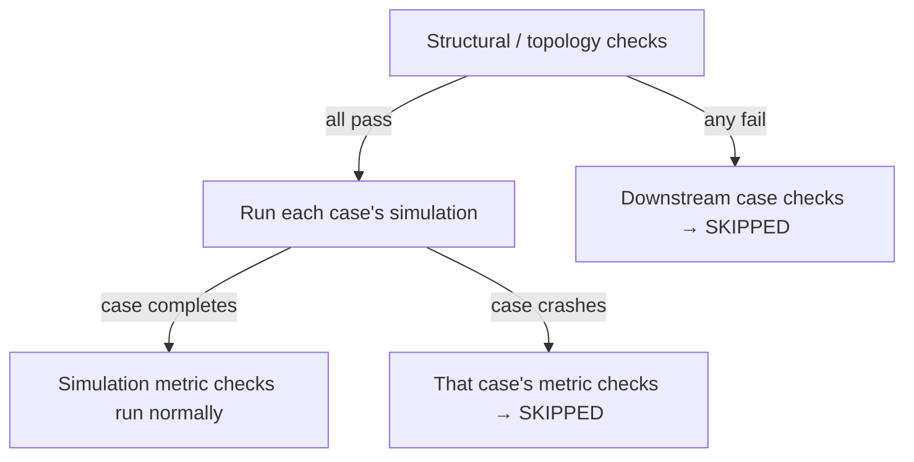

# PR #214 — Rubric Engine Hardening

> **Branch:** `feat/rubric-check-hardening` · **Merge:** `93cec64`
> **Scale:** ~1,900 lines across 14 files
> **Theme:** Make grading **deterministic**, **honest about what it did and did
> not evaluate** (passed vs failed vs *skipped*), and **traceable** through stable
> test IDs.

#212 built the models; #213 wrapped them in a contract. #214 hardens the thing in
the middle — the **rubric engine** — so the numbers inside the contract are
trustworthy and reproducible.

---

## 1. What this PR delivers

| Area | Files | Purpose |
|------|-------|---------|
| Rubric engine | `src/engine/analysis/rubric.ts` (+488) | Check **kinds**, **statuses**, deterministic metric grading, execution rows |
| Grade flattening & IDs | `src/engine/analysis/question.ts` (+390) | `flattenAttemptCheckRows`, content-hashed test IDs, short-circuit skip |
| Contract schema | `src/engine/analysis/evaluationContract.ts` (156 changed) | Expanded summary/kind fields (the surface reconciled in doc 04) |
| Tests & fixtures | `rubric.test.ts` (+215), `question.test.ts` (+130), fixtures | Lock in the hardened semantics |
| CLI parity | `cli/questionEvaluate.test.ts` (+124), `rubric-check-hardening.question.json` | End-to-end proof through the CLI |

---

## 2. Check kinds — classifying *what* a check measures

Before #214, a check was roughly "a metric comparison." #214 gives every check
result a **kind** that says which stage of grading produced it:

```ts
type RubricCheckKind = 'topology' | 'simulation' | 'invariant'   // authored kinds
type CheckResultKind = RubricCheckKind | 'execution'             // + synthetic
type CheckStatus     = 'passed' | 'failed' | 'skipped'
type CaseExecutionStatus = 'completed' | 'failed' | 'skipped'
```

*Reference: `src/engine/analysis/rubric.ts:16`.*

| Kind | Measures | Runs against |
|------|----------|--------------|
| `topology` | A property of the diagram/topology metric | The topology, **before** simulation |
| `simulation` | A metric produced by running a case (e.g. `summary.errorRate`) | A completed simulation verdict |
| `invariant` | An always-must-hold condition | Invariant metrics |
| `execution` | *(synthetic)* Did the case's simulation actually complete? | Per case |

### Inferring the kind

Authors don't have to hand-label every check. `inferRubricCheckKind` derives the
kind from an explicit `kind` field or from the metric name:

```ts
// rubric.ts:133
function inferRubricCheckKind(check): RubricCheckKind {
  if (/* explicit topology kind or topology metric */) return 'topology'
  if (/* invariant metric */)                          return 'invariant'
  return 'simulation'                                  // default
}
```

### Why kinds exist

- **Different kinds have different execution prerequisites.** A `topology` check
  can run on the diagram alone; a `simulation` check *requires a completed run*.
  Encoding the kind lets the engine know which checks are even *eligible* to run
  in a given state — the foundation of the skip semantics below.
- **Per-kind reporting.** The summary can now say *why* a submission failed:
  `topologyFailures`, `simulationFailures`, `invariantFailures`,
  `executionFailures`. "You failed 2 tests" becomes "you failed 1 topology
  requirement and 1 latency target" — far more useful feedback.

---

## 3. The execution row — recording whether a case even ran

#214 adds a **synthetic check** per case, with a reserved ID:

```ts
EXECUTION_CHECK_ID = '__execution__'
EXECUTION_CHECK_DESCRIPTION = 'Case execution completed'
```

*Reference: `src/engine/analysis/rubric.ts:6`.* Every case gets an `execution`
check that passes if the simulation completed, fails if it crashed, and is
skipped if the case never got to run.

### Why a synthetic row

Without it, a case whose simulation *crashed* would just show its rubric checks as
failed — indistinguishable from a case that ran fine but missed its targets. The
execution row makes the difference **explicit and gradeable**: "your design
didn't even run" is a distinct, first-class outcome from "your design ran but was
too slow." It also gives the skip logic a clean anchor: if the execution row is
`failed`/`skipped`, the case's metric checks are `skipped`.

---

## 4. Short-circuit skip semantics — the heart of #214

This is the most important behavioural change, and the one that rippled all the
way into the CLI tests (doc 04).

**The rule:** when a *gating* stage fails, downstream checks are marked
**`skipped`**, not **`failed`**.

Concretely, grading proceeds in stages, and a failure gates the next:



### Worked example (the exact CLI scenario from doc 04)

A question requires a load balancer (`structuralRules: [need-lb]`) and has one
simulation check (`err`, error-rate) over one case (`baseline`). The submitted
topology has **no load balancer**. Grading produces:

| Test | Kind | Status |
|------|------|--------|
| `need-lb` | `topology` | **failed** |
| `baseline` execution | `execution` | **skipped** |
| `baseline` error-rate | `simulation` | **skipped** |

Summary: `totalTests: 3, passedTests: 0, failedTests: 1, skippedTests: 2,
topologyFailures: 1`.

Contrast with the **old** behaviour, which counted the un-run checks as failures
(`failedTests: 2`). That old number was *misleading*: it implied the student's
error-rate was too high, when in fact it was never measured.

### Why skip-vs-fail matters

- **Honesty.** `failed` should mean "we evaluated this and it did not meet the
  bar." Reporting an *un-evaluated* check as failed is a lie the student can't act
  on. `skipped` says "we didn't get to this" — actionable and true.
- **Better feedback and analytics.** A dashboard can now separate "designs that
  fail requirements" from "designs that fail targets," because the former shows
  skips, not spurious metric failures.
- **Determinism.** A crashed simulation is a *known* skip outcome, not a random
  failure — the grade is reproducible.

This formalizes the "structural first, then simulate" ordering that #212 set up
(doc 01, §4). #212 chose the order; #214 makes the *reporting* of that order
truthful.

---

## 5. `flattenAttemptCheckRows` — one source of truth for test rows

Everything that lists tests — the full contract's `tests`, the host contract's
`tests`, the summary counts, the CLI output — derives from a **single** function:

```ts
// question.ts:1138
flattenAttemptCheckRows(grade): AttemptCheckRow[]
```

It walks the structural checks and every case's rubric checks, in a defined order,
and emits one normalized row per check with its `id`, `name`, `kind`, `status`,
`passed`, and optional `detail`.

### Why centralize flattening

The alternative — each consumer building its own list — is exactly how the host
and full contracts drift apart (the bug in doc 04). With one flattening function:

- **Ordering is defined once.** Determinism (doc 02, §5) is a property of this one
  function.
- **The host contract is provably a projection.** `toHostContract` calls the same
  flattening, so the host-alignment invariant (doc 02, §4) holds by construction.
- **Counts can't disagree with rows.** The summary is computed from the flattened
  rows, so `passedTests` is *definitionally* the number of passed rows.

---

## 6. Stable, content-hashed test IDs

#212 introduced readable IDs like `case.baseline.simulation.err`. #214 makes them
**collision-safe** by appending a content hash:

```ts
// question.ts
hostSafeToken('baseline')  // "baseline-1bps56q"   (slug + stableHashToken)
caseRubricTestId('baseline', 'simulation', 'err')
// → "case.baseline-1bps56q.simulation.err-u4ovu4"
structuralTestId('need-lb')  // → "topology.structural.need-lb-195ix8y"
```

The token is a lowercased, dash-normalized **slug** plus a short deterministic
**hash** of the original value.

### Why hash the IDs

- **Collision-safety.** Two different check IDs that happen to slugify the same
  (e.g. `err rate` and `err-rate`) would collide on the slug alone. The hash makes
  each ID unique to its source content.
- **Host-safe.** IDs may travel to a host as DOM ids, map keys, or URL fragments —
  the normalization guarantees they're safe in all of those.
- **Still deterministic.** The hash is a pure function of the input, so the same
  check always gets the same ID — fixtures and re-grades stay stable.

The trade-off: IDs are no longer hand-writable, so tests must build expected IDs
by *calling* `caseRubricTestId` rather than typing string literals. This is why
the #214 reconciliation had to compute expected IDs via the helpers (doc 04).

---

## 7. The expanded summary

The rubric changes required the contract's summary to grow from the old
`{ structuralFailures, rubricFailures, executionFailures }` to the honest,
per-kind shape:

```ts
interface QuestionEvaluationSummary {
  totalTests; passedTests; failedTests; skippedTests
  topologyFailures; simulationFailures; invariantFailures; executionFailures
}
```

*Reference: `src/engine/analysis/evaluationContract.ts:79`.* The old field names
(`structuralFailures`/`rubricFailures`) and the old kind enum
(`structural`/`rubric`) were replaced. **This is precisely the surface that had to
be reconciled during the rebase** — the schema, its `superRefine` validation, and
every frozen fixture referenced these fields. Doc 04 tells that story.

---

## 8. What to take away

1. **Kinds classify what a check measures** and, crucially, its execution
   prerequisites.
2. **The execution row** makes "did it even run?" a first-class, gradeable fact.
3. **Skip-vs-fail is a correctness and honesty feature** — un-evaluated checks are
   `skipped`, never `failed`.
4. **`flattenAttemptCheckRows` is the single source of truth** — determinism,
   host-alignment, and summary counts all derive from it.
5. **Content-hashed IDs** are collision-safe and host-safe at the cost of being
   computed, not typed.
6. **The summary is now per-kind**, turning "you failed N tests" into actionable
   feedback — and this expansion is what forced the reconciliation in doc 04.

**Next:** [Rebase & Contract Reconciliation](04-rebase-and-contract-reconciliation.md)
— how #214 was landed on top of #213 without breaking the frozen contract.
