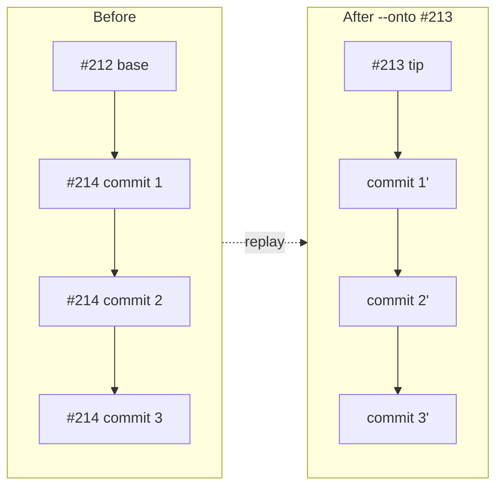

# Rebase & Contract Reconciliation

> **The operational story:** how `feat/rubric-check-hardening` (#214) was restacked
> onto the post-#213 tree, why the overlap was non-trivial, and how the frozen
> contract fixtures were regenerated *correctly* - including a real semantic bug
> the process caught.

This document is deliberately concrete. It is the "what actually happened at the
git and test level" companion to the three PR docs, and a template for the next
time two stacked PRs touch the same surface.

---

## 1. Why a rebase was needed at all

#213 and #214 both branched from #212 and both edited the **same grading
surface**:

- `src/engine/analysis/evaluationContract.ts`
- `src/engine/analysis/question.ts`
- `src/engine/analysis/rubric.ts`
- `src/cli/index.ts`

They were a *stack*, not siblings. The correct landing order (README, "Merge
order") was:

```
1. merge #212                       (shared base)
2. merge #213                       (the contract everyone speaks)
3. rebase #214 onto post-#213, resolve overlap, then merge #214
```

Merging #214 *as-authored* would have reintroduced the pre-#213 contract shape and
regressed the fixture work #213 froze. So #214 had to be **replayed on top of
#213**.

---

## 2. The rebase - `git rebase --onto`

The branch was replayed with:

```bash
git rebase --onto feat/sim-evaluate-contract <merge-base> feat/rubric-check-hardening
```

`--onto` says: *"take #214's unique commits and replay them starting from the tip
of #213 instead of their original base."* The three substantive commits replayed;
an earlier stray-file cleanup commit dropped out as already-upstream.



Two commits hit **content conflicts** in `evaluationContract.ts` and
`evaluationContract.test.ts` - both edited by #213 (imports, fixture-based tests)
and #214 (new function imports, inline assertions). These were resolved by keeping
#213's structural approach (Zod schemas, frozen-fixture tests) and layering #214's
additions on top.

---

## 3. The schema drift - the core of the overlap

After the raw rebase, `typecheck` failed. The cause was a genuine drift, not a
merge accident:

- **#213's interface types** already described the *expanded* summary
  (`skippedTests`, `topologyFailures`, `simulationFailures`, `invariantFailures`)
  and the expanded kind enum (`topology`/`simulation`/`invariant`/`execution`).
- **#214's Zod schemas and validation** still declared the *old* fields
  (`structuralFailures`, `rubricFailures`) and the old kinds
  (`structural`/`rubric`).

So the runtime schema and the compile-time type disagreed. The fix aligned the
Zod schemas and the `superRefine` summary validation in `evaluationContract.ts`
with the expanded interface types:

```diff
- const QuestionEvaluationTestKindSchema = z.enum(['structural', 'rubric', 'execution'])
- const QuestionEvaluationTestStatusSchema = z.enum(['passed', 'failed'])
+ const QuestionEvaluationTestKindSchema = z.enum(['topology', 'simulation', 'invariant', 'execution'])
+ const QuestionEvaluationTestStatusSchema = z.enum(['passed', 'failed', 'skipped'])
```

…plus replacing the `structuralFailures`/`rubricFailures` summary validators with
per-kind ones (`skippedTests`, `topologyFailures`, `simulationFailures`,
`invariantFailures`). See doc 03, §7 for *why* the shape changed.

---

## 4. Regenerating the frozen fixtures - methodology

With the schema fixed, the frozen fixtures
(`fixtures/evaluation-contracts.json`) were now stale: they still carried the old
field names and lacked the execution rows and skip statuses #214 produces.

**The wrong way** (and a trap): hand-edit the JSON, or write a standalone script
that *re-declares* the test inputs. A leftover helper from an earlier attempt did
exactly this and used a **wrong `questionPackage` shape** (`prompt.title/brief`
instead of the real `prompt.text/...`), so it produced subtly wrong fixtures. It
was discarded.

**The right way:** regenerate the fixtures from the **exact same inputs the tests
already use**, by temporarily instrumenting the test file itself:

1. Add a guarded `afterAll` that writes the built contracts to the fixture JSON
   (in the canonical key order) when `RESNAP_FIXTURES=1` is set.
2. Capture each built contract at its existing build site (`__snap.questionPassed
   = contract`, etc.) - *before* the assertions, so capture happens even though
   the stale assertions fail.
3. Run `RESNAP_FIXTURES=1 vitest run …` once to emit fresh fixtures.
4. **Remove the instrumentation** and run the suite normally to prove green.

Because the fixtures are generated from the *tests' own inputs*, they cannot drift
from what the tests exercise - the tests then validate the regeneration by
`toEqual` and by re-parsing (round-trip).

---

## 5. The semantic bug the process caught

Regeneration is not just mechanical - it surfaced a **real latent bug**.

The standalone `questionPassed` test input was still in the *pre-#214* grade shape:
its rubric check had no `kind`/`status`, and its host `contract.tests` listed only
one entry (`baseline:err`) with an old-style ID. Fed through the hardened builder,
it produced a contract where a **passing** question reported:

```
summary.passedTests = 0      // a passing question with zero passed tests (!)
tests[0].kind = undefined    // no kind
```

Blindly freezing that would have baked a lie into the golden fixture. The fix was
to update the input to the real #214 grade shape (add the execution row, `kind`,
`status`, and the per-check summary fields) - mirroring the batch's already-correct
passed input. After that, the passed fixture correctly showed **2 tests, both
passed** (an execution row + the simulation check).

**Lesson:** regenerating fixtures is safe *only* when the inputs are themselves
correct. The regeneration made a hidden inconsistency loud instead of silent.

---

## 6. The host-alignment invariant earns its keep

Next, the Game Playground test and the `parseQuestionEvaluationContract`
round-trip started failing with:

```
host.tests must align one-to-one with tests.
```

This is the invariant from doc 02, §4 - *the tripwire firing exactly as
designed.* The corrected `questionPassed` grade now derived **2** rows (execution +
simulation), but its hand-written host stub still listed **1**. Production never
hits this (both come from the same `flattenAttemptCheckRows`), but the *test
stubs* built the two lists by hand and let them drift.

The fix: update the host stubs to list all derived rows, using the ID helpers
(`caseRubricTestId(...)`) rather than string literals - because #214's IDs are
content-hashed and no longer hand-writable (doc 03, §6). The gamePlayground test
was further hardened to assert against the fixture's own `host` projection, so it
can never again drift from the fixture.

---

## 7. Updating the CLI semantics test

One CLI test asserted `summary.failedTests: 2` for a submission that fails a
structural rule. Under #214's **skip semantics** (doc 03, §4) the correct result
is:

```diff
  summary: {
-   failedTests: 2
+   failedTests: 1,
+   skippedTests: 2,
+   topologyFailures: 1
  }
```

This was verified by running the *real* CLI against a reproduced question/topology
and reading the actual summary - not by guessing. The expectation was then
*strengthened* (asserting the skip counts too) to lock the new semantics in place.

---

## 8. Landing it - `--force-with-lease`

Because the branch history was rewritten (rebased), a normal push would be
rejected. The branch was force-pushed with the safer variant:

```bash
git push --force-with-lease origin feat/rubric-check-hardening
```

`--force-with-lease` aborts if the remote branch moved since your last fetch -
protecting a teammate's push from being silently clobbered, which a bare
`--force` would do. The reconciliation itself was committed as one coherent
commit (the affected files spanned #213's base and #214's changes, so it belonged
to the *restack*, not to any single original commit). #214 then merged cleanly,
and `master` now points at that merge.

---

## 9. A reusable checklist for restacking overlapping PRs

1. **Confirm the stack and the merge order** before touching anything.
2. `git rebase --onto <new-base> <old-base> <branch>`; resolve conflicts by
   keeping the *downstream* structural decisions and layering the upstream
   additions.
3. **Typecheck first** - it exposes schema/type drift fastest.
4. **Regenerate golden fixtures from the tests' own inputs**, never by hand or a
   re-declared script. Instrument → generate → de-instrument → prove green.
5. **Trust the tripwires.** A firing invariant (host-alignment) usually means a
   real inconsistency, not a test to relax.
6. **Verify behavioural changes against the real tool** (run the CLI) before
   editing an expectation; then *strengthen* the assertion.
7. Push with `--force-with-lease`.

**Next:** [Design Decisions & Trade-offs](05-design-decisions-and-tradeoffs.md) -
the consolidated "why" behind every choice referenced above.
