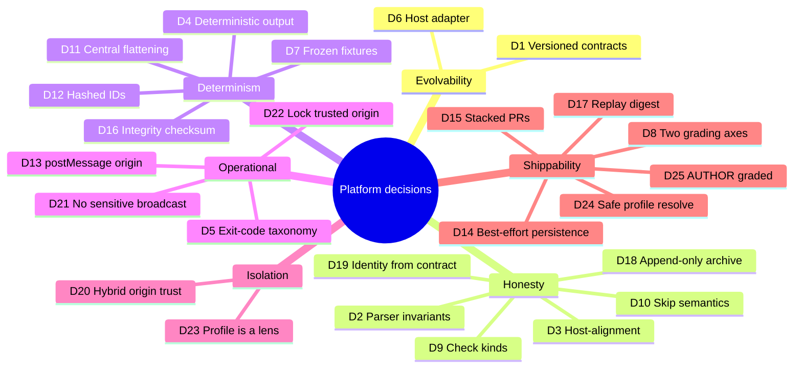

# Design Decisions & Trade-offs

> A consolidated **decision log** for the question-platform stack (#212 → #213 →
> #214). Each entry records the **decision**, the **criteria** it was weighed
> against, the **alternatives** considered, and the **trade-off accepted** — so
> the next decision stays consistent with these.

This complements the formal ADRs in
[`../../design-decisions/`](../../design-decisions/). Those are architecture-wide;
this log is scoped to the grading/question platform.

---

## The criteria we optimized for

Nearly every decision below was judged against the same short list. Naming them
once makes the individual choices easier to follow:

| Criterion | What it means here |
|-----------|--------------------|
| **Determinism** | Same inputs → byte-identical output. Non-negotiable for a grading platform. |
| **Honesty** | The output never overstates what was evaluated (e.g. never reports an un-run check as failed). |
| **Evolvability** | Producers and consumers can change independently without silent breakage. |
| **Isolation** | External/host concerns don't leak into the engine, and vice-versa. |
| **Reviewability** | Meaningful changes show up as reviewable diffs (fixtures, version bumps). |
| **Shippability** | Ship a correct, bounded slice now; defer the rest explicitly rather than gold-plating. |

---

## D1 — Versioned contracts (literal `version` fields)

**Decision.** Every cross-boundary payload carries a `version` literal, asserted
at parse time (`z.literal`). Applies to the evaluation contract and the Game
Playground payloads.

**Criteria.** Evolvability, Reviewability.

**Alternatives.** (a) No version — rely on structural duck-typing. (b) A global
API version outside the payload.

**Why this choice.** A version *inside* the payload travels with it through files,
`postMessage`, and storage, so any consumer can branch on it. A bump is a visible,
reviewable event. Without it, a shape change is a silent, cross-repo landmine.

**Trade-off.** A tiny bit of ceremony on every payload, and the discipline to
actually bump the version when the shape changes.

*See: doc 02, §2.*

---

## D2 — Parsers as one-way trust valves, with `superRefine` invariants

**Decision.** The only sanctioned way to accept a `QuestionPackage`, `AttemptState`,
or any contract from outside is through a parser that validates **field shapes**
*and* **cross-field invariants** (via `superRefine`).

**Criteria.** Honesty, Determinism.

**Alternatives.** Trust TypeScript types at the boundary (they don't exist at
runtime); validate shapes only, not relationships.

**Why this choice.** Untrusted JSON arrives from files, hosts, and storage. Shape
validation alone would still admit an *internally inconsistent* contract — e.g. a
`summary` that disagrees with its `tests`. That's worse than rejecting it, because
a downstream would trust the wrong number. Rejecting inconsistency at the boundary
lets every consumer trust the summary without re-deriving it.

**Trade-off.** Parsers are more code and must be kept in lock-step with the types
(the exact drift that caused the reconciliation in doc 04).

*See: doc 02, §3; doc 04, §3.*

---

## D3 — The host-alignment invariant

**Decision.** `host.tests` must be an exact projection of the full `tests` array
(length, order, ids, names, and `passed`↔`status`), enforced in the parser.

**Criteria.** Honesty, Determinism.

**Alternatives.** Let the host contract be an independent, hand-built list; or
only check counts, not element-wise identity.

**Why this choice.** The thin and full views are two windows on one truth; if they
can disagree, a host UI can show a different verdict than the detail. Because both
are built from `flattenAttemptCheckRows`, alignment holds by construction — the
invariant is the **tripwire** that fires if any code path ever builds them
separately. It did exactly that during the #214 rebase, catching a drifted test
stub (doc 04, §6).

**Trade-off.** Test fixtures must keep the two lists consistent, which is stricter
than "close enough."

*See: doc 02, §4; doc 04, §6.*

---

## D4 — Deterministic output (optional `evaluatedAt`, stable ordering, omit-not-null)

**Decision.** Output is a pure function of inputs: stable ordering everywhere,
`evaluatedAt` optional and caller-supplied, optional fields **omitted** rather than
serialized as `null`/`undefined`.

**Criteria.** Determinism, Reviewability.

**Alternatives.** Stamp `Date.now()` into every contract; serialize all fields
always.

**Why this choice.** Determinism is what makes frozen fixtures, reproducible
re-grades, and diffable CI possible. A wall-clock timestamp or an incidental
`null` would make two logically-equal grades textually different and break all of
that.

**Trade-off.** Callers must pass a timestamp explicitly when they want one; code
must be careful to omit rather than null out.

*See: doc 02, §5.*

---

## D5 — The CLI exit-code taxonomy (0/1/2/3/4)

**Decision.** Distinct exit codes for success (0), usage error (1), evaluation
*failed* (2), invalid submission (3), and evaluation *error* (4).

**Criteria.** Honesty, Isolation (operational).

**Alternatives.** The Unix default of 0/non-zero.

**Why this choice.** A grading service must distinguish *"the student failed"*
(code 2 — expected; record the grade) from *"we couldn't grade this"* (codes 3/4 —
alert a human). One non-zero code makes a legit failing submission
indistinguishable from a broken grader. The taxonomy encodes that operational
decision as a stable interface CI can branch on.

**Trade-off.** More codes to document and keep meaningful; consumers must know the
map.

*See: doc 02, §6.*

---

## D6 — The Game Playground adapter (anti-corruption layer)

**Decision.** All host-specific payload knowledge lives in one file
(`gamePlayground.ts`) with its own version, translating to/from the internal
contract. The engine never speaks the host's format directly.

**Criteria.** Isolation, Evolvability.

**Alternatives.** Emit the host's format straight from the engine; or let the host
read our internal contract.

**Why this choice.** If the engine emitted the host format, every host quirk would
constrain our internals and a *second* host would mean a rewrite. The adapter
keeps the engine host-agnostic and the host engine-agnostic. It also enforces
host-facing guards (`passed` ⇒ `allPassed`; error statuses collapse to an empty
contract) and keeps backward-compatibility for the legacy `contract` field.

**Trade-off.** One more layer to pass through, and a second version number to
manage.

**Where the boundary sits.** This repo owns the *simulator-side* contract and the
iframe payload shapes; the external host repo owns persistence, LMS updates, and
its own DB/API mapping. If the host platform fixes the wire field names, that exact
shape belongs here (we're the producer); if the host can adapt, we stay generic
and it maps.

*See: doc 02, §7.*

---

## D7 — Frozen golden fixtures

**Decision.** Expected contract output is checked in as JSON snapshots and
asserted with `toEqual` plus a parse round-trip.

**Criteria.** Reviewability, Determinism.

**Alternatives.** Assert field-by-field inline; or compute expectations in-test
only.

**Why this choice.** A frozen fixture turns "did grading output change?" into a
reviewable diff a human must consciously approve. Combined with D4 (determinism)
it's a mechanical guard against accidental contract drift.

**Trade-off.** When semantics legitimately change, fixtures must be **regenerated
from the tests' own inputs** (never hand-edited) — a discipline that itself caught
a real bug (doc 04, §4–5).

*See: doc 02, §8; doc 04, §4.*

---

## D8 — Two grading axes: structural vs rubric

**Decision.** Diagram-shape checks (`structuralRules`) are a separate stage from
simulation-metric checks (`rubric.checks`).

**Criteria.** Determinism, Honesty, Shippability.

**Alternatives.** One flat list of checks; or express structure as pseudo-metrics.

**Why this choice.** Structural checks are cheap, deterministic graph inspection
with no simulation; running them first lets grading fail fast and gate the
expensive stage. The split is also what makes the **check-kind** model (D9) clean.

**Trade-off.** Authors must know which axis a requirement belongs to.

*See: doc 01, §4; doc 03, §2.*

---

## D9 — Check kinds and the synthetic execution row

**Decision.** Every check result carries a `kind` (`topology`/`simulation`/
`invariant`/`execution`), and each case gets a synthetic `execution` check
(`__execution__`).

**Criteria.** Honesty, Determinism.

**Alternatives.** Untyped checks; infer failure cause post-hoc.

**Why this choice.** Kinds capture a check's **execution prerequisites** (a
`simulation` check needs a completed run) and enable **per-kind failure
reporting** ("1 topology requirement + 1 latency target," not "2 tests"). The
execution row makes "did the case even run?" a first-class, gradeable fact,
distinct from "ran but missed targets."

**Trade-off.** More result surface (kinds, an extra row per case) and a wider
summary.

*See: doc 03, §2–3.*

---

## D10 — Short-circuit *skip* semantics (skip, don't fail)

**Decision.** When a gating check fails (structural, or a case that didn't run),
downstream checks are **`skipped`**, not **`failed`**.

**Criteria.** Honesty, Determinism.

**Alternatives.** Count un-run checks as failures (the old behaviour); or omit them
entirely.

**Why this choice.** `failed` must mean "evaluated and below the bar." Reporting an
un-evaluated check as failed is a lie a student can't act on. `skipped` is true and
actionable, gives cleaner analytics (requirement-failures vs target-failures), and
keeps a crashed run's grade deterministic. Omitting them would lose the count of
what *would* have been tested.

**Trade-off.** A three-state status (`passed`/`failed`/`skipped`) is more to model
and reason about than a boolean — and it changed downstream counts, forcing the
CLI-test update in doc 04, §7.

*See: doc 03, §4; doc 04, §7.*

---

## D11 — Centralized flattening (`flattenAttemptCheckRows`)

**Decision.** One function produces the canonical ordered list of test rows;
everything else (full `tests`, host `tests`, summary counts, CLI output) derives
from it.

**Criteria.** Determinism, Honesty.

**Alternatives.** Each consumer builds its own list.

**Why this choice.** A single source of truth makes ordering (hence determinism) a
property of one place, makes the host contract provably a projection (D3), and
makes summary counts *definitionally* consistent with the rows. Per-consumer lists
are exactly how views drift apart.

**Trade-off.** All consumers must route through one function's ordering and shape.

*See: doc 03, §5.*

---

## D12 — Content-hashed, host-safe test IDs

**Decision.** Test IDs are a normalized slug **plus a deterministic content hash**,
e.g. `case.baseline-1bps56q.simulation.err-u4ovu4`.

**Criteria.** Determinism, Isolation (host-safety).

**Alternatives.** Plain readable IDs; random UUIDs.

**Why this choice.** Plain slugs can collide (`err rate` vs `err-rate`); UUIDs
aren't deterministic. Slug-plus-hash is unique to the source content, safe as DOM
ids / map keys / URL fragments, and stable across re-grades.

**Trade-off.** IDs are no longer hand-writable — tests must build expected IDs by
calling the helpers, which is precisely what the reconciliation had to do (doc 04,
§6).

*See: doc 03, §6.*

---

## D13 — `postMessage` origin policy (and its accepted sharp edge)

**Decision.** Outbound host messages target the referrer's origin when known,
falling back to `'*'` only when it isn't.

**Criteria.** Isolation (security), Shippability.

**Alternatives.** Always `'*'` (insecure); require an explicitly configured host
origin (safer but blocks the current embed flow).

**Why this choice.** Using the real host origin covers the normal case; the `'*'`
fallback keeps the embed working when the referrer is unavailable. The fallback is
a **documented sharp edge**, not a hidden one — with a follow-up to require an
explicitly configured, validated origin (and to validate inbound `event.origin`).

**Trade-off.** The `'*'` fallback is a real, acknowledged security gap accepted to
keep #212 shippable; hardening it is explicit future work.

*See: doc 01, §7.*

---

## D14 — Best-effort persistence now, durable archive later

**Decision.** Attempt persistence is best-effort `localStorage`, not an immutable
grading/replay archive.

**Criteria.** Shippability.

**Alternatives.** Build the durable, append-only archive up front.

**Why this choice.** Best-effort restore solves the immediate "don't lose work on
reload" problem and unblocks the platform, while the durable archive is a larger,
separable effort deferred deliberately rather than half-built.

**Trade-off.** No guaranteed replay/audit trail yet; the boundary is documented.

*See: doc 01, §8.*

---

## D15 — Stacked PRs with an explicit merge order

**Decision.** Ship the platform as three stacked PRs (#212 → #213 → #214) with a
defined landing order, rebasing #214 onto #213 rather than merging it as-authored.

**Criteria.** Reviewability, Shippability.

**Alternatives.** One giant PR; three independent PRs merged in any order.

**Why this choice.** Three focused PRs are each reviewable; the stack keeps each
building on a stable base. Because #213 and #214 edited the same surface, the order
and the rebase were mandatory to avoid regressing the frozen contract.

**Trade-off.** The overlap required a careful rebase-and-reconcile step (doc 04)
and a `--force-with-lease` history rewrite.

*See: README "Merge order"; doc 04.*

---

## D16 — Seal submissions with a non-cryptographic integrity checksum

**Decision.** Each evaluation envelope is sealed with `canonicalChecksum` — a wide
(128-bit, multi-lane) content hash over its canonical serialization.

**Criteria.** Determinism, Honesty.

**Alternatives.** No checksum (trust the store); a cryptographic signature.

**Why this choice.** A checksum makes a persisted submission **tamper-evident** —
accidental drift or a hand-edit of `localStorage` is caught on read. It is
deliberately *not* sold as security: defeating it needs a server-side signature,
which is out of scope for a client-side artifact. An honest "tamper-evident" beats
a checksum that only *looks* like tamper-proofing.

**Trade-off.** Detects casual tampering and drift, not a motivated adversary.

*See: doc 06, §4.*

---

## D17 — Digest replay by default; bind the full trace by hash

**Decision.** Every envelope embeds a bounded **replay digest** (counts +
`eventStreamChecksum`); the full per-request replay is optional and **excluded
from the envelope checksum**.

**Criteria.** Shippability, Honesty.

**Alternatives.** Embed the full replay in every envelope; omit replay entirely.

**Why this choice.** Full replays are large; embedding them everywhere would
exhaust storage. Binding the trace by *hash* (in the sealed digest) proves what the
replay was without paying to store it, and excluding the heavy blob from the
checksum means attaching/detaching it never breaks the seal.

**Trade-off.** The full trace isn't present in every record; it is re-attached on
demand.

*See: doc 06, §5.*

---

## D18 — Append-only submission archive

**Decision.** Submissions are stored immutably: a repeat write of the same
`submissionId` is refused, reads verify the checksum, and corrupt rows are reported
but never deleted.

**Criteria.** Honesty.

**Alternatives.** Overwrite like the attempt cache; delete corrupt rows.

**Why this choice.** A submitted grade is a historical fact; an audit archive must
not overwrite or erase the very evidence an auditor needs. Verify-on-read keeps a
tampered row from being silently trusted.

**Trade-off.** Storage grows with submissions; a retention/pruning policy is a
separate, deliberate decision.

*See: doc 06, §8.*

---

## D19 — Derive envelope identity from the sealed contract

**Decision.** An envelope's `questionId`/`topologyId` are copied from the contract
it seals, not accepted as independent inputs, and re-checked on parse/verify.

**Criteria.** Honesty.

**Alternatives.** Let callers label the envelope independently.

**Why this choice.** The envelope is a claim ("this grade is for question X"). One
source of truth for that identity (the contract) makes a mislabelled envelope
impossible by construction — the same reasoning as central flattening (D11) and
host-alignment (D3).

**Trade-off.** Callers cannot set identity independently — which is the point.

*See: doc 06, §6.*

---

## D20 — Hybrid iframe origin trust (configured allowlist, else TOFU)

**Decision.** A framed simulator trusts host origins from a `?hostOrigin=` allowlist
when present (strict), otherwise trust-on-first-use against the first valid
launch-context.

**Criteria.** Isolation, Shippability.

**Alternatives.** Strict allowlist only (breaks the config-free preview);
TOFU only (raceable).

**Why this choice.** Backward compatible with the preview flow while letting
production opt into a declarative allowlist. Both sides validate each other
(defense-in-depth).

**Trade-off.** TOFU alone can be raced by a page that sends a launch-context
first; `?hostOrigin=` removes that risk.

*See: doc 07, §5.*

---

## D21 — Never broadcast sensitive messages

**Decision.** `submit`/`error` target the trusted host origin only and are dropped
if none is established; `'*'` survives only for the content-less `ready` bootstrap.

**Criteria.** Isolation, Honesty.

**Alternatives.** Fall back to `'*'`/referrer for all messages (the prior
behaviour — a data leak).

**Why this choice.** `submit` carries a student's grade; broadcasting it to any
framing page is a leak. Dropping-with-a-warning is safer than leaking.

**Trade-off.** If no host is ever established, sensitive messages are silently
dropped (a warning is logged).

*See: doc 07, §6.*

---

## D22 — Lock the trusted origin once

**Decision.** The trusted host origin is set on the first valid launch and never
reassigned for the session.

**Criteria.** Isolation.

**Alternatives.** Re-derive the host per message.

**Why this choice.** Prevents a later message from a different origin hijacking
trust or receiving replies.

**Trade-off.** A legitimate host-origin change mid-session needs a reload.

*See: doc 07, §4.*

---

## D23 — EnvironmentProfile is a lens, not a question variant

**Decision.** Presentation (visibility + capabilities + graded + chrome) lives in a
separate `EnvironmentProfile` applied over one `QuestionPackage`, never baked into
the content or the grader.

**Criteria.** Isolation, Evolvability.

**Alternatives.** Per-mode question variants; mode flags scattered in the UI.

**Why this choice.** One question runs as author/interview/learn without forking
content or grading. Gated surfaces consult the profile, keeping the four layers
cleanly separated.

**Trade-off.** Each gated surface must read the profile rather than hardcode a
mode.

*See: doc 08, §1–2.*

---

## D24 — resolveEnvironmentProfile is total and safe

**Decision.** Any input (mode string, partial override, or malformed/unknown)
resolves to a complete profile; invalid input falls back to the default rather
than throwing.

**Criteria.** Honesty, Shippability.

**Alternatives.** Throw on invalid profile input.

**Why this choice.** A malformed launch payload must never break a student's
session; degrading to the default profile is safer than erroring.

**Trade-off.** A bad profile silently degrades to AUTHOR (logged upstream if
needed) instead of surfacing loudly.

*See: doc 08, §4.*

---

## D25 — AUTHOR is graded (deviates from the spec matrix)

**Decision.** The AUTHOR preset sets `graded: true`, unlike the spec matrix which
lists AUTHOR as ungraded.

**Criteria.** Shippability.

**Alternatives.** Follow the spec (AUTHOR ungraded).

**Why this choice.** AUTHOR doubles as the standalone dev/testing mode, where
exercising the grade → seal → archive path is exactly what a setter needs.

**Trade-off.** A documented divergence from the spec; INTERVIEW remains the
canonical graded contest mode.

*See: doc 08, §3.*

---

## Decision map at a glance

---

## Open follow-ups (documented sharp edges)

These were consciously deferred, not overlooked:

- ~~**Explicit, validated iframe origins** (inbound `event.origin` check; remove the
  `'*'` outbound fallback) — D13.~~ ✅ **Addressed** by the production embed runtime —
  see [doc 07](07-production-embed-runtime-and-origin-security.md) (D20–D22).
  *Remaining:* host-driven lifecycle commands and frame sandboxing / CSP.
- ~~**Durable, immutable attempt/replay archive** — D14.~~ ✅ **Addressed** by the
  evaluation envelope + append-only archive, now **wired into the submit flow** —
  see [doc 06](06-grading-safe-persistence-and-the-evaluation-envelope.md)
  (D16–D19, §11). *Remaining:* move storage server-side and capture full replay
  (not just the digest).
- ~~**`EnvironmentProfile`** (the presentation layer: author / contest / learn) —
  the fourth layer in the mental model, still to be built.~~ ✅ **Core built** — see
  [doc 08](08-environment-profile-presentation-layer.md) (D23–D25); palette
  allowlist, chromeDensity, and scaffold-lock (node provenance +
  `canEditScaffoldNodes`/`scaffoldSourceNodes`) are now applied too (doc 08 §6,
  §6.5). *Remaining:* live-metrics/suite-detail gating and host lifecycle
  commands.
- **Authoring/distribution model** beyond the local sample question.

*See the architecture spec
[`specs/rubric-engine-and-question-platform-architecture.md`](../../specs/rubric-engine-and-question-platform-architecture.md)
for the forward-looking view of these.*
