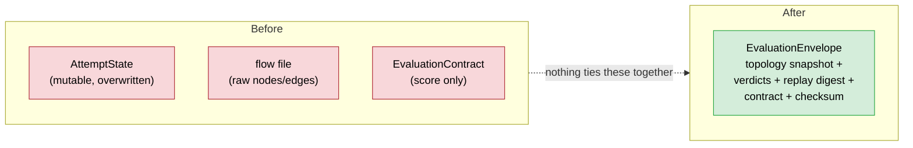
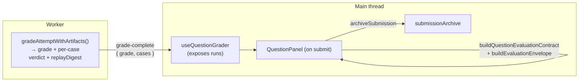

# Grading-Safe Persistence & the Evaluation Envelope

> **Branch:** `feat/grading-safe-persistence`
> **Theme:** Turn a *mutable, best-effort* attempt cache into a **sealed,
> tamper-evident, self-contained record of a submission** — one artifact that
> ties together the graded topology, the simulation verdicts, a replay digest,
> and the grade, and can prove it wasn't altered.

This is the first of the "open follow-ups" from
[doc 05](05-design-decisions-and-tradeoffs.md) to be built. It closes the gap
**D14 — best-effort persistence now, durable archive later**.

---

## 1. What this delivers

| Area | File | Purpose |
|------|------|---------|
| Shared hashing | `src/engine/analysis/stableHash.ts` | One home for canonical serialization + a wider integrity checksum |
| The sealed record | `src/engine/analysis/evaluationEnvelope.ts` | `EvaluationEnvelope` — build, seal, parse, verify |
| Durable archive | `src/renderer/src/utils/submissionArchive.ts` | Append-only, integrity-checked storage of envelopes |

Three new test suites cover the digest, the seal/verify/parse lifecycle, tamper
and identity rejection, replay attach/detach stability, and the archive's
append-only and corruption behaviour.

---

## 2. The problem — "a grade you can't trust later isn't a grade"

Before this work, two persistence paths existed and **neither** was grading-safe:

- **`questionAttemptPersistence.ts`** — a *mutable* `localStorage` cache of the
  in-progress `AttemptState`, **overwritten on every autosave**. Good for "don't
  lose my work on reload," useless as a record of *what was submitted*.
- **`useFlowPersistence.ts`** — saves the raw canvas file
  `{ version, nodes, edges, scenario }`. No `questionId`, no `attemptId`, no
  verdict, no grade.

And the grading output itself (`QuestionEvaluationContract`, doc 02) carries the
*score* but **not** the exact topology that produced it, **not** the simulation
verdicts, and **not** the replay. So nothing let you answer, months later:

> "Here is submission `sub-1837`. Prove this grade came from *this* topology, and
> show me the request-level trace that justifies it."

That question is the whole point of a grading platform — appeals, audits,
re-grades, reproducibility. The **evaluation envelope** exists to answer it.



---

## 3. The `EvaluationEnvelope`

The envelope is the **frozen record of one submission at grade time**:

```ts
interface EvaluationEnvelope {
  version: '1.0'
  submissionId: string
  questionId: string          // derived from the sealed contract
  questionVersion: string
  attemptId: string
  topologyId: string          // derived from the sealed contract
  topologySchemaVersion: string
  submittedAt: string
  evaluatedAt: string
  topologySnapshot: TopologyJSON            // the EXACT graded input, frozen
  cases: EvaluationEnvelopeCase[]           // verdict + replay digest per case
  contract: QuestionEvaluationContract      // the grade
  checksum: string                          // integrity seal over all of the above
}
```

*Reference: `src/engine/analysis/evaluationEnvelope.ts`.*

Each case carries the simulation result and a bounded replay summary:

```ts
interface EvaluationEnvelopeCase {
  caseId: string
  executionStatus: 'completed' | 'failed' | 'skipped'   // reused from the rubric engine (doc 03)
  verdict?: SimulationVerdict     // present when the case ran
  replayDigest?: ReplayDigest     // bounded summary of the request trace
  replay?: ReplayResult           // OPTIONAL full trace — excluded from the checksum
}
```

The design properties that make it *grading-safe*:

1. **Self-contained** — everything needed to re-derive or audit the grade is
   inside it. No external lookups.
2. **Sealed** — a `checksum` binds the contents; any later edit is detectable.
3. **Identity-consistent** — `questionId`/`topologyId` are copied *from the
   contract*, so the envelope can never claim to be about a different question
   than the grade it carries.
4. **Versioned & parseable** — `parseEvaluationEnvelope` validates it end-to-end.

---

## 4. Concept — the integrity checksum (tamper-evidence, not a signature)

The seal is `canonicalChecksum(...)` from the shared `stableHash` module.

### How it works
- **Canonical serialization first.** `stableSerialize` renders the value with
  **sorted keys**, so two structurally-equal envelopes always produce the same
  string — a prerequisite for a reproducible checksum (this is the same
  determinism principle as doc 02 §5).
- **A wider hash.** `canonicalChecksum` runs **four independent FNV-1a lanes**,
  each seeded differently and salted with the input length, and concatenates them
  into a 32-character (128-bit) hex digest. That is far more collision-resistant
  than the single 32-bit `stableHashToken` used for test IDs (doc 03 §6) — a
  single lane is fine to disambiguate an id, but too narrow to seal a whole
  document.

### Why *not* a cryptographic signature
This is an **integrity/reproducibility** primitive, not a security one. It detects
accidental drift (a schema change, a bad migration) and casual tampering (someone
hand-edits `localStorage`). It does **not** stop a motivated adversary who can
recompute the checksum after editing — defeating that needs a **server-side
signature** over the envelope, which is out of scope for a client-side artifact.
The doc and the code both say this plainly, because a checksum that *looks* like
security but isn't is worse than an honest one. (Same honesty principle as the
`'*'` origin fallback in doc 01.)

---

## 5. Concept — the bounded replay digest

The gap asked to tie *replay* into the record. But a full per-request replay
(`ReplayResult`, doc 01's engine) can be **huge** — thousands of lifecycles per
case. Embedding all of it in every envelope would blow through `localStorage`
quota almost immediately.

The resolution (the design fork resolved for this feature): **digest by default,
full replay on demand.**

```ts
interface ReplayDigest {
  lifecycleCount: number
  eventCountsByType: Record<CanonicalEventType, number>
  terminalStatusCounts: Record<TerminalRequestStatus, number>  // success/timeout/rejected/…
  eventStreamChecksum: string   // binds the exact event stream this digest came from
}
```

Two subtle but important rules make this work:

- **The full `replay` is excluded from the envelope checksum.** So attaching or
  detaching the heavy trace **never invalidates** the envelope. You can archive a
  small envelope now and hydrate the full trace later without breaking the seal.
- **The digest is included in the checksum, and it carries
  `eventStreamChecksum`.** So even though the full replay is unsealed, the digest
  *proves what the replay was* — if someone later swaps in a different trace, its
  `canonicalChecksum` won't match the sealed digest.

That is the crux: **bind the replay by reference (a hash), not by value (the whole
blob).** You get integrity over the trace without paying to store it in every
record.

---

## 6. Identity derived from the contract

`buildEvaluationEnvelope` does **not** accept `questionId`/`topologyId` as
free-form inputs — it copies them from the `contract` it seals:

```ts
questionId: input.contract.questionId,
topologyId: input.contract.topologyId,
```

And both `parseEvaluationEnvelope` and `verifyEvaluationEnvelope` re-check that
agreement. Why: an envelope is a *claim* ("this grade is for question X on
topology Y"). If those labels could be set independently of the grade, a
mislabelled envelope could attach a real grade to the wrong question. Deriving
identity from the single source of truth (the contract) makes that class of bug
impossible by construction — the same "one source of truth" reasoning behind
`flattenAttemptCheckRows` (doc 03 §5) and the host-alignment invariant (doc 02 §4).

---

## 7. Parsing vs verifying

Two entry points, deliberately different:

| Function | Behaviour | Use when |
|----------|-----------|----------|
| `parseEvaluationEnvelope(raw)` | **Throws** on any failure: bad shape, invalid carried contract, identity mismatch, or checksum mismatch | Ingesting from outside a trust boundary (a file, an API) |
| `verifyEvaluationEnvelope(envelope)` | **Returns `{ valid, reason? }`** — never throws | Iterating an archive that must degrade gracefully instead of aborting on one bad row |

The parser reuses `parseQuestionEvaluationContract` (doc 02) for the carried
contract, so the envelope inherits *all* of the contract's cross-field
invariants for free — it never re-implements grading validation.

---

## 8. The append-only submission archive

`submissionArchive.ts` is the durable half. It is intentionally the **opposite**
of the mutable attempt cache:

| | Attempt cache (existing) | Submission archive (new) |
|---|---|---|
| Mutability | Overwritten every autosave | **Never overwritten** |
| Keyed by | `questionId` (one slot) | `submissionId` (one slot *per submission*) |
| On corrupt read | Deletes the bad entry | **Keeps it** (reports null) |
| On read | Trusts it | **Verifies the checksum first** |

Key behaviours and their reasons:

- **Append-only.** A second `archiveSubmission` for an existing `submissionId`
  returns `{ stored: false, reason: 'already-archived' }` and leaves the original
  untouched. A submitted grade is a historical fact; overwriting it would erase
  history.
- **Per-question index.** Submission ids are tracked in an index list so
  `loadArchivedSubmissions(questionId)` can enumerate a student's attempts in
  order.
- **Verify on read.** Reads run `verifyEvaluationEnvelope` and return `null` for a
  failed seal — a tampered row is never silently trusted.
- **Never delete evidence.** A corrupt or tampered entry is reported as `null` but
  its bytes are **left in place**. An audit archive that erases the very rows an
  auditor needs is worse than useless.

> **Honest boundary:** the *storage medium* is still `localStorage`
> (best-effort, per-browser). What changed is that the *artifact* is now
> immutable and tamper-evident. True server-side durability is the next step
> (see §11) — but the envelope is designed so that moving it to a server is a
> transport change, not a redesign.

---

## 9. The `stableHash` refactor (reuse over duplication)

`stableSerialize` / `stableHashToken` / `hostSafeToken` previously lived
*privately* inside `question.ts`. They were extracted verbatim into
`stableHash.ts` and `question.ts` now imports them. Behaviour is unchanged
(every test id is byte-identical — the full suite proves it).

Why bother: the envelope needed the exact same canonical serialization the rest
of the analysis layer uses. Copy-pasting it would have created two definitions of
"canonical" that could silently diverge — precisely the drift the platform works
hard to avoid. One serialization primitive, one source of truth.

---

## 10. Design decisions & trade-offs

Weighed against the same criteria as [doc 05](05-design-decisions-and-tradeoffs.md)
(Determinism, Honesty, Evolvability, Isolation, Reviewability, Shippability).
These are logged there as **D16–D19**.

| # | Decision | Criteria | Trade-off accepted |
|---|----------|----------|--------------------|
| **D16** | Seal the envelope with a wide **non-cryptographic checksum** | Determinism, Honesty | Detects drift/casual tampering, **not** a motivated adversary — that needs a server signature |
| **D17** | **Digest by default, full replay on demand**; bind replay by hash, not value | Shippability, Honesty | Full trace isn't in every record; you re-attach it when needed |
| **D18** | **Append-only** archive; never overwrite, never delete corrupt rows | Honesty | Storage grows with submissions; pruning is a separate, deliberate policy |
| **D19** | Derive envelope **identity from the sealed contract** | Honesty | Callers can't label an envelope independently (by design) |

---

## 11. Wiring it into the submit flow (now live)

The machinery above is only useful if a real submission actually produces and
archives an envelope. That wiring now exists end-to-end.

The hard part was **getting the per-case verdict and replay digest out of the
grader** — grading runs in a Web Worker, and the events that a digest is built
from (`SimulationOutput.eventStream`) live *inside* that worker. Posting whole
event streams back to the main thread would be exactly the "bind by value"
mistake §5 warns against. So the digest is computed **where the events already
are**, and only the small result crosses the boundary:



The pieces:

- **`gradeAttemptWithArtifacts(pkg, topology, runTopology)`** (engine) grades as
  before but also returns one `AttemptCaseRun` per case — `{ caseId,
  executionStatus, verdict?, replayDigest? }`. It reuses `evaluateSuite`'s
  verdicts and captures each run's output via a wrapping `runTopology` (keyed by
  the prepared-topology object, so it stays correct even when a case throws).
  `gradeAttempt` is now a thin wrapper (`.grade`) — the CLI pays nothing for
  artifacts it ignores.
- **The worker** returns `{ grade, cases }` in `grade-complete`; **the grader
  hook** exposes `runs` alongside `grade`.
- **`QuestionPanel`** on *submit* (never on dry-run) builds the contract, seals
  the envelope (`buildEvaluationEnvelope`), and calls `archiveSubmission` — all in
  a `try/catch` so archiving can never block the submit/host handshake. A small
  "Archived: N" indicator surfaces the count.

Two deliberate guards worth noting: the digest is only built when an event stream
is actually present (a case that never ran, or a fake output in a test, yields no
digest — never a crash), and archiving is best-effort by design (see §8).

---

## 12. What is intentionally *not* done yet

Being honest about the boundary (a habit of this codebase):

- **Client-side storage only.** `localStorage` is not durable across devices or
  tamper-proof against a determined user. The envelope is *designed* for a
  server/DB backend; moving it there is transport, not redesign.
- **No retention/pruning policy.** Append-only means unbounded growth until a
  policy is defined.
- **Full replay is never captured yet** — only the digest. The schema supports
  attaching it later (§5) without breaking the seal, but no code path stores the
  full trace today.

---

## 13. What to take away

1. **A grade is only as trustworthy as your ability to reproduce it.** The
   envelope makes a submission self-contained and tamper-evident.
2. **Bind heavy data by reference, not by value.** The replay digest seals the
   trace via a hash without storing it.
3. **Immutability is a feature, not an accident** — append-only, verify-on-read,
   never-delete-evidence are what make it an *archive* rather than a cache.
4. **Integrity ≠ security.** The checksum is honest about being tamper-*evident*,
   not tamper-*proof*.
5. **One canonical serialization** for the whole analysis layer — reused, never
   duplicated.

**Related:** [doc 05 — Design Decisions](05-design-decisions-and-tradeoffs.md)
(D16–D19), and the architecture spec's forward-looking view of durable
persistence.
