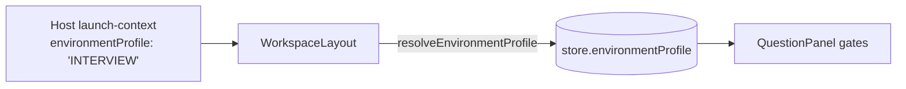

# The Presentation Layer — EnvironmentProfile

> **Theme:** The fourth layer of the platform. An **EnvironmentProfile** is a
> *visibility + capability lens* applied over one shared `QuestionPackage`, so the
> same question runs — unchanged, graded by the same pipeline — as a full
> authoring surface, a locked-down graded contest, or a relaxed learning
> exercise.

This builds the "EnvironmentProfile" follow-up from the mental model
([README](README.md)) and [doc 05](05-design-decisions-and-tradeoffs.md).

---

## 1. Why a separate layer

Recall the governing invariant: **`QuestionPackage` = WHAT**, **`AttemptState` =
the student's work**, and now **`EnvironmentProfile` = HOW MUCH IS SHOWN**. The
grading pipeline is shared by all of them. A question about a URL shortener is one
piece of content; whether the student sees the rubric live, gets three test runs,
or edits the scaffold is *presentation*, not content — and must not require
forking the question or the grader.

```
QuestionPackage("Design a URL shortener")
  + EnvironmentProfile(AUTHOR)    → authoring / testing surface
  + EnvironmentProfile(INTERVIEW) → graded contest, rubric hidden until submit
  + EnvironmentProfile(LEARN)     → self-paced practice, live feedback, ungraded
```

---

## 2. The contract

`src/engine/analysis/environmentProfile.ts`:

```ts
interface EnvironmentProfile {
  mode: 'AUTHOR' | 'INTERVIEW' | 'LEARN'
  visibility: {
    prompt: boolean
    scaffoldSourceNodes: boolean
    gradingSuiteDetails: boolean
    liveMetrics: boolean
    rubricChecks: 'HIDDEN' | 'LIVE_DURING_BUILD' | 'POST_SUBMIT_ONLY'
  }
  capabilities: {
    editPaletteList: string[] | null   // null = all, [] = none
    canEditScaffoldNodes: boolean
    canTriggerTestRuns: boolean
    maxTestRuns?: number               // undefined = unlimited
  }
  graded: boolean
  chromeDensity: 'full' | 'minimal'
}
```

Two axes — **visibility** (what the student can *see*) and **capabilities** (what
they can *do*) — plus `graded` and `chromeDensity`.

---

## 3. The three presets

| Field | AUTHOR | INTERVIEW | LEARN |
|-------|--------|-----------|-------|
| `visibility.rubricChecks` | LIVE_DURING_BUILD | **POST_SUBMIT_ONLY** | LIVE_DURING_BUILD |
| `visibility.gradingSuiteDetails` | true | **false** | true |
| `capabilities.canEditScaffoldNodes` | true | **false** | true |
| `capabilities.maxTestRuns` | unlimited | **3** | unlimited |
| `graded` | true | true | **false** |
| `chromeDensity` | full | minimal | minimal |

**Note on AUTHOR + `graded`.** The spec matrix lists AUTHOR as *ungraded*; here
AUTHOR is set `graded: true`. AUTHOR doubles as the standalone dev/testing mode,
where exercising the grade → seal → archive path (docs 06) is exactly what you
want. This is a deliberate, documented deviation.

---

## 4. Resolving a profile — total and safe

Hosts send either a mode string (`"INTERVIEW"`) or a partial override
(`{ mode: 'INTERVIEW', capabilities: { maxTestRuns: 1 } }`). `resolveEnvironmentProfile`
turns *anything* — including `unknown` / malformed input — into a complete
profile:

```ts
resolveEnvironmentProfile()                              // → AUTHOR (default)
resolveEnvironmentProfile('LEARN')                       // → LEARN preset
resolveEnvironmentProfile({ mode: 'LEARN', graded: true })// → LEARN, graded flipped
resolveEnvironmentProfile(42)                            // → AUTHOR (safe fallback)
```

It is **total and never throws**: a malformed launch payload falls back to the
default profile rather than breaking question mode (same "absence is never
success, but never crash the student" posture as the rest of the platform). Unknown
keys are stripped, so a richer future host payload still resolves.

---

## 5. Where the profile lives and how it flows



- The **store** holds the *resolved* profile, defaulting to AUTHOR (so the
  standalone app is unaffected).
- **WorkspaceLayout** resolves the launch payload's `environmentProfile` on a
  valid launch-context and sets it; it resets to AUTHOR when the question closes.
- **QuestionPanel** reads it and applies the gates.

---

## 6. The gates applied in this slice

Two pure helpers make the decisions (unit-tested, DOM-free):

- `shouldShowRubricResults(profile, { hasSubmittedGrade })` — HIDDEN → never;
  LIVE_DURING_BUILD → always; POST_SUBMIT_ONLY → only once a *submitted* grade
  exists.
- `canTriggerTestRun(profile, { testRunCount })` — false if disabled, or once
  `testRunCount` reaches `maxTestRuns`.

Applied in `QuestionPanel`:

| Gate | Behaviour |
|------|-----------|
| **Rubric timing** | In INTERVIEW the checklist + summary are masked ("revealed after you submit") until a submission exists; HIDDEN hides them entirely; LIVE shows them as before. |
| **Test-run limit** | The Test button disables at the cap and shows "N left"; unlimited modes show no suffix. |
| **Graded submit** | The Submit button only renders when `graded` — LEARN has no submit-for-grade, and only graded modes seal + archive an envelope. |
| **Prompt visibility** | When `visibility.prompt` is false the Brief tab and its content are hidden and the panel shows Tests only. |
| **Palette allowlist** | `capabilities.editPaletteList` filters the component library (`LibrarySidebar`) to the allowed node types/ids; `null` = all. Curates the palette for INTERVIEW. |
| **Chrome density** | `chromeDensity: 'minimal'` drops the authoring file operations (Open/Save/Auto-Layout + file status) from the header for a cleaner INTERVIEW/LEARN surface. |
| **Scaffold lock** | `capabilities.canEditScaffoldNodes: false` locks the question's scaffold nodes — the store drops their deletions and no-ops their edits (unbypassable); `visibility.scaffoldSourceNodes` badges them. See §6.5. |
| **Live metrics** | `visibility.liveMetrics: false` suppresses the runtime metric overlays via one chokepoint (`useNodeMetrics` reports no runtime) and hides the metric-lens switcher/legend. |
| **Grading-suite details** | `visibility.gradingSuiteDetails` (AND the author's `suite.visibleToStudent`) reveals a compact list of the suite cases + their condition overrides in the brief; hidden in INTERVIEW. |

### 6.5 Scaffold lock — provenance + unbypassable enforcement

`canEditScaffoldNodes` and `scaffoldSourceNodes` needed a **node-provenance**
mechanism first: a node is "scaffold-provided" iff its id is in the active
question's partial-scaffold topology. That set (`scaffoldNodeIds`) is derived
canonically in the store's `setActiveQuestion`, so it is independent of whatever a
resumed attempt happened to load.

Enforcement lives at the **store chokepoints**, not the UI, so no interaction path
can bypass it:

- `onNodesChange` drops `remove` changes for a locked scaffold node.
- `updateNodeData` no-ops for a locked scaffold node.

A node is *locked* when it is a scaffold node **and** the profile's
`canEditScaffoldNodes` is false. The cues: `BaseNode` shows a **lock badge** on
locked nodes (and a subtler "scaffold" badge when `scaffoldSourceNodes` is on but
editing is allowed), and the properties panel shows a **locked banner**.

Dragging a locked node is left free — position is cosmetic and doesn't affect
grading.

### 6.6 Host lifecycle commands — `reset` / `lock` / `reveal`

The profile decides the *initial* posture; the host can drive the attempt
mid-session with a single origin-validated inbound message
(`ns-simulator:command`, `command: 'reset' | 'lock' | 'reveal'`), parsed by
`parseQuestionCommandMessage` and handled in `WorkspaceLayout` **only after the
launch handshake locked a trusted origin** (doc 07):

- **`reveal`** — force rubric results visible regardless of the profile's timing
  (a store `resultsRevealed` flag OR-ed into `shouldShowRubricResults`). Used to
  release results after a contest ends.
- **`lock`** — freeze the attempt (`lockAttempt` → status `LOCKED`). Test/Submit
  disable, autosave stops, and the **whole canvas freezes** — the same store
  chokepoints that enforce the scaffold lock (§6.5) also block *all*
  delete/edit/add while `LOCKED`. Used at "time's up."
- **`reset`** — reload the scaffold topology and start a fresh, unlocked `DRAFT`
  attempt (clearing reveal). Used to let a student start over.

`reset` and `reveal` clear on the next launch and on question close, so a reused
frame never carries stale lifecycle state.

---

## 7. Coverage — every field is now applied

The layer started as a typed contract with only the highest-signal gates wired
(§6); the rest were applied in follow-up slices. **All `EnvironmentProfile` fields
are now respected in the UI:**

| Field | Where |
|-------|-------|
| `visibility.prompt` / `rubricChecks` | §6 (brief tab, rubric timing) |
| `visibility.liveMetrics` | §6 (metric overlays + lens switcher) |
| `visibility.gradingSuiteDetails` | §6 (grading-suite section) |
| `visibility.scaffoldSourceNodes` | §6.5 (scaffold badge) |
| `capabilities.editPaletteList` | §6 (palette allowlist) |
| `capabilities.canEditScaffoldNodes` | §6.5 (scaffold lock) |
| `capabilities.canTriggerTestRuns` / `maxTestRuns` | §6 (test-run gate) |
| `graded` | §6 (graded submit) |
| `chromeDensity` | §6 (minimal header) |
| host lifecycle (`reset`/`lock`/`reveal`) | §6.6 |

Deeper follow-ups remain possible (e.g. richer minimal-chrome layouts, or locking
scaffold-node *dragging*), but no field is unwired.

---

## 8. Design decisions & trade-offs

Logged in [doc 05](05-design-decisions-and-tradeoffs.md) as **D23–D25**.

| # | Decision | Criteria | Trade-off |
|---|----------|----------|-----------|
| **D23** | A profile is a lens over one QuestionPackage, not a question variant | Isolation, Evolvability | Every gated surface must consult the profile rather than hardcoding a mode |
| **D24** | `resolveEnvironmentProfile` is total & safe (bad input → default) | Honesty, Shippability | A malformed profile silently degrades to AUTHOR rather than erroring |
| **D25** | AUTHOR is `graded: true` (deviates from the spec matrix) | Shippability | AUTHOR/standalone can exercise the graded path; differs from the spec's "AUTHOR ungraded" |

---

## 9. What to take away

1. **Presentation is a lens, not a fork.** One question, one grader, three
   experiences — selected by a profile.
2. **Resolve untrusted config totally and safely** — a bad profile must never
   break the student's session.
3. **Keep the gate decisions pure** (`shouldShowRubricResults`,
   `canTriggerTestRun`) so they're testable away from the UI.
4. **A complete contract lets you ship gates incrementally** — the unapplied
   fields are follow-ups, not blockers.

**Related:** [doc 05 — Design Decisions](05-design-decisions-and-tradeoffs.md)
(D23–D25), [doc 06](06-grading-safe-persistence-and-the-evaluation-envelope.md)
(the graded path AUTHOR exercises), and the architecture spec's Layer 3.
