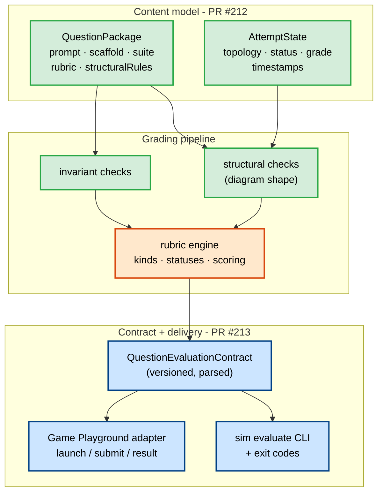

# Question & Grading Platform Hardening - A Learning Guide

> A PR-by-PR, concept-first walkthrough of how the NS Simulator became a
> deterministic **question and grading platform**, delivered as three stacked
> pull requests: **#212 → #213 → #214**.

This guide is written for *understanding and learning*. Each document follows the
same rhythm - **What → How it works → Why (design rationale & criteria) →
Trade-offs** - and links back to the exact source files so you can read the code
alongside the prose.

For the high-level, staff-level architecture spec, see
[`specs/rubric-engine-and-question-platform-architecture.md`](../../specs/rubric-engine-and-question-platform-architecture.md).
This guide is the *implementation companion* to that spec: it explains what was
actually built, in what order, and why each decision was made.

---

## The documents in this set

| # | Document | What it covers |
|---|----------|----------------|
| - | **README.md** (this file) | The arc, the mental model, the merge order, and a full glossary |
| 01 | [PR #212 - Question Platform Foundation](01-pr212-question-platform-foundation.md) | `QuestionPackage`, `AttemptState`, structural & invariant checks, iframe-embed hardening |
| 02 | [PR #213 - Evaluation Contract & CLI](02-pr213-evaluation-contract-and-cli.md) | The versioned evaluation contract, parsers, CLI grading, exit-code taxonomy, Game Playground adapter |
| 03 | [PR #214 - Rubric Engine Hardening](03-pr214-rubric-engine-hardening.md) | Check kinds & statuses, execution rows, short-circuit skip semantics, hashed test IDs |
| 04 | [Rebase & Contract Reconciliation](04-rebase-and-contract-reconciliation.md) | How #214 was restacked onto #213 and the overlap resolved (the operational story) |
| 05 | [Design Decisions & Trade-offs](05-design-decisions-and-tradeoffs.md) | A consolidated decision log with the criteria behind each choice |
| 06 | [Grading-Safe Persistence & the Evaluation Envelope](06-grading-safe-persistence-and-the-evaluation-envelope.md) | The immutable, tamper-evident submission record: envelope, integrity checksum, replay digest, append-only archive |
| 07 | [Production Embed Runtime & Origin Security](07-production-embed-runtime-and-origin-security.md) | Hardening the iframe seam: trusted-origin handshake, configured-allowlist-vs-TOFU policy, no `'*'` for sensitive messages |
| 08 | [The Presentation Layer - EnvironmentProfile](08-environment-profile-presentation-layer.md) | The visibility + capability lens (AUTHOR/INTERVIEW/LEARN) over one QuestionPackage: presets, safe resolver, applied gates |

Read them in order for a narrative, or jump to a PR you care about - each stands
alone, with the glossary below as a shared reference.

---

## The one-paragraph story

The simulator could already *run* a topology and produce metrics. These three
PRs turned that engine into something a learning platform can build questions on:
**#212** introduced the content model (what a question *is*) and the student's
attempt lifecycle, plus the structural checks that grade a *diagram* rather than
a *simulation*. **#213** wrapped grading in a **versioned, machine-readable
contract**, exposed it through a scriptable CLI, and added an adapter so an
external host (the Game Playground) can launch and receive results without
coupling to our internals. **#214** hardened the rubric engine itself so grading
is **deterministic, honest about what it did and did not evaluate** (passed vs
failed vs *skipped*), and traceable through stable test IDs.

---

## The mental model - four layers over one pipeline

The platform is best understood as **four layers of responsibility** stacked over
**one shared grading pipeline**. Each layer has a single job and a clean contract
with its neighbours.

```
CONTENT          QuestionPackage    ── WHAT the question is (prompt, scaffold, suite, rubric)
   │
ATTEMPT          AttemptState       ── the student's evolving build + submit lifecycle
   │
GRADING          topology → structural → evaluate(suite) → rubric → score
   │
PRESENTATION     EnvironmentProfile ── HOW MUCH of all this is shown / editable
```

The governing invariant:

- **`QuestionPackage` = WHAT** - the fixed content of a question.
- **`AttemptState` = THE STUDENT'S WORK** - mutable, versioned, lifecycle-driven.
- **`EnvironmentProfile` = HOW MUCH IS SHOWN** - author vs contest vs learn.
- **The grading pipeline is shared** - the same code grades every question in
  every environment.



Colour = the PR that delivered each piece. Notice the rubric engine (orange,
#214) sits in the *middle* of an already-wired pipeline - that is exactly why
#214's changes rippled into the contract fixtures and required the reconciliation
described in document 04.

---

## Merge order - and why it mattered

The three branches were a **stack**, not three independent features:

```
master
  └── #212  feat/question-platform-hardening   (foundation)
        └── #213  feat/sim-evaluate-contract    (contract + CLI, built ON #212)
        └── #214  feat/rubric-check-hardening    (rubric hardening, also branched from #212)
```

#213 and #214 both branched from #212 and both edited the **same grading
surface** (`evaluationContract.ts`, `question.ts`, `rubric.ts`, `cli/index.ts`).
That overlap is why the merge order had to be deliberate:

1. Merge **#212** (the shared base).
2. Merge **#213** (the contract everyone else must speak).
3. **Rebase #214 onto the post-#213 tree**, resolve the overlap, then merge #214.

All three are now merged into `master`. The rebase-and-reconcile step is a
first-class part of the story - see
[document 04](04-rebase-and-contract-reconciliation.md).

---

## Glossary

Concepts used throughout this set. Each is explained in depth in the document
noted in the last column.

| Term | Meaning | Detailed in |
|------|---------|-------------|
| **QuestionPackage** | The immutable definition of a question: `prompt`, `scaffold`, `suite` (test cases), `rubric`, optional `structuralRules`, `constraints`, metadata. | 01 |
| **AttemptState** | A student's work on a question: their topology, a `status` in the attempt lifecycle, timestamps, and the last `grade`. | 01 |
| **Attempt lifecycle** | The state machine `DRAFT → AUTOSAVED → SUBMITTED → GRADING → GRADED` (with `LOCKED`). | 01 |
| **Scaffold** | The starting topology a student is given: `empty`, `partial` (a seed diagram), etc. | 01 |
| **Suite / Case** | A named set of simulation *cases* (e.g. `baseline`, `peak`) a submission is run against. | 01 |
| **Structural check** | A check on the *diagram shape*, not the simulation - e.g. "requires a load balancer". Runs before any simulation. | 01 |
| **Invariant check** | A check on a condition that must always hold (parsed from a condition string). | 01 |
| **Host contract** | The thin `{ tests, totalTests, passedTests, allPassed }` projection handed to an embedding host / UI. | 01, 02 |
| **iframe embed** | The simulator running inside a host page's `<iframe>`, communicating via `postMessage`. | 01 |
| **`origin` / `targetOrigin`** | Browser security fields on `postMessage`; controlling them prevents cross-origin message leakage. | 01, 05 |
| **Evaluation contract** | The versioned, machine-readable result of grading a submission (`QuestionEvaluationContract`) - the platform's public grading API. | 02 |
| **Versioned contract** | A payload that carries a `version` literal so producers and consumers can evolve independently. | 02, 05 |
| **`superRefine` / parser** | Zod's cross-field validation hook; used to enforce invariants (e.g. summary counts must match the tests) at parse time. | 02 |
| **Host-alignment invariant** | The rule that `host.tests` must be an exact projection of the derived `tests` (same length, ids, pass flags). | 02, 04 |
| **Deterministic output** | Grading the same inputs always yields byte-identical output (stable ordering, no wall-clock, optional timestamps). | 02, 05 |
| **Exit-code taxonomy** | The CLI's mapping of *outcome category* → *process exit code* (0/1/2/3/4). | 02 |
| **Adapter / anti-corruption layer** | `gamePlayground.ts` - translates between our internal contract and the external host's payloads so neither leaks into the other. | 02, 05 |
| **Frozen fixture** | A checked-in JSON snapshot of expected contract output, asserted against by tests. | 02, 04 |
| **Check kind** | The category of a rubric check result: `topology`, `simulation`, `invariant`, or the synthetic `execution`. | 03 |
| **Check status** | The outcome of a check: `passed`, `failed`, or **`skipped`**. | 03 |
| **Execution row** | A synthetic per-case check (`__execution__`) recording whether the case's simulation actually completed. | 03 |
| **Short-circuit / skip semantics** | When a gating check fails (e.g. structural), downstream checks are marked **skipped**, not **failed**. | 03, 05 |
| **`flattenAttemptCheckRows`** | The single function that flattens a grade into the ordered, deduplicated list of test rows everything else derives from. | 03 |
| **Stable hashed test ID** | A deterministic, host-safe ID like `case.baseline-1bps56q.simulation.err-u4ovu4`, combining a slug and a content hash. | 03, 05 |
| **`rebase --onto`** | The Git operation used to replay #214's commits onto the post-#213 tree. | 04 |
| **`--force-with-lease`** | A safer force-push that aborts if the remote moved unexpectedly. | 04 |
| **EvaluationEnvelope** | The sealed, immutable record of one submission: frozen topology snapshot + verdicts + replay digest + contract + checksum. | 06 |
| **Integrity checksum** | A wide, non-cryptographic content hash (`canonicalChecksum`) that makes an envelope tamper-*evident* (drift/casual edits), not tamper-*proof*. | 06 |
| **Replay digest** | A bounded per-case summary of the request trace (counts + an event-stream checksum) that binds the full replay by reference rather than storing it. | 06 |
| **Append-only archive** | Durable submission storage that never overwrites, verifies on read, and never deletes corrupt rows. | 06 |
| **Trusted host origin** | The single parent origin a framed simulator locks onto (via config or first valid launch) and thereafter targets/accepts. | 07 |
| **Trust-on-first-use (TOFU)** | Trusting the origin of the first valid launch-context when no allowlist is configured. | 07 |
| **`targetOrigin`** | The `postMessage` argument that restricts which origin may receive a message; `'*'` means "any", a data-leak risk for sensitive payloads. | 07 |
| **EnvironmentProfile** | The presentation lens (mode + visibility + capabilities + graded + chromeDensity) applied over one QuestionPackage. | 08 |
| **Profile mode** | AUTHOR / INTERVIEW / LEARN - the three presets a profile resolves from. | 08 |
| **Visibility / capability gate** | A UI decision (show rubric now? allow another test run?) derived from the resolved profile. | 08 |

---

## How to use this guide

- **New to the platform?** Read README → 01 → 02 → 03 in order.
- **Reviewing the grading semantics?** Jump to 03, then 05.
- **Trying to understand the messy git history?** Read 04.
- **Making a new design decision?** Read 05 first - it records the criteria that
  earlier decisions were weighed against, so you stay consistent.
