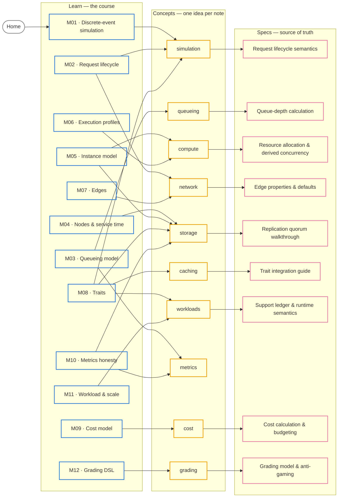

> The big picture the graph view can't give you: which **module** teaches which
> **concept cluster**, and which **spec** is the source of truth behind it. Read it
> left to right. Every box is a link.

Each arrow comes from the notes themselves: a module → cluster arrow means that
cluster's concept notes say they are **Taught in** that module, and a cluster →
spec arrow is the spec those notes cite. The metrics notes cite no single spec,
so the metrics cluster has none; start from [[m10-metrics-honesty|M10]].

## The same thing, as a table

| Cluster | Taught in | Source of truth | Map |
|---|---|---|---|
| simulation | [[m01-discrete-event-simulation\|M01]] · [[m02-request-lifecycle\|M02]] · [[m08-traits\|M08]] | [[arrival-departure-and-request-lifecycle-semantics]] | [[maps/simulator-physics\|Simulator Physics]] |
| queueing | [[m03-queueing-model\|M03]] | [[queue-depth-calculation]] | [[maps/simulator-physics\|Simulator Physics]] |
| compute | [[m05-instance-model\|M05]] · [[m06-execution-profiles\|M06]] | [[resource-allocation-and-derived-concurrency]] | [[maps/simulator-physics\|Simulator Physics]] |
| network | [[m07-edges\|M07]] · [[m02-request-lifecycle\|M02]] | [[edge-properties-and-defaults]] | [[maps/simulator-physics\|Simulator Physics]] |
| storage | [[m04-nodes-service-time\|M04]] · [[m05-instance-model\|M05]] · [[m08-traits\|M08]] · [[m10-metrics-honesty\|M10]] | [[replication-quorum-state-machine-walkthrough]] | [[maps/distributed-systems\|Distributed Systems]] |
| caching | [[m08-traits\|M08]] | [[trait-integration-guide]] | [[maps/distributed-systems\|Distributed Systems]] |
| workloads | [[m11-workload-scale\|M11]] · [[m08-traits\|M08]] | [[support-ledger-and-runtime-semantics]] | [[maps/distributed-systems\|Distributed Systems]] |
| metrics | [[m10-metrics-honesty\|M10]] · [[m03-queueing-model\|M03]] | — | [[maps/performance\|Performance]] |
| cost | [[m09-cost-model\|M09]] | [[cost-calculation-and-budgeting]] | [[maps/simulator-physics\|Simulator Physics]] |
| grading | [[m12-grading-dsl\|M12]] | [[question-grading-model-and-anti-gaming]] | [[maps/authoring-grading\|Authoring & Grading]] |

**Not on the diagram:** the platform modules ([[m13-environment-profiles|M13]],
[[m14-frontend|M14]], [[m15-newton-integration|M15]]) and the
[[capstone|Capstone]] teach tooling rather than a concept cluster. The worked
problems live in [[problems/_moc|Practice on Problems]], and every spec is in
[[reference/README|Reference]].
