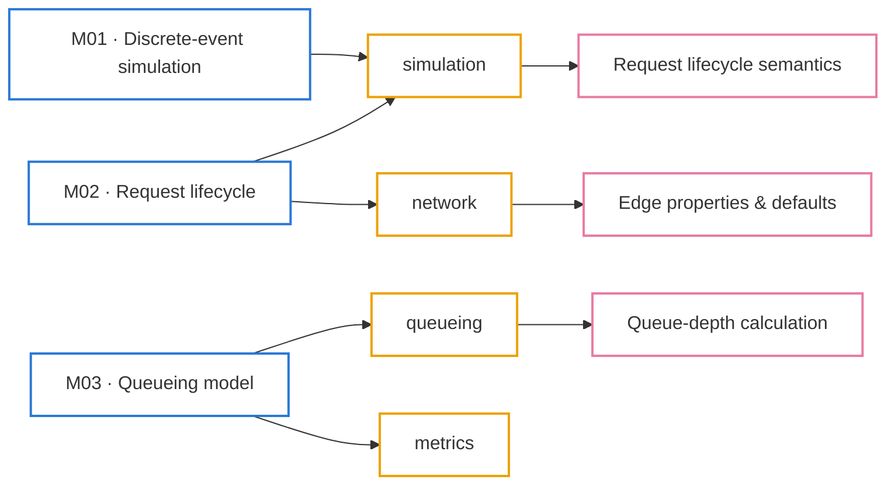
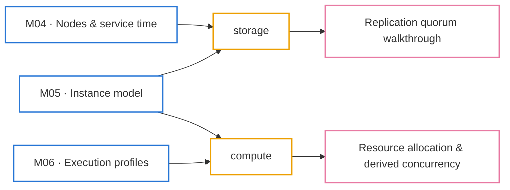
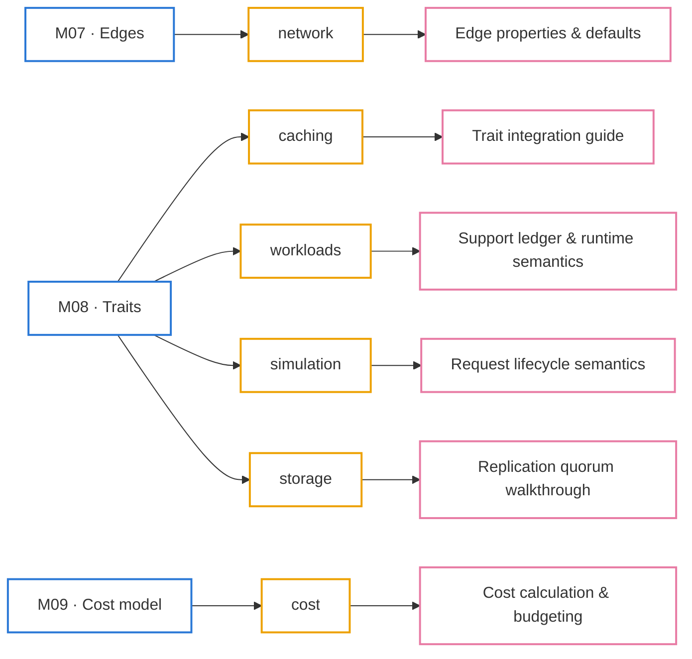
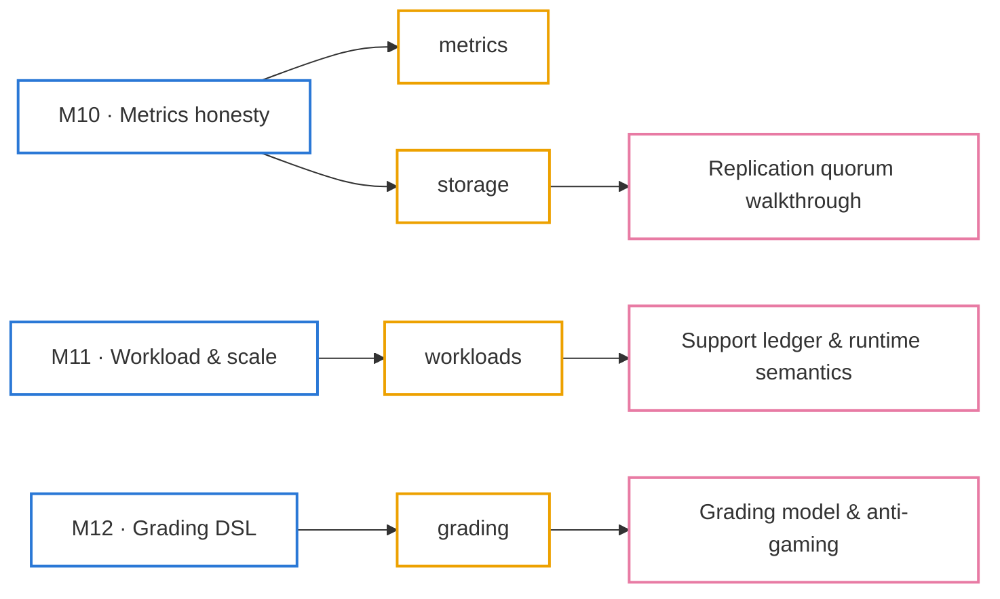

> The big picture the graph view can't give you: which **module** teaches which
> **concept cluster**, and which **spec** is the source of truth behind it.

**How to read it.** The course in [[learn/_moc|Learn]] is 16 modules, M00 to M15
(M = module). Read them in number order: each one builds only on the ones before it. The course has three parts (Part II is
split in two to keep it readable), and each gets a diagram below: modules on the left (blue) in reading order,
the concept clusters they teach in the middle (yellow), and the spec behind each
cluster on the right (pink). Every box is a link.

## Part I - Core physics engine
How time, requests and queues work.

[[m00-orientation|M00]] is orientation and doesn’t teach a concept cluster, so it is left off the diagram.

## Part II - Node & edge mechanics (M04–M06)
What a node is and how much work it can do at once.

## Part II - Node & edge mechanics (M07–M09)
What edges and traits add, and what it all costs.

## Part III - Metrics, grading & authoring
Measuring honestly, and turning it into a graded question.

[[m13-environment-profiles|M13]], [[m14-frontend|M14]], [[m15-newton-integration|M15]] are platform tooling and don’t teach a concept cluster, so they are left off the diagram.

The arrows come from the notes themselves: a module → cluster arrow means that
cluster's concept notes say they are **Taught in** that module, and a cluster →
spec arrow is the spec those notes cite. The metrics notes cite no single spec,
so the metrics cluster has none; start from [[m10-metrics-honesty|M10]].

## The same thing, as a table

| Cluster | Taught in | Source of truth | Map |
|---|---|---|---|
| simulation | [[m01-discrete-event-simulation\|M01]] · [[m02-request-lifecycle\|M02]] · [[m08-traits\|M08]] | [[arrival-departure-and-request-lifecycle-semantics]] | [[maps/simulator-physics\|Simulator Physics]] |
| queueing | [[m03-queueing-model\|M03]] | [[queue-depth-calculation]] | [[maps/simulator-physics\|Simulator Physics]] |
| compute | [[m05-instance-model\|M05]] · [[m06-execution-profiles\|M06]] | [[resource-allocation-and-derived-concurrency]] | [[maps/simulator-physics\|Simulator Physics]] |
| network | [[m02-request-lifecycle\|M02]] · [[m07-edges\|M07]] | [[edge-properties-and-defaults]] | [[maps/simulator-physics\|Simulator Physics]] |
| storage | [[m04-nodes-service-time\|M04]] · [[m05-instance-model\|M05]] · [[m08-traits\|M08]] · [[m10-metrics-honesty\|M10]] | [[replication-quorum-state-machine-walkthrough]] | [[maps/distributed-systems\|Distributed Systems]] |
| caching | [[m08-traits\|M08]] | [[trait-integration-guide]] | [[maps/distributed-systems\|Distributed Systems]] |
| workloads | [[m08-traits\|M08]] · [[m11-workload-scale\|M11]] | [[support-ledger-and-runtime-semantics]] | [[maps/distributed-systems\|Distributed Systems]] |
| metrics | [[m03-queueing-model\|M03]] · [[m10-metrics-honesty\|M10]] | - | [[maps/performance\|Performance]] |
| cost | [[m09-cost-model\|M09]] | [[cost-calculation-and-budgeting]] | [[maps/simulator-physics\|Simulator Physics]] |
| grading | [[m12-grading-dsl\|M12]] | [[question-grading-model-and-anti-gaming]] | [[maps/authoring-grading\|Authoring & Grading]] |

The [[capstone|Capstone]] comes after M15. The worked problems (P01–P13) live
in [[problems/_moc|Practice on Problems]], and every spec is in [[reference/README|Reference]].
