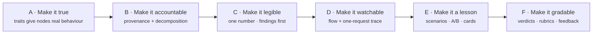
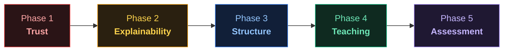
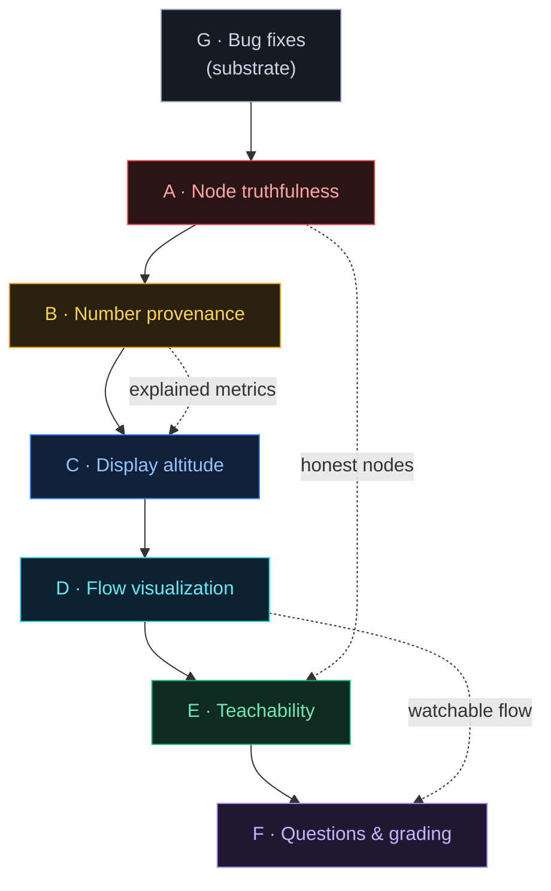

> [!abstract] The roadmap in one line
> The simulator computes queueing numbers correctly but cannot yet answer **"why is
> this number what it is"** for anything on screen - nodes don't behave like what they
> claim to be, numbers appear without provenance, and the UI renders everything at
> maximum detail all the time. The roadmap fixes those three, in order.

_Adapted from the interactive reference at `planning/roadmap-reference.html`. This is
the **execution plan** (how the product gets built); for the **learning curriculum**
see [[learn/_moc|Modules]]._

## The diagnosis - 3 root causes

| # | Root cause | What it means |
|---|------------|---------------|
| 1 | **Nodes aren't true** | a node's behaviour keys off its *label*, not its *type* - a "cache" may not cache |
| 2 | **Numbers without provenance** | a metric shows a value but not *why* it has that value, nor its limit |
| 3 | **No display altitude** | every panel renders at max detail always - findings are buried in clutter |

## The amplification chain - how the workstreams compose

Each workstream makes the last one *legible*: you can't explain a number (B) until the
node is true (A); you can't teach (E) until you can watch it (D); you can't grade (F)
until the lesson exists (E).

## The five phases - why this order

| Phase | Theme | Tasks | Why it comes here |
|-------|-------|-------|-------------------|
| **1 - Trust** | 🔴 the model is honest | A1 A8 A2 A3 A4 · B3 · G1 G2 | nothing else matters until the numbers are real |
| **2 - Explainability** | 🟠 every number has a why | B1 B2 · A5 · B4 · G3 | provenance turns correct numbers into *understood* numbers |
| **3 - Structure** | 🔵 findings first, detail on demand | C1 C2 C6 C3 C4 C5 | altitude makes the honest, explained numbers *legible* |
| **4 - Teaching** | 🟢 features become lessons | E1 E2 · D1 D2 · E3 · A6 | flow + scenarios compose the primitives into learning |
| **5 - Assessment** | 🟣 designs are graded | F1 F2 · E4 · A7 · F3 | verdicts + rubrics are the endgame - the LeetCode loop |

## The seven workstreams

| ID | Workstream | Focus | Lands in phase |
|----|------------|-------|----------------|
| 🔴 **A** | Node Truthfulness | the trait system - behaviour keys off type, not name | 1 (mostly), 2, 4, 5 |
| 🟠 **B** | Number Provenance | "no number without a why" - provenance + decomposition | 1, 2 |
| 🔵 **C** | Display Altitude | structure, not clutter - one number, findings first | 3 |
| 🟦 **D** | Flow Visualization | watch the system move - flow + one-request trace | 4 |
| 🟢 **E** | Teachability Content | composing features into lessons - scenarios, A/B, cards | 4, 5 |
| 🟣 **F** | Questions & Grading | the endgame - verdicts, rubrics, feedback | 5 |
| ⬜ **G** | Bug Fixes | the substrate everything else stands on | 1, 2 |

## Governing principles - 35, in six families

> [!info]- A - Truth of the model
> - **Nodes must be true** - a component behaves like its type, or it isn't that type.
> - **Failure is injected, never ambient** - no random background failure; faults are explicit.
> - **Model honestly or don't model it** - no fake precision for things the engine can't decide.
> - **Behaviour keys off type, never name** - labels are cosmetic; type drives physics.
> - **The queue stays; traits overlay** - G/G/c/K is the substrate; traits add behaviour on top.

> [!info]- B - Truth of the numbers
> - **No number without a why** - every metric can show its provenance.
> - **A number needs its limit** - a value is meaningless without the ceiling it's measured against.
> - **Determinism is the product** - same seed, same result (see [[concepts/simulation/discrete-event-simulation-advances-time-through-events|DES advances time through events]]).
> - **The event log is the ground truth** - metrics are derived from it, never invented.
> - **Conservation always balances** - Little's Law and flow conservation are invariants.
> - **Defaults are teaching artifacts** - a default value is a lesson, chosen deliberately.

> [!info]- C - Structure of the presentation
> - **Altitude, not amputation** - hide detail behind a click; never delete it.
> - **One question at a time** - each surface answers one thing.
> - **Configuration is not a result** - separate what you *set* from what the run *found*.
> - **The verdict comes first** - the headline finding leads; the evidence follows.
> - **Show the flow, not just the totals** - motion communicates more than a table.
> - **The constraint is the lesson** - the binding limit is what the learner should see.

> [!info]- D · E · F - Teaching, Engineering discipline, Visualization governance
> The remaining families cover **teaching** (a scenario is a claim; A/B beats prose),
> **engineering discipline** (types are the contract; validate at the boundary), and
> **visualization governance** (one encoding per meaning; motion has a budget). See
> `planning/roadmap-reference.html` for the full 35.

## How it maps to this knowledge base

The roadmap's themes are already load-bearing across the KB:

| Roadmap workstream | Where it lives here |
|--------------------|---------------------|
| A · Node truthfulness | [[m08-traits|M08 - Traits]], [[concepts/caching/cache-aside-is-bernoulli-thinning|cache-aside is Bernoulli thinning]] |
| B · Number provenance | [[m10-metrics-honesty|M10 - Metrics & Honesty]], [[concepts/metrics/utilization-is-a-time-weighted-integral|utilization is a time-weighted integral]] |
| C · Display altitude | [[m14-frontend|M14 - Frontend]] (metric lenses) |
| D · Flow visualization | [[m14-frontend|M14 - Frontend]], [[p05-live-voting|P05 - Live Voting]] |
| E · Teachability | this whole vault + [[learn/_moc|the curriculum]] |
| F · Questions & grading | [[m12-grading-dsl|M12 - Grading DSL]], [[maps/authoring-grading|Authoring & Grading]] |
| G · Bug fixes | [[concepts/metrics/utilization-display-bug|the utilization-display bug]] |

---
Source: `../../planning/roadmap-reference.html` · Curriculum: [[learn/_moc|Modules]] · Home: [[index|Knowledge Base]]
