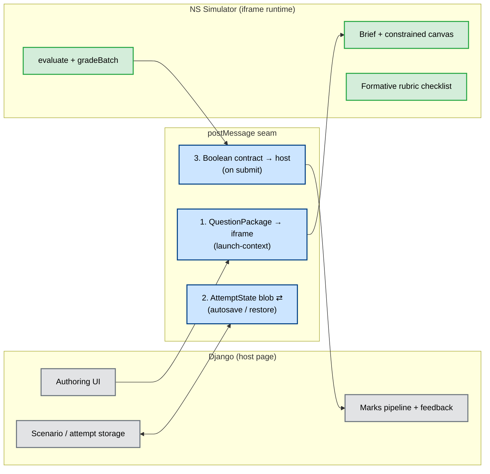

# Question Platform — UI Changes (Companion Spec)

Companion to [`rubric-engine-and-question-platform-architecture.md`](./rubric-engine-and-question-platform-architecture.md). That document defines the **data model and grading pipeline**; this one defines the **UI changes** required to turn the NS Simulator into an embeddable question runtime — and, just as importantly, **what the simulator must *not* build** because it belongs to the Django backend.

---

## Table of Contents

1. [Governing Constraint — Ownership Boundary](#governing-constraint--ownership-boundary)
2. [The Reframing: Simulator is a Runtime, Not an LMS](#the-reframing-simulator-is-a-runtime-not-an-lms)
3. [The Seam — What Crosses the Boundary](#the-seam--what-crosses-the-boundary)
4. [UI-1 — EnvironmentProfile Gate (cross-cutting)](#ui-1--environmentprofile-gate-cross-cutting)
5. [UI-2 — Student Attempt Runtime](#ui-2--student-attempt-runtime)
6. [UI-3 — Author Preview Mode (not authoring forms)](#ui-3--author-preview-mode-not-authoring-forms)
7. [UI-4 — Modifications to Existing Surfaces](#ui-4--modifications-to-existing-surfaces)
8. [UI-5 — Reusable Components](#ui-5--reusable-components)
9. [What the Simulator Does NOT Build](#what-the-simulator-does-not-build)
10. [Build Order](#build-order)

---

## Governing Constraint — Ownership Boundary

Every UI decision in this document is subordinate to this split. It is the single most important input to the design.

```
NS Simulator owns:                     Django Backend owns:
  ✓ TopologyJSON validation              ✓ Question authoring UI
  ✓ Deterministic simulation execution   ✓ Scenario storage
  ✓ SimulationVerdict contract           ✓ Student submission handling
  ✓ Rubric/check engine (gap 3)          ✓ Marks pipeline integration
  ✓ QuestionPackage + AttemptState        ✓ Feedback generation
    schemas (gap 4)                      ✓ Assignment lifecycle
  ✓ Seeded reproducibility
```

**The rule this imposes on the UI:** the simulator builds surfaces that let a student *attempt* a question and get *immediate, formative* grading signal. It does **not** build the surfaces that let a teacher *author*, *store*, *mark*, or *manage* — those are Django's, and they consume the simulator's schemas and boolean contract rather than living inside it.

## The Reframing: Simulator is a Runtime, Not an LMS

An earlier draft of the UI list proposed a full authoring workspace inside the simulator (prompt editor, rubric editor, suite editor, constraints editor). **Per the ownership boundary, those move to Django.** The simulator's UI responsibility collapses to five things:

| # | Simulator UI responsibility | Notes |
|---|---|---|
| 1 | **Consume** a `QuestionPackage` (render its brief + scaffold + constraints) | Package authored in Django, handed in at boot |
| 2 | **Constrain** the canvas to the question (palette allowlist, locked scaffold, forbidden types) | Enforced client-side; validated server-side by Django |
| 3 | **Run** Test/Dry-run and **Submit** (deterministic engine + rubric, already built) | Engine + `gradeBatch` are simulator-owned |
| 4 | **Display** immediate formative feedback (rubric checklist, metrics, margins) | Formative only — not the authoritative mark |
| 5 | **Emit** the collapsed boolean contract + attempt blob to the host | Django persists, marks, and generates summative feedback |

> **Formative vs. summative feedback.** The simulator shows the student the rubric checklist and rich metrics *in the iframe* so they can iterate — this is display of engine data, not grade authoring. The **authoritative mark and the official feedback record are generated by Django** from the boolean contract. These do not conflict: the simulator renders data; Django owns the record.

## The Seam — What Crosses the Boundary

Three payloads cross the iframe boundary. Everything else stays on its own side. This is the entire integration surface.



### postMessage protocol (extends the existing `EmbeddedIframeQuestion` handshake)

| Direction | Message | Payload | Owner of payload |
|---|---|---|---|
| host → iframe | `ns-simulator:launch-context` | `QuestionPackage` (or ref) + prior `AttemptState` blob + resolved `EnvironmentProfile` | Django |
| iframe → host | `ns-simulator:ready` | — | Simulator |
| iframe → host | `ns-simulator:attempt-autosave` | `AttemptState` blob (topology, status, timestamps) | Simulator emits, **Django stores** |
| iframe → host | `ns-simulator:submit` | collapsed boolean contract `{ tests[], totalTests, passedTests, allPassed }` **+** attempt blob | Simulator emits, **Django marks** |

The rich `GradedEvaluationBatch` (scores, per-node metrics, margins) **never crosses the seam** — only the booleans do. This keeps the host contract stable while the engine grows in sophistication.

---

## UI-1 — EnvironmentProfile Gate (cross-cutting)

The `EnvironmentProfile` is delivered by the host in `launch-context`. It is the master switch for the entire runtime.

- **`EnvironmentProvider`** — React context holding `{ mode, visibility, capabilities, graded, chromeDensity }`.
- **Gating hooks** consumed by every panel: `usePaletteAllowlist()`, `useCanEditNode(id)`, `useResultsVisibility()`, `useRubricVisibility()`, `usePromptVisible()`, `useCanTest()`.
- **`chromeDensity`** collapses the shell (left rail, debugger, terminal, extra tabs) for `LEARN` / `INTERVIEW`.

This is the largest cross-cutting change: no panel renders unconditionally anymore — each asks the profile.

## UI-2 — Student Attempt Runtime

The core new surfaces, all simulator-owned:

| Surface | Renders | Gated by |
|---|---|---|
| **Question Brief panel** | `QuestionPrompt`: FR list, NFR targets, scale (DAU, peak RPS, **read/write ratio**, storage, retention) | `visibility.prompt` |
| **Attempt controls** | Replace **Run** with **Test / Dry-run** + **Submit**; status chip (Draft → Autosaved → Submitted → Graded) | `capabilities.canTriggerTestRuns`, `maxTestRuns` |
| **Rubric checklist** | `CheckResult[]` rows: description + ✓/✗, optional actual + margin | `visibility.rubricChecks: HIDDEN \| LIVE_DURING_BUILD \| POST_SUBMIT_ONLY` |
| **Grade summary** | Score `earned/possible`, overall pass/fail, per-case results | `graded` |
| **Autosave chip** | Reflects `AttemptState.lastSavedAt` / lifecycle | student modes |

**Where `AttemptState` lives:** the simulator holds it *in session* and emits it on autosave/submit. It does **not** persist attempts itself — Django stores the blob (ownership: *student submission handling*).

## UI-3 — Author Preview Mode (not authoring forms)

The `AUTHOR` `EnvironmentProfile` is **not** an authoring workspace — it is a **full-capability preview** so a setter (working primarily in Django) can load a draft `QuestionPackage` into the simulator and test-run it: everything visible, everything editable, full results, all rubric checks shown live.

- ✅ Simulator builds: the AUTHOR profile (unrestricted runtime + a "test this question" harness).
- ❌ Simulator does **not** build: the prompt/rubric/suite/constraint **editor forms** — those are Django (*question authoring UI*). Django may embed the simulator in AUTHOR mode as its preview pane.

## UI-4 — Modifications to Existing Surfaces

All simulator-side, all gated by the profile:

- **Palette (`LibrarySidebar`)** → filter to `capabilities.editPaletteList`; hide forbidden types.
- **Canvas (`FlowCanvas`)** → locked scaffold nodes/edges (non-draggable/deletable + lock badge); block forbidden-type placement; enforce `maxNodeCount`.
- **`PropertiesPanel` / `EdgePropertiesPanel`** → read-only for locked nodes or when `canEditScaffoldNodes` is false.
- **`SimulationControls`** → Run splits into **Test** (dry-run, representative load) and **Submit** (full hidden suite → grade).
- **`ResultsTray` / `RunInspector`** → curated results in student modes (only question-relevant metrics); hide suite details (`visibility.gradingSuiteDetails`); gate live metrics (`visibility.liveMetrics`). Full tabs remain in AUTHOR.
- **Scenarios flask tab** → in embedded mode this is replaced by the single injected question; the local sample-scenario catalog stays for the standalone app only. (There is **no** in-simulator "questions catalog" — browsing/assigning questions is Django's *assignment lifecycle*.)

## UI-5 — Reusable Components

`FRNFRScalePanel`, `CheckRow` (description + pass/fail + optional actual/margin), `ScoreBadge`, `LockedNodeBadge`, `AttemptStatusChip`. (Note: `MetricSelector` — the verdict-path picker for building rubrics — lives in **Django's** authoring UI, not here.)

---

## What the Simulator Does NOT Build

Explicit non-goals, to prevent scope creep across the boundary:

| Tempting to build in the simulator | Actually owned by | Why |
|---|---|---|
| Prompt / rubric / suite / constraint **editor forms** | Django (authoring UI) | Authoring is a teacher workflow, not a runtime concern |
| A **questions catalog / browser** | Django (assignment lifecycle) | Assignment, due dates, cohorts are LMS concerns |
| **Attempt persistence** (a DB of submissions) | Django (submission handling) | Simulator emits the blob; storage is the host's |
| The **authoritative mark / gradebook** | Django (marks pipeline) | Simulator emits booleans; the record is Django's |
| **Summative feedback** report generation | Django (feedback generation) | Simulator shows formative signal only |
| **Metric-selector** UI for authoring rubrics | Django (authoring UI) | Belongs with the rubric editor, which is Django's |

The simulator's contribution to all of these is its **schemas and contracts** (`QuestionPackage`, `AttemptState`, `SimulationVerdict`, `GradedEvaluationBatch`, the boolean projection), which Django imports/consumes — not the surfaces.

## Build Order

Aligned to the architecture doc's slices. Only student-runtime UI is in scope for the simulator.

**Gap 4 (minimum question loop — no environment gating yet, verdict-rubric only):**
1. Question Brief panel (read-only FR/NFR/scale render).
2. Test / Submit controls + in-session `AttemptState` + status chip.
3. Rubric checklist + Grade summary (post-submit).
4. `launch-context` / `submit` postMessage wiring against a single injected `QuestionPackage` (Fix + Open-Build types).

**Follow-up slices:**
5. `EnvironmentProfile` provider + gating across all panels (unlocks INTERVIEW vs LEARN vs AUTHOR-preview).
6. Palette allowlist + locked scaffold nodes + curated results.
7. `attempt-autosave` round-trip (emit blob; Django stores/restores).
8. Curated-results and hidden-suite refinements per mode.

Authoring forms, catalog, persistence, marks, and summative feedback are **out of every simulator slice** — they are Django deliverables that consume the contracts above.
