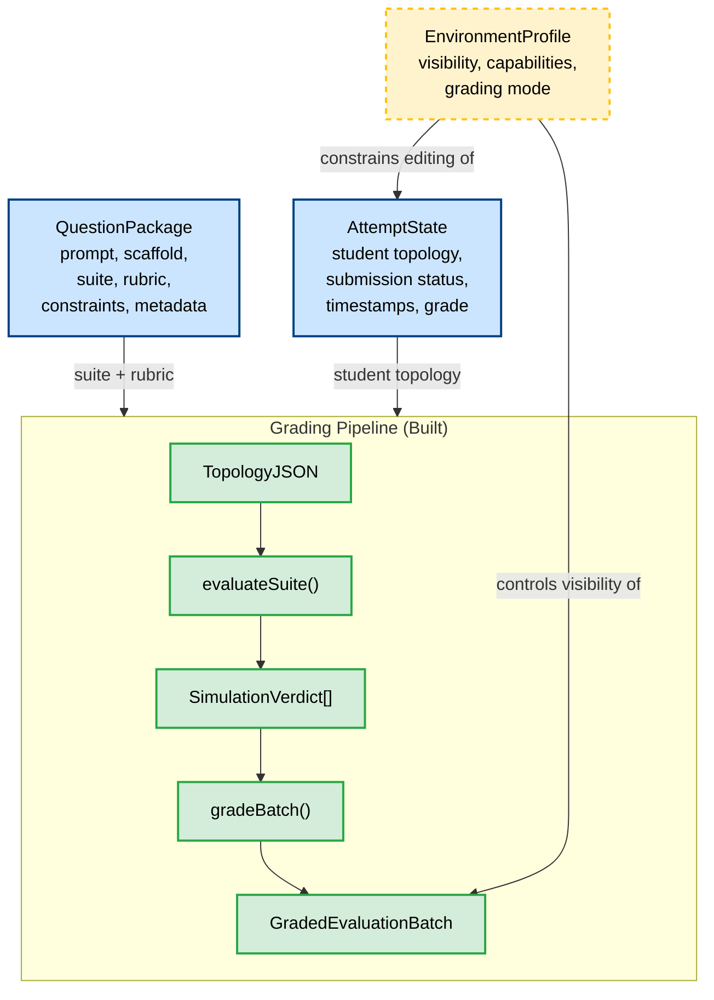
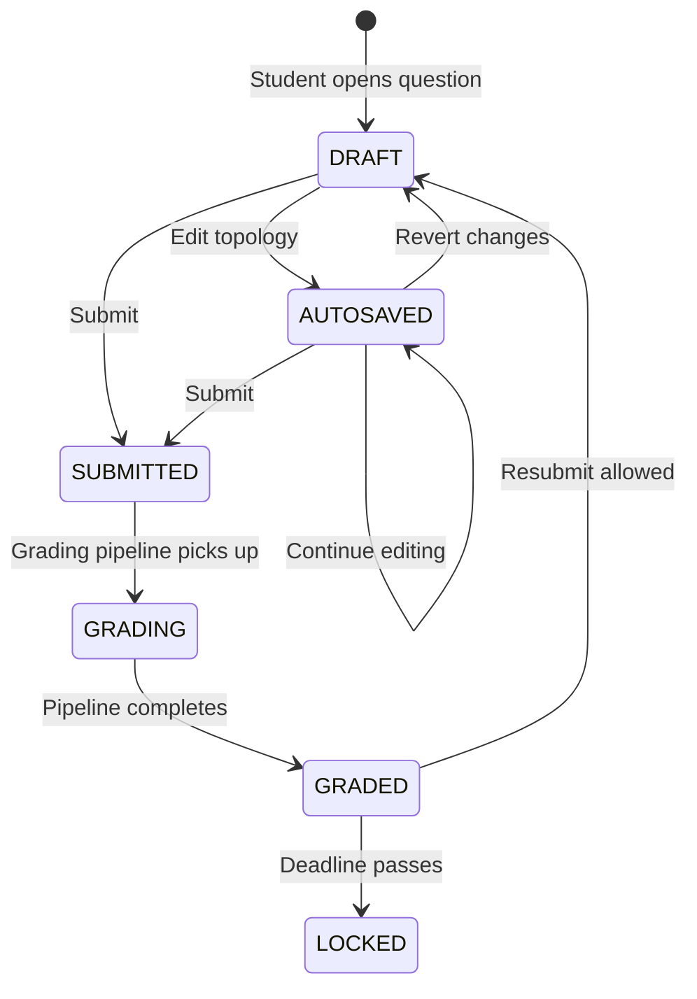
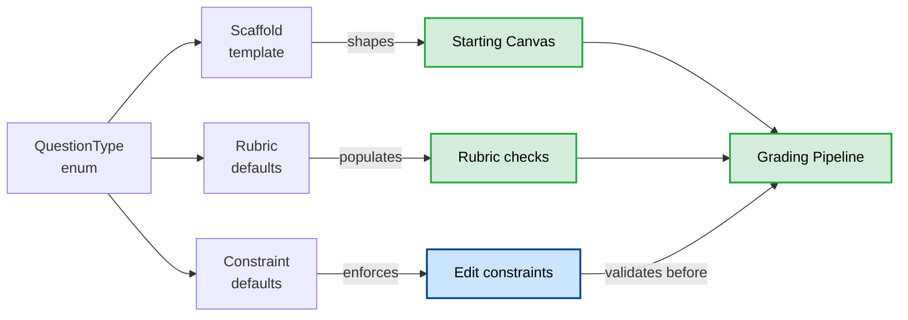
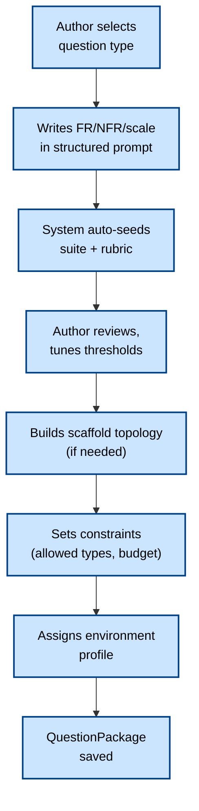
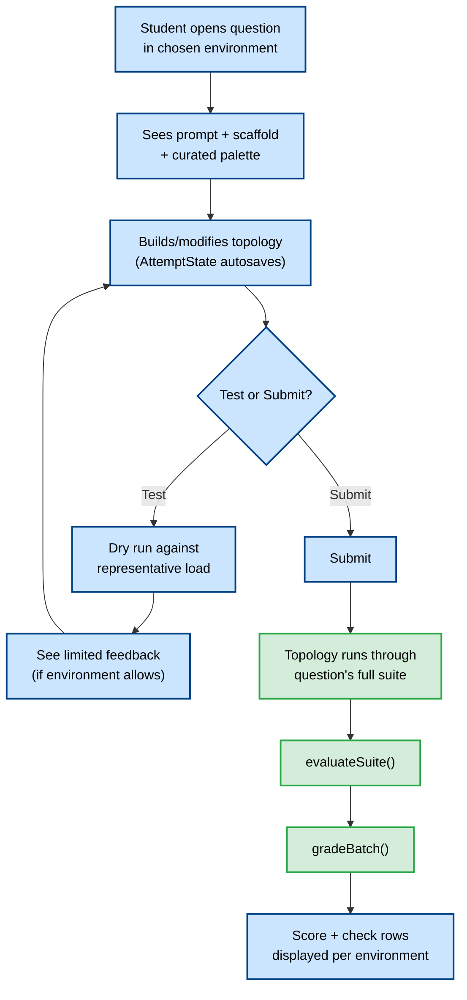
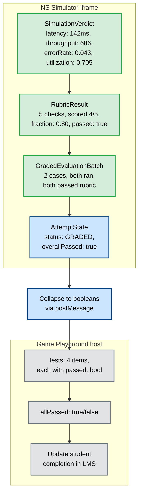

# Rubric Engine & Question Platform Architecture

This document specifies the complete architecture for turning the NS Simulator into a deterministic question and grading platform. It covers three layers: the **grading pipeline** (built), the **question content model** (next), and the **presentation/environment layer** (follow-up) - and defines how they compose into an end-to-end system for system design evaluation.

It is written at Staff/Principal level to serve both as an implementation guide for the engineering work and as a portfolio-grade architecture artifact.

---

## Table of Contents

1. [Architectural Mental Model](#architectural-mental-model)
2. [Layer 1 - Grading Pipeline (Built)](#layer-1--grading-pipeline-built)
3. [Layer 2 - Question Content Model (Gap 4)](#layer-2--question-content-model-gap-4)
4. [Layer 3 - Presentation & Environment (Follow-up)](#layer-3--presentation--environment-follow-up)
5. [Question Types - Taxonomy & Grading Characteristics](#question-types--taxonomy--grading-characteristics)
6. [Rubric Domain Extensions](#rubric-domain-extensions)
7. [Resolved Architectural Decisions](#resolved-architectural-decisions)
8. [End-to-End Flow](#end-to-end-flow)
9. [Game Playground Host Contract](#game-playground-host-contract)
10. [Build Order & Scope Boundaries](#build-order--scope-boundaries)
11. [Relationship to Existing Specs](#relationship-to-existing-specs)

---

## Architectural Mental Model

The platform is four layers over one shared pipeline. Each layer has a single responsibility and a clean contract with the layers above and below it.

```
CONTENT          QuestionPackage   ── what the question is (prompt, scaffold, suite, rubric)
   │
ATTEMPT          AttemptState      ── the student's evolving build + submit lifecycle
   │
GRADING          topology → evaluate(suite) → verdicts → rubric → score
   │
PRESENTATION     EnvironmentProfile ── how much of all this is shown/editable
```

The key architectural invariant: **QuestionPackage = WHAT**, **EnvironmentProfile = HOW MUCH IS SHOWN**, **AttemptState = THE STUDENT'S WORK**, and the **grading pipeline is shared by all of them**. A single question can be shown in three environments (author / contest / learn) without changing its content or its grading.



### Legend

| Color           | Meaning                           |
| --------------- | --------------------------------- |
| Green (solid)   | Built and working in the codebase |
| Blue (solid)    | Next to build (gap 4)             |
| Yellow (dashed) | Follow-up slice                   |

---

## Layer 1 - Grading Pipeline (Built)

These are the engine modules that already exist and are tested. They form the foundation everything else builds on.

### 1.1 Simulation Verdict Contract

**Location:** `src/engine/analysis/verdict.ts`

The `SimulationVerdict` is a stable, versioned projection of `SimulationOutput` designed as a public API for grading systems. It ensures the grading pipeline never depends on internal engine types.

> **The shape below is abbreviated for readability - `src/engine/analysis/verdict.ts` is authoritative.** The full contract also carries `sloTargetCount`; additional `summary` counts (`postWarmupSuccessfulRequests`, `postWarmupFailedRequests`, `rejectedRequests`, `timedOutRequests`, `connectionResetRequests`); `perNode.totalConnectionReset`; optional `rootCause` / `affectedComponents` on invariant violations; `connectionReset` (and optional `nodeLabel`) on conservation; and `lambda` / `wSeconds` on Little's Law.

```typescript
interface SimulationVerdict {
  version: '1.0'
  meta: {
    seed: string
    simulationDurationMs: number
    warmupDurationMs: number
    eventsProcessed: number
    reproducible: boolean
  }
  summary: {
    totalRequests: number
    postWarmupTotalRequests: number
    successfulRequests: number
    failedRequests: number
    throughput: number          // req/s post-warmup
    errorRate: number           // fraction [0, 1]
    latency: {
      p50: number | null
      p90: number | null
      p95: number | null
      p99: number | null
      min: number | null
      max: number | null
      mean: number | null
    }
  }
  perNode: Record<string, {
    nodeLabel: string
    totalArrived: number
    totalProcessed: number
    totalRejected: number
    totalTimedOut: number
    utilization: number         // [0, 1]
    throughput: number
    errorRate: number
    availability: number
    latencyP50: number
    latencyP95: number
    latencyP99: number
    avgQueueLength: number
    avgServiceTime: number
    peakQueueLength: number
  }>
  sloBreaches: Array<{
    nodeId: string
    nodeLabel: string
    metric: 'latencyP99' | 'availability'
    target: number
    actual: number
    severity: 'warning' | 'critical'
  }>
  invariantViolations: Array<{
    invariantId: string
    invariantName: string
    violatedAt: number
    details: string
  }>
  conservation: Array<{
    nodeId: string
    arrived: number
    processed: number
    rejected: number
    timedOut: number
    inFlight: number
    balanced: boolean
  }>
  littlesLaw: Array<{
    nodeId: string
    observedL: number
    expectedL: number
    error: number
    withinTolerance: boolean
  }>
}
```

**Projection function:** `projectToVerdict(output: SimulationOutput): SimulationVerdict` - straightforward field selection and renaming, ensuring the backend never depends on internal field names.

### 1.2 Headless Batch Evaluation Runner

**Location:** `src/engine/analysis/evaluate.ts`

The `evaluateSuite()` function runs a suite of prepared test cases through the simulation engine and projects each successful run to a `SimulationVerdict`. Failed cases carry through as error results rather than crashing the batch.

```typescript
type EvaluationCaseResult =
  | { id: string; ok: true;  verdict: SimulationVerdict }
  | { id: string; ok: false; error: string }

interface EvaluationBatch {
  version: '1.0'
  suite?: string
  results: EvaluationCaseResult[]
  summary: { total: number; succeeded: number; failed: number }
}
```

**CLI integration:** `sim evaluate --suite suite.json [--rubric rubric.json]`

### 1.3 Rubric & Check Engine

**Location:** `src/engine/analysis/rubric.ts`

The rubric engine is the core grading component that converts a suite's verdicts into pass/fail check rows based on authored criteria.

#### What a check is

A check is fundamentally an assertion against the verdict's numeric fields - latency thresholds, error rates, SLO breaches, throughput targets, resource utilization limits, invariant violations. Each check has:

| Part                | Purpose                                                                       |
| ------------------- | ----------------------------------------------------------------------------- |
| `metric`            | Selector that points into the verdict data (dotted path or derived aggregate) |
| `op`                | Comparator: `<`, `<=`, `>`, `>=`, `==`, `!=`                                  |
| `value`             | Threshold to compare against                                                  |
| `id`, `description` | Human-readable metadata                                                       |
| `points`            | Weight toward the overall score (default 1)                                   |

```typescript
interface RubricCheck {
  id: string
  description: string
  metric: string       // e.g. 'summary.errorRate', 'perNode.maxUtilization'
  op: '<' | '<=' | '>' | '>=' | '==' | '!='
  value: number
  points?: number
}

interface Rubric {
  version?: string
  id?: string
  passThreshold?: number   // fraction 0..1; default = 1 (every point)
  checks: RubricCheck[]
}
```

#### Metric resolution

The resolver supports three categories of metric selectors:

**Direct dotted paths** - navigate into the verdict structure:

- `summary.errorRate` → `verdict.summary.errorRate`
- `summary.latency.p99` → `verdict.summary.latency.p99`
- `perNode.<nodeId>.utilization` → `verdict.perNode[nodeId].utilization`

**Derived aggregates** - computed across collections:

- `sloBreaches.count` → `verdict.sloBreaches.length`
- `invariantViolations.count` → `verdict.invariantViolations.length`
- `conservation.unbalanced` → count of nodes where `balanced === false`
- `littlesLaw.violations` → count of nodes where `withinTolerance === false`
- `perNode.maxUtilization` → `max(perNode[*].utilization)`
- `perNode.maxErrorRate` → `max(perNode[*].errorRate)`
- `perNode.maxLatencyP99` → `max(perNode[*].latencyP99)`

**Null handling:** The resolver is honest about missing data. A null latency percentile or unknown path fails the check with a detail note - **never a silent pass**. This is critical: null latency indicates no successful samples, which should not silently pass a check like `p99 < 200`.

```typescript
function resolveMetric(verdict: SimulationVerdict, metric: string): number | null
```

#### Grading output

```typescript
interface CheckResult {
  id: string
  description: string
  metric: string
  op: CheckOp
  value: number          // threshold (expected)
  actual: number | null  // resolved value
  passed: boolean
  points: number         // possible
  awarded: number        // earned (0 or points)
  detail?: string        // explanation on failure
}

interface RubricResult {
  version: '1.0'
  rubricId?: string
  checks: CheckResult[]
  score: { earned: number; possible: number; fraction: number }
  passed: boolean       // fraction >= passThreshold
}
```

#### Batch grading

`gradeBatch(rubric, batch)` applies one rubric across every case in an `EvaluationBatch`:

- Cases that ran successfully are graded against the rubric
- Cases that failed to run carry through as errors (ungraded)
- The batch summary counts total, ran, errored, passed, failed

```typescript
interface GradedEvaluationBatch {
  version: '1.0'
  suite?: string
  rubricId?: string
  cases: GradedCaseResult[]
  summary: {
    total: number
    ran: number
    errored: number
    passed: number
    failed: number
  }
}
```

#### Exit code semantics

The CLI exits 0 **only** if every case ran successfully AND (if a rubric is provided) every case passed the rubric. Both runtime errors and rubric failures produce a non-zero exit - natural "green build" semantics.

#### Verification status

- 7 unit tests covering: metric resolution (paths + aggregates + null), check grading/scoring, partial passThreshold, unresolved-metric fail, batch grading with run-failure carrythrough
- CLI smoke (pass): both suite cases graded 5/5 with real resolved values (errorRate 0.043, throughput 686, maxUtil 0.705) → exit 0
- CLI smoke (fail): strict error < 1% rubric → both cases FAIL (4.3%, 6.3%) → exit 1
- Full test suite: 340 passing across 51 files, typecheck clean

---

## Layer 2 - Question Content Model (Gap 4)

This layer defines **what** a question is and **how** a student interacts with it. It builds directly on the grading pipeline without modifying it.

### 2.1 QuestionPackage - What a Question Setter Defines

A `QuestionPackage` bundles everything required to pose and grade a single system design question.

```typescript
interface QuestionPackage {
  /** Unique identifier for this question. */
  id: string
  
  /** Human-readable metadata. */
  title: string
  description?: string
  difficulty: 'beginner' | 'intermediate' | 'advanced' | 'expert'
  tags: string[]
  estimatedTimeMinutes?: number
  
  /** Question archetype - drives scaffold, UI template, and default rubric. */
  type: QuestionType
  
  /** The prompt shown to the student. */
  prompt: QuestionPrompt
  
  /** Starting canvas state the student opens. */
  scaffold: QuestionScaffold
  
  /** What the student is allowed to do. */
  constraints: QuestionConstraints
  
  /** The scenario suite used for grading. */
  suite: EvaluationSuiteSpec
  
  /** The rubric applied to verdicts. */
  rubric: Rubric
  
  /** Default environment profile (can be overridden per deployment). */
  defaultEnvironment?: EnvironmentProfileId
  
  /** Authoring metadata. */
  author?: string
  createdAt?: string
  version?: string
}
```

#### The elegant part: interview inputs do double duty

The non-functional requirements the setter writes (p99 < 200ms, availability ≥ 99.9%) **become** rubric SLO checks. The scale numbers (40k RPS, 90:10 read/write) **become** the scenario workload parameters (`baseRps` + request distribution). Authoring the interview question ≈ filling FR/NFR/scale fields, and the suite + rubric are auto-seeded from them. The setter can then override any auto-generated values.

```
Setter writes FR/NFR/scale
      │
      ├──→ Auto-seed scenario suite (workload params from scale)
      │
      └──→ Auto-seed rubric checks (SLO thresholds from NFR)
              │
              └──→ Setter reviews, tunes, overrides as needed
```

### 2.2 QuestionPrompt - Structured Interview Requirements

The prompt is not just a text blob - it carries structured fields that drive both the student UI and the auto-generation pipeline.

```typescript
interface QuestionPrompt {
  /** The human-readable problem statement (markdown). */
  text: string
  
  /** Functional requirements - what the system must do. */
  functionalRequirements: string[]
  
  /** Non-functional requirements - the targets the system must meet. */
  nonFunctionalRequirements: NFRTarget[]
  
  /** Scale parameters - the load the system must handle. */
  scale: ScaleParameters
  
  /** Any additional context or constraints described in prose. */
  additionalContext?: string
}

interface NFRTarget {
  metric: 'latency_p99' | 'latency_p50' | 'availability' | 'error_rate' | 'throughput'
  operator: '<' | '<=' | '>' | '>='
  value: number
  unit: 'ms' | 'percent' | 'req_per_sec' | 'nines'
  description: string  // e.g. "P99 latency must be under 200ms"
}

interface ScaleParameters {
  /** Daily active users. */
  dau?: number
  /** Peak requests per second. */
  peakRps?: number
  /** Read-to-write ratio (e.g. 90 means 90% reads). */
  readWriteRatio?: number
  /** Storage requirement. */
  storageGb?: number
  /** Data retention period. */
  retentionDays?: number
  /** Expected growth rate. */
  growthRatePercent?: number
}
```

This is what the interview-style UI renders: the FR/NFR panel, the scale numbers, and the read/write ratio - all the things a candidate would need to reason about in a real system design interview.

### 2.3 QuestionScaffold - The Starting Canvas

```typescript
interface QuestionScaffold {
  /** What the student starts with. */
  type: 'empty' | 'partial' | 'complete'
  
  /** The starting topology (null for empty scaffolds). */
  topology?: TopologyJSON
  
  /** Which nodes in the scaffold are locked (read-only). */
  lockedNodeIds?: string[]
  
  /** Which edges in the scaffold are locked. */
  lockedEdgeIds?: string[]
  
  /** 
   * For 'optimize' questions: the baseline verdict to beat.
   * Generated by running the scaffold topology through the suite.
   */
  baselineVerdict?: SimulationVerdict
}
```

| Question type          | Scaffold `type` | What the student sees                   |
| ---------------------- | --------------- | --------------------------------------- |
| Fix / missing node     | `partial`       | Broken/incomplete topology with gaps    |
| Build within budget    | `empty`         | Empty canvas + budget constraint        |
| Optimize               | `complete`      | Working-but-suboptimal topology         |
| Open build (interview) | `empty`         | Empty canvas + full FR/NFR/scale prompt |
| Scaling challenge      | `complete`      | Working MVP that handles low load       |
| HA / Chaos             | `partial`       | Partially built multi-AZ topology       |
| Trade-off design       | `empty`         | Empty canvas + competing constraints    |

### 2.4 QuestionConstraints

```typescript
interface QuestionConstraints {
  /** Component types the student is allowed to use (whitelist). Null = all types. */
  allowedNodeTypes?: string[]
  
  /** Component types the student is explicitly forbidden from using. */
  forbiddenNodeTypes?: string[]
  
  /** Maximum number of nodes the student can place. */
  maxNodeCount?: number
  
  /** Maximum total cost budget (requires cost model). */
  maxBudget?: number
  
  /** Maximum total workers across all nodes. */
  maxTotalWorkers?: number
  
  /** Whether the student can modify scaffold nodes (vs. only adding new ones). */
  canModifyScaffold: boolean
  
  /** Whether the student can remove scaffold nodes. */
  canRemoveScaffoldNodes: boolean
}
```

### 2.5 EvaluationSuiteSpec - What the Student is Tested Against

The suite defines the workload conditions under which the submission gets evaluated. For interview questions, it is auto-seeded from the scale parameters.

```typescript
interface EvaluationSuiteSpec {
  /** Suite identifier. */
  name: string
  
  /** Individual test cases. */
  cases: EvaluationCaseSpec[]
  
  /** 
   * Whether the student can see scenario details.
   * false = contest mode (hidden grading scenarios).
   */
  visibleToStudent: boolean
  
  /** 
   * Optional representative dry-run case the student CAN see and test against.
   * Typically a lighter version of the real grading suite.
   */
  dryRunCase?: EvaluationCaseSpec
}

interface EvaluationCaseSpec {
  id: string
  /** Description shown to student (if suite is visible). */
  description?: string
  /** Topology file path or inline TopologyJSON object. */
  topology?: string | TopologyJSON
  /** Global overrides (seed, duration, warmup). */
  global?: Partial<GlobalConfig>
  /** Workload overrides (baseRps, pattern, distribution). */
  workload?: Partial<WorkloadProfile>
  /**
   * Fault injection specs. NOTE: not yet applied by the CLI evaluator -
   * `prepareCase` currently merges only `global` and `workload`. Per-case fault
   * override is a follow-up slice, and archetype 6 (HA/Chaos) depends on it.
   */
  faults?: FaultSpec[]
}
```

### 2.6 AttemptState - The Student's Working Envelope

`AttemptState` is the durable envelope around a student's work. It tracks their topology, submission status, latest verdict and grade, and timestamps. It never mutates the canonical question - consistent with the source-overlay principle established in the codebase.

```typescript
interface AttemptState {
  /** Unique attempt identifier. */
  attemptId: string
  
  /** Reference to the question being attempted. */
  questionId: string
  
  /** The student's current topology (autosaved). */
  topology: TopologyJSON
  
  /** Lifecycle status. */
  status: AttemptStatus
  
  /** When the attempt was created. */
  startedAt: string    // ISO 8601
  
  /** Last autosave timestamp. */
  lastSavedAt: string
  
  /** When the student hit Submit (null if not yet submitted). */
  submittedAt?: string
  
  /** Number of test runs the student has executed (for dry-run limiting). */
  testRunCount: number
  
  /** Latest dry-run result (if the student has tested before submitting). */
  lastDryRun?: {
    timestamp: string
    verdict: SimulationVerdict
    rubric?: RubricResult
  }
  
  /** Final grading result (populated after submission). */
  grade?: {
    gradedAt: string
    batch: GradedEvaluationBatch
    overallScore: number
    overallPassed: boolean
  }
}

type AttemptStatus =
  | 'DRAFT'          // student is still building
  | 'AUTOSAVED'      // topology saved, not submitted
  | 'SUBMITTED'      // student hit submit, pending grading
  | 'GRADING'        // grading pipeline is running
  | 'GRADED'         // grade available
  | 'LOCKED'         // read-only after grading deadline
```

#### Lifecycle state machine



---

## Layer 3 - Presentation & Environment (Follow-up)

The environment layer is not a separate product - it's a **capability and visibility lens** applied over the same `QuestionPackage`. The same question can run in full authoring mode for question setters, in a graded contest mode with curated results, or in a minimal learning mode stripped of grading pressure.

> The concrete UI work this implies - and the split of what the simulator builds vs. what the Django backend owns - is specified in the companion doc [`question-platform-ui-changes.md`](./question-platform-ui-changes.md).

### 3.1 EnvironmentProfile Schema

```typescript
interface EnvironmentProfile {
  /** The operating mode. */
  mode: 'AUTHOR' | 'ASSIGNMENT' | 'PRACTICE'
  
  /** What the student can see. */
  visibility: {
    /** Show the question prompt and FR/NFR panel. */
    prompt: boolean
    
    /** Show which nodes are part of the scaffold. */
    scaffoldSourceNodes: boolean
    
    /** Show the detailed grading suite scenarios. */
    gradingSuiteDetails: boolean   // true in PRACTICE, false in ASSIGNMENT
    
    /** Show live RPS/metrics while building (before submit). */
    liveMetrics: boolean
    
    /** When rubric check results are visible. */
    rubricChecks: 'HIDDEN' | 'LIVE_DURING_BUILD' | 'POST_SUBMIT_ONLY'
  }
  
  /** What the student can do. */
  capabilities: {
    /** Allowed node types in the palette (null = all, [] = none). */
    editPaletteList: string[] | null
    
    /** Whether scaffold-provided nodes can be edited. */
    canEditScaffoldNodes: boolean
    
    /** Whether the student can trigger test/dry runs before submitting. */
    canTriggerTestRuns: boolean
    
    /** Maximum number of test runs allowed (null = unlimited). */
    maxTestRuns?: number
  }
  
  /** Whether submissions are graded in this environment. */
  graded: boolean
  
  /** UI chrome density. */
  chromeDensity: 'full' | 'minimal'
}
```

### 3.2 The Three Modes

| Aspect            | AUTHOR (Today's full UI)          | ASSIGNMENT (Contest/Evaluation)    | PRACTICE (Minimal guided) |
| ----------------- | --------------------------------- | ---------------------------------- | ------------------------- |
| **Palette**       | The full palette (~60 node types) | Curated allowlist per question     | Curated + explanations    |
| **Prompt**        | Not shown (author is the setter)  | FR/NFR panel visible               | Prompt + guided hints     |
| **Results shown** | Everything (all tabs)             | Only metrics relevant to question  | Curated + explanations    |
| **Suite details** | Full scenario definitions         | Hidden (student sees dry-run only) | Visible for learning      |
| **Rubric checks** | Full authoring view               | Hidden until submit                | Live green/red feedback   |
| **Editing**       | Full - all nodes, all properties  | Scaffold locked, add nodes only    | Edit freely, no pressure  |
| **Grading**       | Not graded                        | Graded on submit → score           | Not graded, streamlined   |
| **Chrome**        | Full panels, debugger, terminal   | Clean interview panel              | Minimal, distraction-free |

> **Key insight:** Mode 2 (ASSIGNMENT) and Mode 3 (PRACTICE) differ primarily in `graded` + `rubricChecks` + `chromeDensity`. They share the same underlying content and grading pipeline - the environment profile just controls what's exposed.

### 3.3 Environment Applied to Question Types

The same `QuestionPackage` can be deployed in different environments by swapping the profile:

```
QuestionPackage("Design a URL shortener")
  ├── + EnvironmentProfile(ASSIGNMENT) → Graded contest question
  ├── + EnvironmentProfile(PRACTICE)     → Self-paced learning exercise
  └── + EnvironmentProfile(AUTHOR)    → Question authoring/testing mode
```

---

## Question Types - Taxonomy & Grading Characteristics

All question types share the same grading pipeline. What differs is the **scaffold** (what the student starts with), the **rubric focus** (which checks matter most), and the **constraints** (what the student can modify).

### Base Types

| #   | Type                       | Scaffold                         | Student Action                  | Primary Grading Domain                                 |
| --- | -------------------------- | -------------------------------- | ------------------------------- | ------------------------------------------------------ |
| 1   | **Fix / Missing Node**     | Broken/incomplete topology       | Add/repair the gap              | Verdict SLO rubric + minimal-edit constraint           |
| 2   | **Build Within Budget**    | Empty + budget + FR/NFR          | Design from constraints         | SLO rubric + cost check (Σ node cost ≤ budget)         |
| 3   | **Optimize**               | Working-but-suboptimal topology  | Improve latency/cost/throughput | Comparative rubric: beat stored baseline verdict       |
| 4   | **Open Build (Interview)** | Empty + full FR/NFR/scale prompt | Design from scratch             | SLO rubric + structural checks (has cache/LB/replicas) |

### Advanced Archetypes

| #   | Type                           | Scaffold                  | Grading                                                               | Unique Characteristic                                                               |
| --- | ------------------------------ | ------------------------- | --------------------------------------------------------------------- | ----------------------------------------------------------------------------------- |
| 5   | **Scaling Challenge**          | Working MVP for 1k DAU    | Graduated scenario suite (100 RPS → 10k RPS)                          | Must pass both low and high load without manual intervention                        |
| 6   | **HA / Chaos Challenge**       | Partial multi-AZ topology | Engine triggers node/zone failures via `DOWN` state during evaluation | Rubric checks SLO compliance *despite* simulated hardware failure                   |
| 7   | **Trade-off / Constraint Box** | Empty                     | Structural checks + competing metric rubric                           | Rubric instantly fails if forbidden component exists (e.g., `NodeType === 'redis'`) |

> **Dependency:** Archetype 6 (HA/Chaos) requires per-case fault injection in the evaluation suite. The current CLI evaluator (`prepareCase`) merges only `global` and `workload` overrides - suite-level fault override is a follow-up slice (see Build Order & Scope Boundaries).

### How Question Type Maps to Grading



All seven types feed into the **same** pipeline - the type mainly controls the scaffold, which rubric metrics are emphasized, and what constraints are active.

---

## Rubric Domain Extensions

The current rubric only grades **verdict metrics** (behavioral, from the simulation run). Three of the seven question types need checks over things the verdict doesn't carry. The rubric grows two additional check domains:

### Current: Verdict Checks (Built)

Assertions against `SimulationVerdict` fields - latency, throughput, error rate, SLO breaches, utilization. **Already implemented** in `rubric.ts`.

### Extension 1: Topology / Structural Checks (Follow-up)

Assertions against the **submitted graph**, not the run:

```typescript
type TopologyCheck =
  | { type: 'contains_type'; nodeType: string; minCount: number }
  | { type: 'forbids_type'; nodeType: string }
  | { type: 'node_count'; op: CheckOp; value: number }
  | { type: 'has_path'; fromType: string; toType: string }
  | { type: 'read_path_has_replica'; replicaType: string }
  | { type: 'cost_within_budget'; maxCost: number }
```

**Needed for:** Budget questions (cost sum ≤ budget), open-build questions (must have cache/LB), trade-off questions (forbidden component check), fix questions (minimal-edit constraint).

### Extension 2: Comparative Checks (Follow-up)

Assertions that compare the student's verdict against a **stored baseline verdict**:

```typescript
type ComparativeCheck =
  | { type: 'improves_metric'; metric: string; baseline: number; minImprovement: number }
  | { type: 'beats_baseline'; metric: string; baselineMetric: string }
```

**Needed for:** Optimize questions ("p99 at least 20% below baseline"), scaling challenges ("throughput ≥ 5x baseline").

### Extended Rubric Shape

```typescript
interface ExtendedRubric extends Rubric {
  /** Checks against SimulationVerdict fields (existing). */
  checks: RubricCheck[]
  
  /** Checks against the submitted TopologyJSON (new). */
  topologyChecks?: TopologyCheck[]
  
  /** Checks comparing verdict vs. baseline verdict (new). */
  comparativeChecks?: ComparativeCheck[]
}
```

The `gradeVerdict`/`gradeBatch` functions already handle verdict checks. The structural and comparative engines slot in beside them - same interface, different data source.

### Cost Model Dependency

Topology checks that involve cost (`cost_within_budget`) require a per-node cost model. This maps to the existing cost calculator specification (`specs/cost-calculation-and-budgeting.md`), which defines:

- Default pricing: CPU @ $0.048/hr, Memory @ $0.006/GB-hr
- Per-node provisioned cost based on `ResourceConfig` (cpu, memory, replicas)
- Cost aggregation across the topology

This is a **separate engineering task** and is deferred from gap 4.

---

## Resolved Architectural Decisions

These five decisions were evaluated and resolved to maintain momentum while keeping the architecture clean for future expansion.

### Decision 1: Scenario Source - Auto-seed or Hand-written?

**Resolution: Hybrid.** Auto-seed the suite from the FR/NFR scale numbers as a default, but allow the setter to override.

**Rationale:** In an interview, if the prompt says "40k peak RPS", the system should automatically generate a Poisson distribution workload hitting 40k. However, as an author, edge cases sometimes require hand-written scenarios (burst traffic vs. steady state, specific failure injection timing).

**Implementation:** The `QuestionPrompt.scale` fields drive a `seedSuiteFromScale(scale, nfr)` function that produces a default `EvaluationSuiteSpec`. The setter reviews and overrides as needed.

### Decision 2: Rubric Transparency - Live During Build or After Submit?

**Resolution: Controlled by the `EnvironmentProfile`.**

| Mode       | Rubric visibility                                                                   |
| ---------- | ----------------------------------------------------------------------------------- |
| PRACTICE   | `LIVE_DURING_BUILD` - checks turn green/red as student designs, tight feedback loop |
| ASSIGNMENT | `HIDDEN` or `POST_SUBMIT_ONLY` - forces reasoning about design constraints          |
| AUTHOR     | Full visibility - sees all checks and how they evaluate                             |

**Rationale:** Learning benefits from immediate feedback. Evaluation benefits from forcing the student to reason without hints. The same rubric works in both modes - only the visibility changes.

### Decision 3: Hidden Grading Scenarios in Contest Mode?

**Resolution: Yes, use a hidden grading suite.**

**Design:** In ASSIGNMENT mode, the student gets a "Dry Run" button that tests against a representative load (e.g., 50% of peak). On Submit, the system evaluates against the full, hidden grading suite (including failure conditions).

**Rationale:** Prevents students from "over-fitting" their design to pass a specific visible test. The dry-run gives enough signal to iterate without revealing the exact grading criteria.

**Implementation:** `EvaluationSuiteSpec.visibleToStudent = false` + `EvaluationSuiteSpec.dryRunCase` for the representative test.

### Decision 4: Cost Model - In v1 or Deferred?

**Resolution: Defer to the next slice.**

**Rationale:** Per-node cost data introduces a new data dimension (pricing per component type, resource-based cost formulas). Gap 4 should focus on getting `AttemptState` and the verdict-rubric pipeline solid using metrics that already work (latency, throughput, error rate, utilization). The "Build Within Budget" question type ships after the cost model lands.

### Decision 5: Structural Checks - In Scope for Gap 4?

**Resolution: Defer to the next slice.**

**Rationale:** Adding graph-traversal structural checks ("does the read path have a replica?") is a distinct engineering task requiring a topology query mini-language. Ship "Fix" and "Open Build" types first - they rely purely on the existing SLO/verdict metrics. Structural checks follow immediately after gap 4 as a self-contained slice.

---

## End-to-End Flow

This is how the complete system works from question authoring through grading.

### Author Flow



### Student Flow



### Data Flow Through the Pipeline

```
QuestionPackage.suite              QuestionPackage.rubric
        │                                  │
        ▼                                  │
student topology ──→ evaluateSuite() ──→ EvaluationBatch ──→ gradeBatch() ──→ GradedEvaluationBatch
        │                                                                           │
        │                                                                           ▼
        │                                                                    AttemptState.grade
        │                                                                    (score, passed, checks)
        │
        └──→ AttemptState.topology (autosaved)
```

---

## Game Playground Host Contract

At the delivery layer, this system follows the same integration pattern as Newton's existing Game Playground (used by `web-based-packet-tracer`): an iframe-hosted simulator with test cases, each carrying a boolean pass/fail, and an overall boolean for completion. The rich grading engine data collapses to this simple contract at the iframe boundary.

### What Game Playground expects

The Game Playground host (the Newton platform iframe wrapper) only understands a simple shape:

| Game Playground concept                     | NS Simulator equivalent                                                                                                                                                                |
| ------------------------------------------- | -------------------------------------------------------------------------------------------------------------------------------------------------------------------------------------- |
| Iframe-hosted simulator                     | NS Simulator embedded in `ASSIGNMENT` or `PRACTICE` environment mode                                                                                                                   |
| Seeded starting state                       | `QuestionPackage.scaffold` (the topology the student opens)                                                                                                                            |
| Durable attempt-state blob                  | `AttemptState` (JSON envelope - student topology, status, timestamps)                                                                                                                  |
| N test cases, each with a boolean pass/fail | `GradedEvaluationBatch.cases[]` - each case has `ran` and `rubric.passed`                                                                                                              |
| Overall boolean: all tests passed?          | `AttemptState.grade.overallPassed` (derived from `summary.errored === 0 && summary.passed === summary.ran` - a case that could not run is not a pass, matching the CLI exit-code rule) |
| Visible checklist of tests                  | `RubricResult.checks[]` - each `CheckResult` has `passed: boolean` + human-readable `description`                                                                                      |

### The shape the host actually reads

When the iframe sends completion data back to the Game Playground host via `postMessage`, it collapses everything down to the boolean contract:

```json
{
  "tests": [
    { "id": "error-rate",       "name": "Error rate under 10%",       "passed": true },
    { "id": "throughput",       "name": "Sustains 100+ req/s",        "passed": true },
    { "id": "no-invariants",    "name": "No invariant violations",    "passed": true },
    { "id": "node-saturation",  "name": "No node at full saturation", "passed": false }
  ],
  "totalTests": 4,
  "passedTests": 3,
  "allPassed": false
}
```

The host doesn't know or care about latency numbers, throughput values, or utilization percentages - it reads the booleans and updates the student's completion status in the LMS.

### What's richer underneath

The difference from the packet tracer is that **inside** the iframe, the NS Simulator has much richer data backing those booleans:

```
Host sees:           "throughput test: ✅ passed"
Simulator knows:     "throughput was 686 req/s, threshold was ≥ 100, margin: +586"
```

The rich data (exact metrics, margins, per-node breakdowns, causal explanations) stays inside the simulator and powers the student-facing feedback UI. The host only ever sees the collapsed booleans.

### Collapse architecture



### Mapping to packet tracer precedent

| Packet tracer pattern                        | NS Simulator equivalent                                        | Notes                                                           |
| -------------------------------------------- | -------------------------------------------------------------- | --------------------------------------------------------------- |
| `topology_xml` blob in attempt state         | `TopologyJSON` in `AttemptState.topology`                      | JSON-native, not XML                                            |
| Per-test boolean checks (ping, connectivity) | Per-check booleans from `RubricResult.checks[]`                | Backed by simulation metrics instead of packet-level checks     |
| Overall pass flag sent to host               | `AttemptState.grade.overallPassed` collapsed via `postMessage` | Same contract, richer engine                                    |
| Visible checklist in sidebar                 | `CheckResult[]` rendered as check rows in the simulator UI     | Shows description + pass/fail, optionally actual values         |
| Seeded starting state                        | `QuestionPackage.scaffold.topology`                            | Loaded on iframe boot                                           |
| Save/restore via attempt blob                | `AttemptState` JSON envelope autosaved                         | Same lifecycle: draft → autosaved → submitted → graded → locked |

The architectural takeaway: **the Game Playground host contract is a thin boolean projection of a rich grading engine**. The engine produces scored, weighted, multi-dimensional results - but the host only needs `N tests × boolean + overall boolean`. This separation means the grading engine can grow in sophistication (structural checks, comparative checks, cost checks) without ever changing the host integration contract.

---

## Build Order & Scope Boundaries

### Gap 4 Scope (Next)

Focus on defining schemas and wiring the lifecycle using the **existing verdict-rubric pipeline only**.

| Deliverable               | Description                                                                 |
| ------------------------- | --------------------------------------------------------------------------- |
| `QuestionPackage` type    | Full schema including prompt, scaffold, constraints, suite ref, rubric ref  |
| `AttemptState` type       | Attempt envelope with lifecycle status, autosave, grade storage             |
| `QuestionPrompt` type     | Structured FR/NFR/scale fields                                              |
| `QuestionScaffold` type   | Scaffold with locked nodes and baseline verdict                             |
| Attempt → grade lifecycle | Wire: open question → autosave topology → submit → evaluate → grade → store |
| Sample question package   | A complete example using the order-topology scaffold                        |

**Question types that ship with gap 4:** Fix (partial scaffold + verdict rubric) and Open Build (empty scaffold + verdict rubric). These need only what's already built.

### Immediate Follow-up Slices

| Slice                     | What it adds                                   | Unlocks                                      |
| ------------------------- | ---------------------------------------------- | -------------------------------------------- |
| **Topology checks**       | `topologyChecks` in rubric, small query engine | Structural validation, forbidden-type checks |
| **Cost model**            | Per-node cost formulas, budget constraint      | "Build within budget" question type          |
| **Comparative checks**    | Baseline verdict comparison                    | "Optimize" question type, scaling challenges |
| **Suite fault injection** | Per-case `faults` override in `prepareCase`    | HA/Chaos challenge (archetype 6)             |
| **EnvironmentProfile**    | Visibility/capability profiles, 3 modes        | Interview mode, learn mode, contest mode     |
| **Suite auto-seeder**     | `seedSuiteFromScale(scale, nfr)`               | Interview-style question authoring           |

### What Already Exists (Gaps 1-3)

| Gap | Deliverable                                                 | Status          |
| --- | ----------------------------------------------------------- | --------------- |
| 1   | `SimulationVerdict` + `projectToVerdict()`                  | ✅ Built, tested |
| 2   | `evaluateSuite()` + CLI `evaluate` command                  | ✅ Built, tested |
| 3   | `Rubric`, `gradeVerdict()`, `gradeBatch()` + CLI `--rubric` | ✅ Built, tested |

---

## Relationship to Existing Specs

This document integrates and extends the following existing specifications:

| Existing spec                                            | Relationship                                                                                                                                                                                                                                                                                                            |
| -------------------------------------------------------- | ----------------------------------------------------------------------------------------------------------------------------------------------------------------------------------------------------------------------------------------------------------------------------------------------------------------------- |
| `question-creation-feature-spec.md`                      | Defines the Django-side features (10 question types, 4 scoring buckets, structural rules, feedback). This document covers the **engine-side** architecture and the type system that both sides share.                                                                                                                   |
| `game-playground-evaluation-integration-gap-analysis.md` | Defines the gap matrix and integration principles for Game Playground embedding. This document implements gaps 1-3 and specifies gaps 4+ with concrete types.                                                                                                                                                           |
| `environment-definition-and-configuration-model.md`      | Defines the simulation environment configuration (defaults, normalization, validation). This document's `EnvironmentProfile` is a **presentation** layer - distinct from the simulation environment. They compose: the simulation environment controls engine behavior, the environment profile controls UI visibility. |
| `cost-calculation-and-budgeting.md`                      | Defines the per-node cost model. This document's topology checks and budget constraints depend on the cost model as a prerequisite.                                                                                                                                                                                     |

### Architecture Boundary (Unchanged)

The boundary defined in `question-creation-feature-spec.md` remains authoritative:

```
NS Simulator owns:
  ✓ TopologyJSON validation
  ✓ Deterministic simulation execution
  ✓ SimulationVerdict contract
  ✓ Rubric/check engine (NEW - gap 3)
  ✓ QuestionPackage + AttemptState schemas (NEW - gap 4)
  ✓ Seeded reproducibility

Django Backend owns:
  ✓ Question authoring UI
  ✓ Scenario storage
  ✓ Student submission handling
  ✓ Marks pipeline integration
  ✓ Feedback generation
  ✓ Assignment lifecycle
```

The rubric engine (`rubric.ts`) and question schemas are deliberately placed in the simulator's `src/engine/analysis/` module rather than in Django because they operate on `SimulationVerdict` types that the simulator owns. The Django backend invokes them via the CLI or imports them as a type package.
