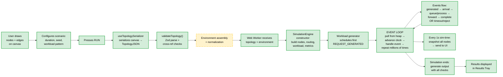
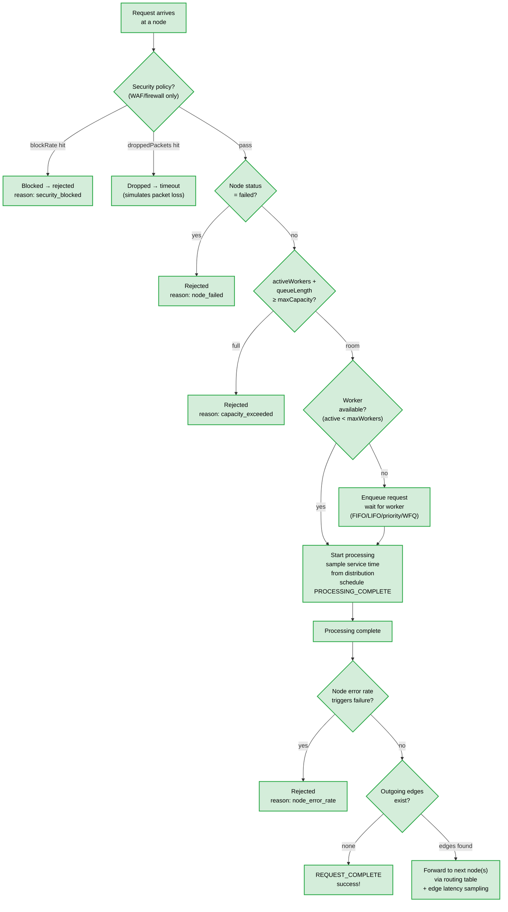
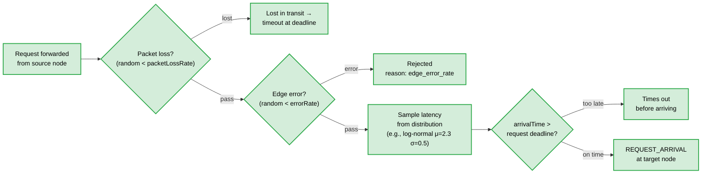
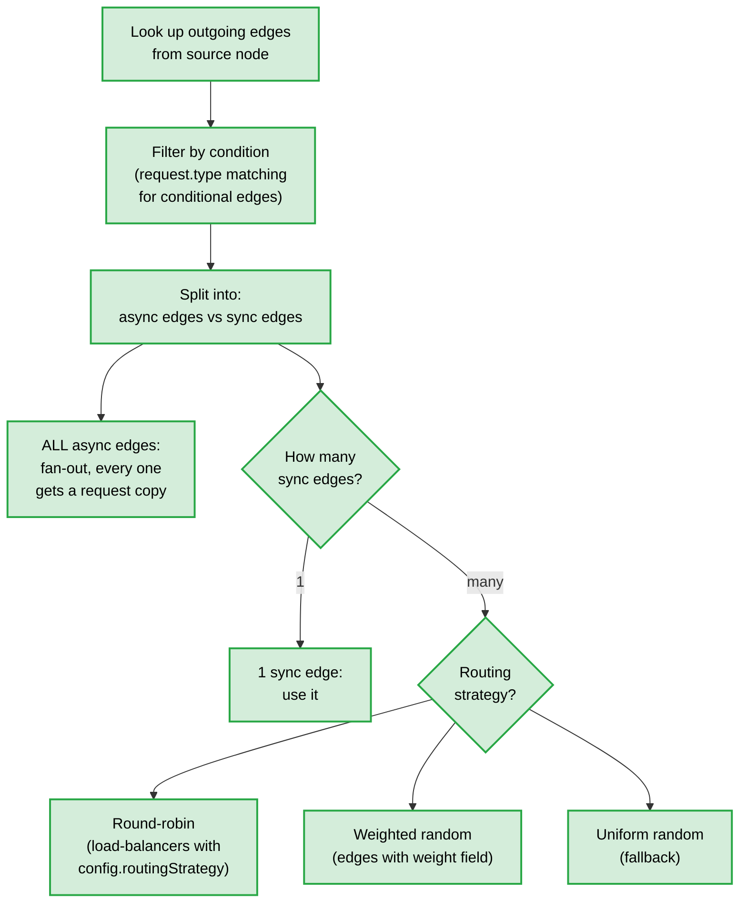
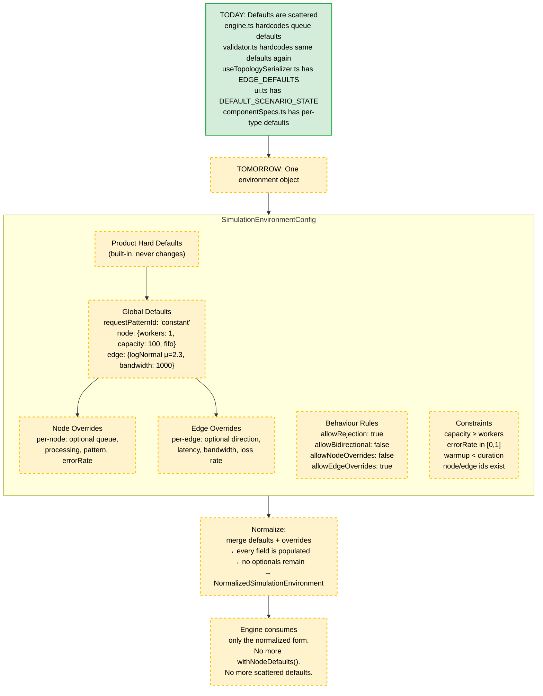
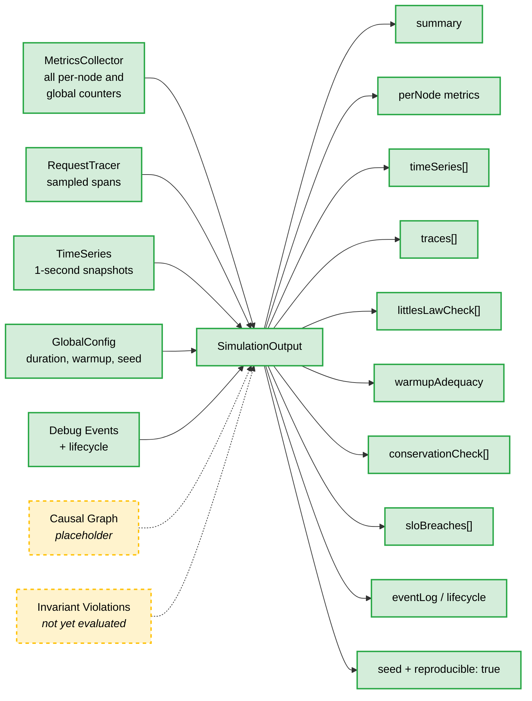

# NS Simulator — System Mind Map

> How everything connects. Solid boxes = built and working. Dashed boxes = planned/specced but not yet implemented.
> Read this like someone sketched it on a whiteboard to understand the whole system.

---

## The Big Picture

```mermaid
flowchart TB
  classDef built fill:#d4edda,stroke:#28a745,stroke-width:2px,color:#000
  classDef planned fill:#fff3cd,stroke:#ffc107,stroke-width:2px,stroke-dasharray:5 5,color:#000
  classDef core fill:#cce5ff,stroke:#004085,stroke-width:2px,color:#000
  classDef infra fill:#e2e3e5,stroke:#6c757d,stroke-width:2px,color:#000

  USER["A Human<br/>draws a system on a canvas<br/>and presses Run"]:::built

  USER --> CANVAS
  USER --> CLI
  USER -.-> TERMINAL

  subgraph FRONTEND ["Renderer — What the user sees and touches"]
    direction TB
    CANVAS["React Flow Canvas<br/>drag nodes, draw edges<br/><i>src/renderer</i>"]:::built
    STORE["Zustand Store<br/>nodes, edges, scenario,<br/>simulation metrics<br/><i>useStore.ts</i>"]:::built
    CATALOG_UI["Component Library Sidebar<br/>palette of ~113 node types<br/>grouped by category<br/><i>catalogConfig.ts</i>"]:::built
    PROPS["Properties Panel<br/>edit node config,<br/>edge config, scenario<br/><i>components/properties</i>"]:::built
    SIM_CONTROLS["Simulation Controls<br/>Run / Pause / Resume / Stop<br/><i>useSimulation.ts</i>"]:::built
    SCENARIO_BAR["Scenario Bar<br/>duration, warmup, seed,<br/>timeout, source node,<br/>workload overrides<br/><i>ScenarioState in ui.ts</i>"]:::built
    RESULTS["Results Tray<br/>summary, per-node metrics,<br/>health checks, SLO breaches<br/><i>components/simulation</i>"]:::built
    DEBUGGER_UI["Event Debugger UI<br/>event log, request inspector,<br/>waterfall, step-through,<br/>canvas overlay, sequence diagram<br/><i>13 features specced</i>"]:::planned
    TERMINAL["In-App Terminal<br/>Cisco IOS-style CLI,<br/>context modes, show/set commands,<br/>port-level state<br/><i>11 features specced</i>"]:::planned
    DSDS["Design System (DSDS)<br/>atoms, molecules, templates,<br/>pages — unified component library<br/><i>stitch_simulation_output_analysis</i>"]:::planned

    CANVAS --> STORE
    CATALOG_UI --> CANVAS
    PROPS --> STORE
    SCENARIO_BAR --> STORE
    STORE --> SIM_CONTROLS
    SIM_CONTROLS --> RESULTS
    DEBUGGER_UI -.-> STORE
    TERMINAL -.-> STORE
    DSDS -.-> RESULTS
    DSDS -.-> DEBUGGER_UI
  end

  subgraph SERIALIZATION ["The Bridge — Canvas to Engine"]
    direction TB
    SERIALIZER["Topology Serializer<br/>canvas state → TopologyJSON<br/>applies EDGE_DEFAULTS,<br/>merges workload overrides,<br/>builds GlobalConfig<br/><i>useTopologySerializer.ts</i>"]:::built
    VALIDATOR_TOPO["Topology Validator<br/>Zod schema parse,<br/>cross-ref checks,<br/>connectivity analysis,<br/>applies node defaults (mutation)<br/><i>validator.ts</i>"]:::built
    ENV_ASSEMBLY["Environment Assembly<br/>build SimulationEnvironmentConfig<br/>from topology + scenario + defaults<br/><i>assembleEnvironment.ts</i>"]:::planned
    ENV_NORMALIZE["Environment Normalization<br/>resolve inheritance:<br/>product defaults → global → node/edge<br/>produce NormalizedSimulationEnvironment<br/><i>normalizeEnvironment.ts</i>"]:::planned
    ENV_VALIDATE["Environment Validation<br/>shape, references, behaviour rules,<br/>constraints → EnvironmentDiagnostic[]<br/><i>validateEnvironment.ts</i>"]:::planned

    SERIALIZER --> VALIDATOR_TOPO
    VALIDATOR_TOPO --> ENV_ASSEMBLY
    ENV_ASSEMBLY -.-> ENV_VALIDATE
    ENV_VALIDATE -.-> ENV_NORMALIZE
  end

  STORE --> SERIALIZER

  subgraph WORKER ["Web Worker — Off-thread execution"]
    direction TB
    WORKER_THREAD["simulation.worker.ts<br/>receives TopologyJSON,<br/>constructs engine,<br/>streams progress/snapshots,<br/>returns SimulationOutput"]:::built
    WORKER_PROTO["Worker Protocol<br/>Inbound: run, pause, resume, stop, step<br/>Outbound: progress, snapshot, complete, error<br/><i>protocols.ts</i>"]:::built
    WORKER_DEBUG["Debug Messages<br/>EventBatchMessage,<br/>DebugSnapshotMessage,<br/>DebugRequestMessage<br/><i>specced in event-debugger-schema</i>"]:::planned

    WORKER_PROTO --> WORKER_THREAD
    WORKER_DEBUG -.-> WORKER_THREAD
  end

  ENV_NORMALIZE -.-> WORKER_THREAD
  VALIDATOR_TOPO --> WORKER_THREAD

  subgraph ENGINE ["Simulation Engine — The brain"]
    direction TB
    ENGINE_CORE["SimulationEngine<br/>the event loop<br/>pulls from MinHeap,<br/>advances clock,<br/>dispatches to handlers<br/><i>engine.ts</i>"]:::built

    subgraph EVENTS_SYS ["Event System"]
      direction LR
      EVENTS["20 Event Types<br/>request-generated, arrival,<br/>processing-complete, forwarded,<br/>complete, timeout, rejected,<br/>node-failure, recovery,<br/>network-partition, scale-up/down,<br/>circuit-breaker, cache, db-failover<br/><i>events.ts</i>"]:::built
      HEAP["Min-Heap Priority Queue<br/>events sorted by timestamp,<br/>then by priority for ties<br/><i>min-heap.ts</i>"]:::built
      CLOCK["Simulation Clock<br/>bigint microseconds,<br/>no real time — pure numbers<br/><i>time.ts</i>"]:::built
    end

    subgraph NODES_SYS ["Node Runtime"]
      direction LR
      GGCK["G/G/c/K Node<br/>c workers, K capacity,<br/>queue discipline (FIFO/LIFO/priority/WFQ),<br/>service time from distribution,<br/>reject on capacity_exceeded or node_failed<br/><i>GGcKNode.ts</i>"]:::built
      NODE_STATES["Node States<br/>idle → busy → saturated → failed<br/>tracks activeWorkers,<br/>queueLength, utilization<br/><i>NodeState in types.ts</i>"]:::built
    end

    subgraph ROUTING_SYS ["Routing"]
      direction LR
      ROUTING["Routing Table<br/>adjacency list by source node,<br/>sync vs async fan-out,<br/>weighted / round-robin / random selection,<br/>conditional edges (request.type matching)<br/><i>routing.ts</i>"]:::built
    end

    subgraph WORKLOAD_SYS ["Workload Generation"]
      direction LR
      WORKLOAD["Workload Generator<br/>7 patterns: constant, poisson,<br/>bursty, diurnal, spike, sawtooth, replay<br/>request type distribution (weighted),<br/>inter-arrival time sampling<br/><i>workload.ts</i>"]:::built
    end

    subgraph STOCHASTIC_SYS ["Randomness"]
      direction LR
      DISTRIBUTIONS["14 Distributions<br/>constant, deterministic, log-normal,<br/>exponential, normal, uniform,<br/>weibull, poisson, binomial,<br/>gamma, beta, pareto, empirical, mixture<br/><i>distribution.ts</i>"]:::built
      RNG["Seeded RNG<br/>same seed = same output,<br/>always reproducible<br/><i>random.ts</i>"]:::built
    end

    subgraph METRICS_SYS ["Metrics & Tracing"]
      direction LR
      METRICS["Metrics Collector<br/>per-node: arrived, processed,<br/>rejected, timed out, queue stats,<br/>utilization, throughput, latency percentiles<br/>global: success/fail/reject/timeout counts<br/>warmup-aware (pre/post warmup windows)<br/><i>metrics.ts</i>"]:::built
      TRACER["Request Tracer<br/>sampled traces (configurable rate),<br/>per-request spans: nodeId, arrivalTime,<br/>queueWait, serviceTime, departureTime<br/><i>tracer.ts</i>"]:::built
    end

    subgraph DEBUG_SYS ["Debug System"]
      direction LR
      DEBUG_EVENTS["Debug Event Projection<br/>DebugEvent: timestampMs, type,<br/>nodeId, requestId, status,<br/>reason, nodeState snapshot<br/><i>debugTypes.ts</i>"]:::built
      LIFECYCLE["Request Lifecycle Builder<br/>assembles full lifecycle for<br/>a single request from debug events<br/>+ trace spans<br/><i>debugTypes.ts</i>"]:::built
    end

    ENGINE_CORE --> EVENTS_SYS
    ENGINE_CORE --> NODES_SYS
    ENGINE_CORE --> ROUTING_SYS
    ENGINE_CORE --> WORKLOAD_SYS
    ENGINE_CORE --> STOCHASTIC_SYS
    ENGINE_CORE --> METRICS_SYS
    ENGINE_CORE --> DEBUG_SYS
  end

  WORKER_THREAD --> ENGINE_CORE

  subgraph ANALYSIS ["Output & Analysis — What comes out"]
    direction TB
    SIM_OUTPUT["SimulationOutput<br/>the final result object<br/><i>output.ts</i>"]:::built

    subgraph OUTPUT_PARTS ["What's inside SimulationOutput"]
      direction TB
      SUMMARY["Summary<br/>totalRequests, successful,<br/>failed, rejected, timedOut,<br/>throughput, errorRate,<br/>latency percentiles (p50-p99)"]:::built
      PER_NODE["Per-Node Metrics<br/>arrived, processed, rejected,<br/>timedOut, avgQueueLength,<br/>avgServiceTime, utilization,<br/>throughput, availability,<br/>Little's Law L/λ/W values"]:::built
      TIME_SERIES["Time Series<br/>1-second snapshots of every node:<br/>queueLength, activeWorkers,<br/>utilization, status"]:::built
      TRACES_OUT["Traces<br/>sampled RequestTrace[] with<br/>full span data per hop"]:::built
      LITTLES_LAW["Little's Law Check<br/>L = λW verification per node,<br/>post-warmup window,<br/>tolerance: 10% or ΔL ≤ 0.5"]:::built
      WARMUP_CHECK["Warmup Adequacy<br/>warmup ≥ 10× max p99?<br/>if not → transient contamination warning"]:::built
      CONSERVATION["Conservation Check<br/>arrived = processed + rejected<br/>+ timedOut + inFlight<br/>per node, post-warmup"]:::built
      SLO_BREACHES["SLO Breaches<br/>latencyP99 > target or<br/>availability < target<br/>per node with slo config"]:::built
      CAUSAL_GRAPH["Causal Graph<br/>root causes → propagation → impact<br/><i>placeholder, not yet populated</i>"]:::planned
      EVENT_LOG["Debug Event Log<br/>full or filtered event stream<br/>+ debugged lifecycle for<br/>single-request focus"]:::built
    end

    SIM_OUTPUT --> OUTPUT_PARTS
  end

  ENGINE_CORE --> SIM_OUTPUT
  SIM_OUTPUT --> WORKER_THREAD
  WORKER_THREAD --> RESULTS

  subgraph CATALOG ["Component Catalog — The 113 node types"]
    direction TB
    COMP_SPECS["Component Specs<br/>per-type: structuralRole, profile,<br/>defaultRenderer, routingStrategy,<br/>asyncBoundary, createDefaultSimConfig,<br/>validateCanvas, serializeCanvas<br/><i>componentSpecs.ts</i>"]:::built
    PALETTE["Palette Templates<br/>drag-and-drop presets,<br/>seed metrics, labels, icons<br/><i>paletteTemplates.ts</i>"]:::built
    NODE_SPEC_TYPES["Node Spec Types<br/>CanvasNodeDataV2, ComponentSpec,<br/>NodeProfile, StructuralRole,<br/>RoutingStrategy, NodeSimulationConfig<br/><i>nodeSpecTypes.ts</i>"]:::built
    CATEGORIES["14 Categories<br/>compute, network, storage, messaging,<br/>orchestration, security, observability,<br/>devops, data-infra, real-time,<br/>integration, dns, consensus, auxiliary"]:::built

    COMP_SPECS --> PALETTE
    NODE_SPEC_TYPES --> COMP_SPECS
    CATEGORIES --> COMP_SPECS
  end

  CATALOG --> CANVAS
  CATALOG --> SERIALIZER
  CATALOG --> GGCK

  subgraph TOPOLOGY ["Topology JSON — The contract"]
    direction TB
    TOPO_JSON["TopologyJSON<br/>id, name, version<br/>the single object that crosses<br/>the canvas→engine boundary<br/><i>types.ts</i>"]:::built

    subgraph TOPO_PARTS ["What's inside"]
      direction TB
      GLOBAL_CFG["GlobalConfig<br/>simulationDuration, seed,<br/>warmupDuration, timeResolution,<br/>defaultTimeout, traceSampleRate"]:::built
      COMP_NODES["ComponentNode[]<br/>id, type, category, label,<br/>position, resources, queue,<br/>processing, dependencies,<br/>resilience, slo, failureModes,<br/>scaling, config"]:::built
      EDGE_DEFS["EdgeDefinition[]<br/>source→target, mode, protocol,<br/>latency (distribution + pathType),<br/>bandwidth, maxConcurrentRequests,<br/>packetLossRate, errorRate,<br/>weight, condition"]:::built
      WORKLOAD_PROF["WorkloadProfile<br/>sourceNodeId, pattern, baseRps,<br/>requestDistribution,<br/>pattern-specific params"]:::built
      FAULTS["FaultSpec[]<br/>targetId, faultType,<br/>timing, duration, params<br/><i>modeled but not fully wired</i>"]:::planned
      INVARIANTS["InvariantCheck[]<br/>id, description, condition<br/><i>modeled but not evaluated</i>"]:::planned
      SCENARIOS["ScenarioRef[]<br/>id, name, overrides<br/><i>modeled for future use</i>"]:::planned
    end

    TOPO_JSON --> TOPO_PARTS
  end

  SERIALIZER --> TOPO_JSON
  TOPO_JSON --> ENGINE_CORE

  subgraph ENV_MODEL ["Environment Model — The missing layer (specced)"]
    direction TB
    ENV_CONFIG["SimulationEnvironmentConfig<br/>id, name, global, defaults,<br/>nodes, edges, behaviourRules,<br/>constraints"]:::planned
    ENV_DEFAULTS["EnvironmentDefaults<br/>requestPatternId,<br/>node defaults (queue, processing),<br/>edge defaults (latency, bandwidth, etc.)"]:::planned
    ENV_BEHAVIOUR["Behaviour Rules<br/>allowRejection,<br/>allowBidirectionalRequests,<br/>allowNodePatternOverrides,<br/>allowEdgeOverrides"]:::planned
    ENV_CONSTRAINTS["Constraint Model<br/>type, severity, message<br/>evaluated before simulation<br/>blocks or warns"]:::planned
    NORMALIZED["NormalizedSimulationEnvironment<br/>fully resolved — no optionals,<br/>every node/edge has complete config,<br/>ready for engine consumption"]:::planned

    ENV_CONFIG -.-> ENV_DEFAULTS
    ENV_CONFIG -.-> ENV_BEHAVIOUR
    ENV_CONFIG -.-> ENV_CONSTRAINTS
    ENV_CONFIG -.-> NORMALIZED
  end

  ENV_NORMALIZE -.-> NORMALIZED

  subgraph FUTURE_SPECS ["Future Feature Specs — Planned domains"]
    direction TB
    REQ_PATTERN["Request Pattern Configuration<br/>pattern shapes, presets,<br/>pattern validation,<br/>simulation effect"]:::planned
    REQ_DIRECTION["Request Flow Direction<br/>& Topology Rules<br/>direction inference,<br/>routing semantics"]:::planned
    REQ_TYPES["Request Type Model<br/>type properties,<br/>effects on processing"]:::planned
    EDGE_PROPS["Edge Properties & Defaults<br/>full edge model,<br/>bandwidth shaping,<br/>protocol effects"]:::planned
    THROUGHPUT_CALC["Throughput Calculation<br/>formulas, result semantics"]:::planned
    QUEUE_DEPTH["Queue Depth Calculation<br/>formulas, overflow semantics"]:::planned
    LIFECYCLE_SPEC["Arrival, Departure &<br/>Request Lifecycle Semantics<br/>state machine, transitions"]:::planned
    REJECTION_SPEC["Request Rejection Behaviour<br/>causes, metrics,<br/>cascading effects"]:::planned
    COST_SPEC["Cost Calculation & Budgeting<br/>cost formulas, budget<br/>thresholds, warnings"]:::planned
    ACCURACY_SPEC["Simulation Validation &<br/>Pattern Accuracy<br/>regression fixtures,<br/>expected outputs"]:::planned
    SIMPLIFICATION["Default-Driven<br/>Simplification Layer<br/>progressive disclosure,<br/>presets, simplified setup"]:::planned
  end

  NORMALIZED -.-> FUTURE_SPECS

  subgraph GRADING ["Question Creation & Grading (Django backend)"]
    direction TB
    VERDICT["Simulation Verdict Contract<br/>TopologyJSON in → SimulationOutput out<br/>black-box execution engine"]:::planned
    BATCH_RUNNER["Headless Batch Runner<br/>run N topologies against<br/>M scenarios, collect verdicts"]:::planned
    RUBRIC["Rubric & Scoring Engine<br/>4 scoring buckets,<br/>10 question types,<br/>structural + simulation checks"]:::planned
    TOPO_DIFF["Topology Diffing<br/>for fix/debug questions,<br/>compare student vs reference"]:::planned
    FEEDBACK["Feedback Generation<br/>per-scenario breakdown,<br/>specific failure explanations"]:::planned

    VERDICT -.-> BATCH_RUNNER
    BATCH_RUNNER -.-> RUBRIC
    RUBRIC -.-> FEEDBACK
    TOPO_DIFF -.-> RUBRIC
  end

  SIM_OUTPUT -.-> VERDICT
  CLI --> VERDICT

  subgraph CLI_SYS ["CLI — Headless execution"]
    direction LR
    CLI["CLI Runner<br/>tsx src/cli/index.ts<br/>reads topology JSON file,<br/>validates, runs engine,<br/>streams progress bar,<br/>prints results or --json<br/><i>cli/index.ts</i>"]:::built
  end

  TOPO_JSON --> CLI

  subgraph RESILIENCE ["Resilience Patterns (modeled, partially wired)"]
    direction TB
    CIRCUIT_BREAKER["Circuit Breaker<br/>failureThreshold, recoveryTimeout,<br/>halfOpenRequests<br/><i>type exists, events defined,<br/>not fully simulated</i>"]:::planned
    RETRY["Retry<br/>maxAttempts, baseDelay,<br/>maxDelay, multiplier, jitter<br/><i>type exists, not simulated</i>"]:::planned
    RATE_LIMITER["Rate Limiter<br/>maxTokens, refillRate<br/><i>type exists, not simulated</i>"]:::planned
    BULKHEAD["Bulkhead<br/>maxConcurrent<br/><i>type exists, not simulated</i>"]:::planned
  end

  COMP_NODES -.-> RESILIENCE

  subgraph SCALING ["Scaling & Failures (modeled, partially wired)"]
    direction TB
    AUTOSCALING["Auto-scaling<br/>horizontal/vertical,<br/>scale-up/down thresholds,<br/>cooldown, cold start penalty<br/><i>type exists, events defined</i>"]:::planned
    FAILURE_MODES["Failure Modes<br/>severity, mtbf, mttr,<br/>trigger conditions<br/><i>type exists, node-failure<br/>event is handled</i>"]:::built
    FAULT_INJECTION["Fault Injection<br/>FaultSpec targeting nodes/edges,<br/>deterministic/probabilistic/conditional<br/><i>type exists, not orchestrated</i>"]:::planned
  end

  ENGINE_CORE --> FAILURE_MODES

  subgraph DOCS ["Documentation & Knowledge"]
    direction TB
    SYS_OVERVIEW["System Overview<br/>how simulation works end-to-end<br/><i>SYSTEM_OVERVIEW.md</i>"]:::built
    THEORY["Theoretical Foundations<br/>queueing theory, Little's Law,<br/>Erlang formulas, M/M/c/K<br/><i>theoretical-foundations.md</i>"]:::built
    SIM_FUNDAMENTALS["5-Part Docs Series<br/>system diagrams, fundamentals,<br/>data structures, distributed systems,<br/>devops & chaos<br/><i>docs/01-05</i>"]:::built
    ADRs["Architecture Decision Records<br/>canonical node refactor,<br/>state management, modularity,<br/>no custom change detection,<br/>UI architecture<br/><i>design-decisions/</i>"]:::built
    IMPL_PLAN["Implementation Plan<br/>9 phases: topology format →<br/>core primitives → engine →<br/>network → failures → resilience →<br/>metrics → scenarios → UI integration →<br/>advanced features<br/><i>IMPLEMENTATION_PLAN.md</i>"]:::built
    TICKETS_DOC["Engineering Tickets<br/>phased, self-contained,<br/>with AC and dependencies<br/><i>TICKETS.md</i>"]:::built
    SKILLS["11 AI Skills<br/>chaos-experiment-designer,<br/>component-taxonomy-selector,<br/>cost-and-provider-mapper,<br/>failure-propagation-analyzer,<br/>invariant-policy-checker,<br/>resilience-pattern-tuner,<br/>scenario-composer,<br/>schema-catalog-sync-guard,<br/>simulation-output-analyst,<br/>ticket-implementation-copilot,<br/>topology-json-author<br/><i>skills/</i>"]:::built
  end
```

## How a Simulation Actually Runs (the flow)



## What a Node Actually Does Inside



## How Edges Work



## Routing Decisions



## The Environment Model (what's being introduced)



## Everything That Feeds Into SimulationOutput



---

## Legend

| Visual | Meaning |
|--------|---------|
| Solid green box | Built and working in the codebase |
| Dashed yellow box | Planned / specced / type exists but not implemented |
| Blue box | Core infrastructure |
| Arrow `→` | Data flows this way |
| Dashed arrow `-.->` | Will flow this way once implemented |
